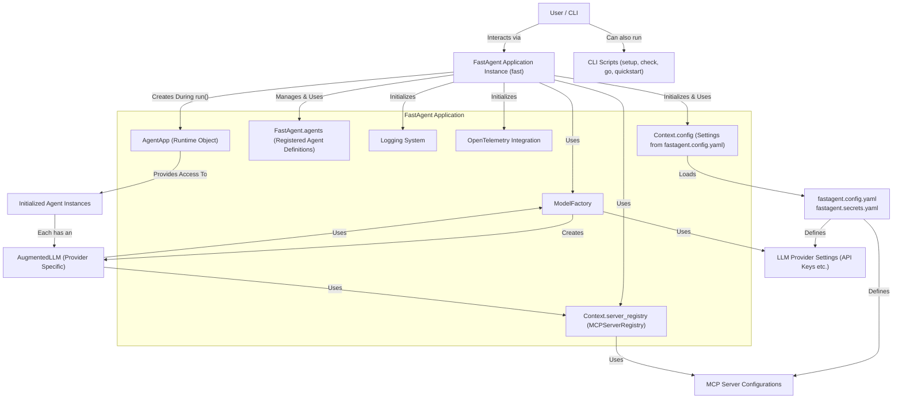
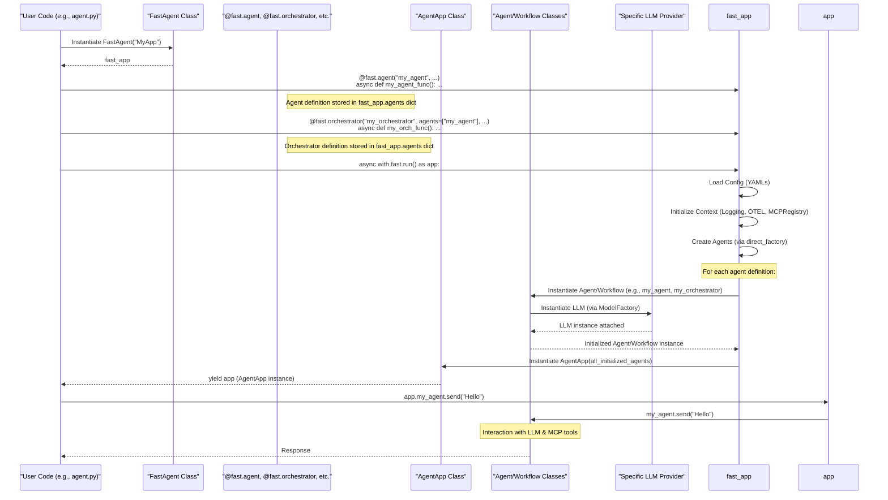
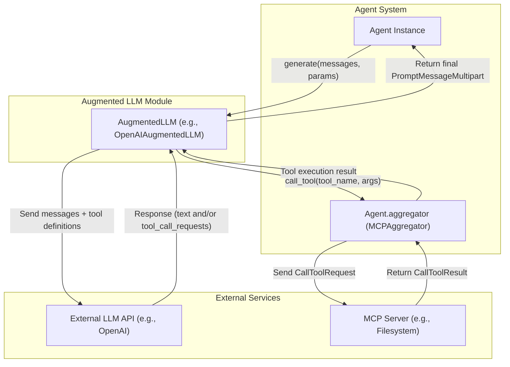
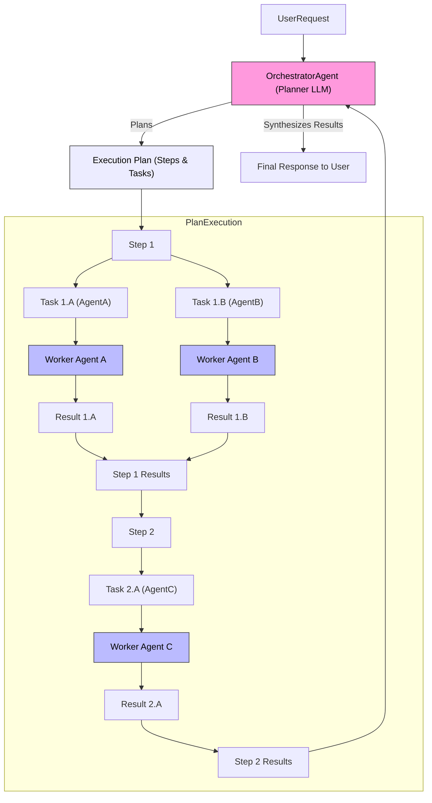
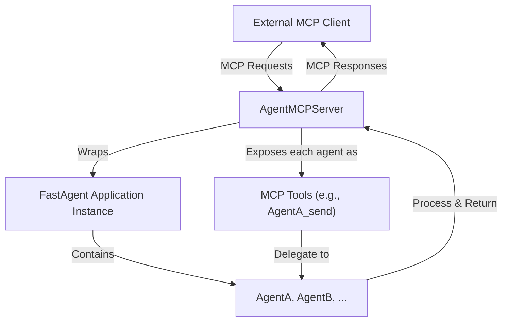

Okay, diving into `fast-agent` will be a significant step up in terms of framework features compared to your initial client. Here's a set of documentation and Mermaid diagrams designed to elucidate its internals and help you get started quickly.

This is based on inferring the architecture from the provided file list and typical patterns in such frameworks.

---

## `fast-agent`: Documentation & Internals Overview

`fast-agent` is a Python framework designed for building sophisticated agentic applications that can leverage the Model Context Protocol (MCP) for tool use, alongside various Large Language Models (LLMs). It emphasizes a declarative, decorator-based approach to defining agents and complex workflows.

### Core Concepts

1.  **`FastAgent` Application (`core/fastagent.py`):**
    *   The main entry point and container for your entire agent application.
    *   You initialize it with a name and optionally a configuration path.
    *   It uses decorators (`@fast.agent`, `@fast.orchestrator`, etc.) to register different agent types and their behaviors.
    *   The `async with fast.run() as agent_app:` block is crucial: it initializes the application context, loads configurations, sets up MCP server connections, and creates actual agent instances.
    *   The `agent_app` yielded by `fast.run()` provides access to your defined agents (e.g., `agent_app.my_research_agent`).

2.  **Agents (`agents/agent.py`, `agents/base_agent.py`):**
    *   The fundamental building blocks. An `Agent` in `fast-agent` is an entity that combines an LLM with an instruction, a set of available tools (MCP servers), and potentially a specific workflow logic.
    *   Defined using the `@fast.agent(...)` decorator.
    *   Each agent gets its own `AugmentedLLM` instance, configured with a specific model and parameters.
    *   `AgentConfig` (in `core/agent_types.py`) is a Pydantic model holding the configuration for an agent (name, instruction, servers, model, history, etc.).

3.  **Workflow Patterns (Decorators in `core/direct_decorators.py`):**
    *   `fast-agent` provides decorators for common agentic workflow patterns:
        *   `@fast.agent`: A basic agent that interacts with an LLM and tools.
        *   `@fast.orchestrator`: A planner agent that can break down tasks and delegate to other "worker" agents.
        *   `@fast.router`: An agent that decides which other agent or tool is best suited for a given query.
        *   `@fast.chain`: Links multiple agents in a sequence, passing output from one to the next.
        *   `@fast.parallel`: Executes multiple agents concurrently and can fan-in their results to another agent.
        *   `@fast.evaluator_optimizer`: Implements a generate-evaluate-refine loop with a "generator" agent and an "evaluator" agent.

4.  **LLM Providers (`llm/providers/`):**
    *   `fast-agent` is LLM-agnostic. It achieves this through an `AugmentedLLMProtocol` and concrete `AugmentedLLM` subclasses for different providers (OpenAI, Anthropic, Google, DeepSeek, OpenRouter, Generic for Ollama-like, TensorZero).
    *   `ModelFactory` (`llm/model_factory.py`) parses model strings (e.g., `"openai.gpt-4.1-mini"`, `"anthropic.haiku"`) to instantiate the correct LLM provider.
    *   Each provider handles its specific API details, tool/function calling format, and message conversion.

5.  **MCP Servers & Tools (`mcp/`):**
    *   `MCPServerRegistry` (`mcp_server_registry.py`): Loads MCP server configurations from `fastagent.config.yaml`.
    *   `MCPConnectionManager` (`mcp_connection_manager.py`): Manages persistent connections to MCP servers (supports stdio, SSE, HTTP).
    *   `MCPAggregator` (`mcp_aggregator.py`): An `Agent` uses this to interact with its configured list of MCP servers, abstracting tool listing and calling. Tools are namespaced (e.g., `filesystem-list_files`).

6.  **Configuration (`config.py`):**
    *   Uses YAML (`fastagent.config.yaml` for main config, `fastagent.secrets.yaml` for sensitive data).
    *   Pydantic models (`Settings`, `MCPServerSettings`, `LoggerSettings`, etc.) define the schema.
    *   A JSON schema (`.vscode/fastagent.config.schema.json`) is provided for validation and IDE assistance.
    *   Supports configuring multiple LLM providers, detailed MCP server settings (transport, command, args, env, auth, roots, sampling), OTEL, and logging.

7.  **Context (`context.py`):**
    *   A central `Context` object is initialized by `MCPApp` (and `FastAgent`).
    *   It holds shared resources like the configuration (`Settings`), `ServerRegistry`, `Executor` (for async tasks), and `Tracer` (for OTEL).
    *   Agents and services access this context.

8.  **Human-in-the-Loop (HITL):**
    *   Agents can be configured with `human_input=True`.
    *   Uses a `HumanInputCallback` (defaulting to console input) to pause workflow and solicit user feedback/input via a special `__human_input__` tool.

9.  **Logging & Observability (`logging/`, `event_progress.py`):**
    *   Event-driven logging system.
    *   `RichProgressDisplay` for live progress in the console.
    *   JSONL file logging for structured logs.
    *   Scripts for replaying and summarizing log events.
    *   OpenTelemetry (OTEL) integration for distributed tracing.

### Key Components Deep Dive

1.  **`FastAgent` Class (`core/fastagent.py`)**
    *   **Purpose:** Application orchestrator and definition hub.
    *   **How it works:**
        *   Collects agent definitions via decorators.
        *   On `fast.run()`:
            *   Initializes `MCPApp` which sets up the global `Context` (config, logging, OTEL, MCP server registry, etc.).
            *   Validates agent and server references.
            *   Uses `direct_factory.create_agents_in_dependency_order` to instantiate all defined agents and their LLM providers.
            *   Yields an `AgentApp` instance providing access to the initialized agents.
            *   Handles CLI argument processing (model override, quiet mode, running as an MCP server).

2.  **`Agent` / `BaseAgent` (`agents/agent.py`, `agents/base_agent.py`)**
    *   **Purpose:** Represents a single, configurable agent.
    *   **How it works:**
        *   Initialized with an `AgentConfig`.
        *   Inherits from `MCPAggregator` to manage its list of MCP servers/tools.
        *   An `AugmentedLLM` instance is attached to it (via `attach_llm`), specific to its configured model.
        *   Implements `AgentProtocol`, providing methods like `send()`, `generate()`, `structured()`, `apply_prompt()`, `list_tools()`, etc.
        *   The `generate()` method is the core interaction point, which delegates to its `AugmentedLLM`.

3.  **`AugmentedLLM` & Providers (`llm/augmented_llm.py`, `llm/providers/`)**
    *   **Purpose:** Abstract LLM interaction and implement tool-calling loops.
    *   **How it works:**
        *   `AugmentedLLMProtocol` defines the interface.
        *   `AugmentedLLM` is the base class, handling the generic ReAct-like loop:
            1.  Prepare messages (including system prompt, history).
            2.  Call the provider-specific LLM method (`_apply_prompt_provider_specific`).
            3.  If LLM requests tool calls:
                *   Use its `MCPAggregator` (passed from the `Agent`) to `call_tool`.
                *   Format tool results.
                *   Send results back to LLM.
            4.  Repeat until LLM gives a final answer or hits iteration limits.
        *   Specific providers (e.g., `OpenAIAugmentedLLM`, `AnthropicAugmentedLLM`) implement:
            *   API client initialization.
            *   Conversion of MCP `PromptMessageMultipart` to their native message format.
            *   Conversion of MCP `Tool` schemas to their native function/tool definition format.
            *   Parsing of LLM responses (text, tool calls).
            *   Conversion of native tool call results back to MCP `CallToolResult`.

4.  **Configuration (`config.py`)**
    *   **Purpose:** Load and manage all application settings.
    *   **How it works:**
        *   `Settings` is the top-level Pydantic model.
        *   Nested models (e.g., `MCPSettings`, `MCPServerSettings`, `OpenAISettings`, `LoggerSettings`) define structured configuration.
        *   `get_settings(config_path)`:
            *   Finds `fastagent.config.yaml` (and optionally `fastagent.secrets.yaml`) in CWD or parent dirs if `config_path` is not given.
            *   Loads YAML files.
            *   Merges secrets into the main config.
            *   Hydrates the `Settings` Pydantic model, performing validation.
            *   Environment variables can override YAML settings (e.g., `OPENAI_API_KEY`).

### Workflow Pattern Internals (High-Level)

*   **`@fast.orchestrator` (`agents/workflow/orchestrator_agent.py`)**:
    *   Uses its own LLM (the "planner") to generate a `Plan` (list of `Step`s, each with `AgentTask`s).
    *   Iteratively (or once for `plan_type="full"`) executes tasks by calling the `generate()` method of the specified worker agents.
    *   Passes context (objective, previous step results) to worker agents.
    *   Finally, synthesizes all results using its planner LLM.
*   **`@fast.router` (`agents/workflow/router_agent.py`)**:
    *   Uses its own LLM to determine the most appropriate agent from a list.
    *   The LLM is prompted with the user query and descriptions of available agents.
    *   It's expected to return a `RoutingResponse` (Pydantic model indicating chosen agent, confidence, reasoning).
    *   Delegates the original query to the chosen agent.
*   **`@fast.chain` (`agents/workflow/chain_agent.py`)**:
    *   Sequentially calls `generate()` on each agent in its `sequence`.
    *   `cumulative=False` (default): Output of agent N becomes the input to agent N+1.
    *   `cumulative=True`: Input to agent N+1 includes the original request AND all responses from agents 1 to N.
*   **`@fast.parallel` (`agents/workflow/parallel_agent.py`)**:
    *   Uses `asyncio.gather` to call `generate()` on all `fan_out` agents concurrently with the same input.
    *   Collects all responses.
    *   If a `fan_in` agent is specified, it formats the collected responses (and optionally the original request) into a single prompt and sends it to the `fan_in` agent. If no `fan_in` agent, a default passthrough one is used.
*   **`@fast.evaluator_optimizer` (`agents/workflow/evaluator_optimizer.py`)**:
    *   Calls `generate()` on the `generator_agent`.
    *   Sends the generator's output to the `evaluator_agent`.
    *   The `evaluator_agent` is expected to return a structured `EvaluationResult` (rating, feedback, needs_improvement).
    *   If `needs_improvement` is true and `min_rating` not met and `max_refinements` not exceeded, it re-prompts the `generator_agent` with the original request, previous response, and feedback.

---

### Mermaid Diagrams

Here are some Mermaid diagrams to help visualize the internals:

**Diagram 1: Core Components & Configuration**



**Diagram 2: Agent Definition and Initialization (`FastAgent.run()`)**



**Diagram 3: LLM Interaction with Tools (Simplified ReAct Loop within `AugmentedLLM`)**



**Diagram 4: Orchestrator Workflow (`@fast.orchestrator`)**



**Diagram 5: `fast-agent` as an MCP Server (`mcp_server/agent_server.py`)**



### Getting Started Rapidly

1.  **Set Up Configuration:**
    *   Run `fast-agent setup` in a new project directory. This creates `fastagent.config.yaml` and `fastagent.secrets.yaml`.
    *   Edit `fastagent.secrets.yaml` to add your API keys for the LLM providers you want to use (e.g., OpenAI, Anthropic).
    *   Review `fastagent.config.yaml`. You can define your MCP servers here (e.g., a local Python script running an MCP server, or an HTTP/SSE one).

2.  **Define a Basic Agent:**
    *   Create an `agent.py` (or similar).
    *   Import `FastAgent`: `from mcp_agent.core.fastagent import FastAgent`
    *   Instantiate it: `fast = FastAgent("MyTestApp")`
    *   Define an agent:
        ```python
        @fast.agent(
            name="my_simple_agent",
            instruction="You are a helpful assistant.",
            model="openai.gpt-4.1-mini", # Or your preferred model
            servers=["my_mcp_server_name_from_config"] # If using MCP tools
        )
        async def run_simple_agent():
            async with fast.run() as app:
                response = await app.my_simple_agent.send("Hello, world!")
                print(response)

        if __name__ == "__main__":
            import asyncio
            asyncio.run(run_simple_agent())
        ```

3.  **Explore Examples:**
    *   The `examples/` directory in the `fast-agent` project is your best friend.
    *   `examples/workflows/chaining.py` or `router.py` show basic multi-agent setups.
    *   `examples/researcher/researcher-imp.py` or `examples/data-analysis/analysis-campaign.py` show complex orchestrations.
    *   Copy an example using `fast-agent quickstart <example_type> .` and modify it.

4.  **Run and Observe:**
    *   Use the CLI: `uv run agent.py` (or however you run Python scripts).
    *   Use `uv run agent.py -- --quiet` to reduce log noise if desired, or check `fastagent.jsonl` for detailed logs.
    *   Use `fast-agent go --instruction "Be a pirate" --model sonnet` for quick interactive tests without writing a file.

5.  **Focus on Your Unique Needs:**
    *   If you want to implement your custom `LOG_LEVEL_USER_INTERACTION`, you'll need to understand `fast-agent`'s logging (`src/mcp_agent/logging/`) and potentially customize or extend it. Its current `LoggerSettings` with `show_chat` and `show_tools` might get you close for the console output.
    *   For advanced memory or cognitive graph ideas, you'd likely build these as:
        *   Custom Python classes/services.
        *   Agents that use these services as tools (exposed via MCP or directly if in the same process).
        *   Specialized `fast-agent` workflow types if the pattern is generic enough.

This documentation should give you a solid starting point. The `fast-agent` framework offers a lot of pre-built functionality that aligns well with your "Bigger Vision" documents. Good luck!
