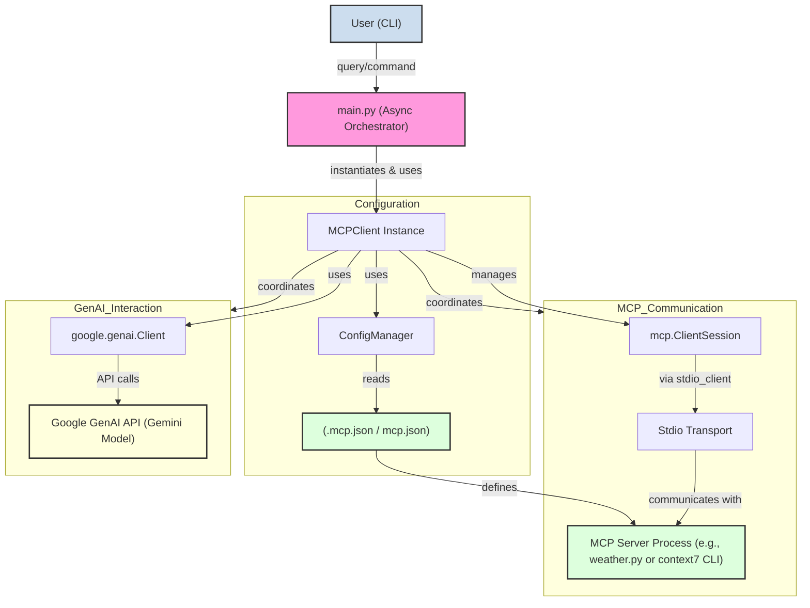
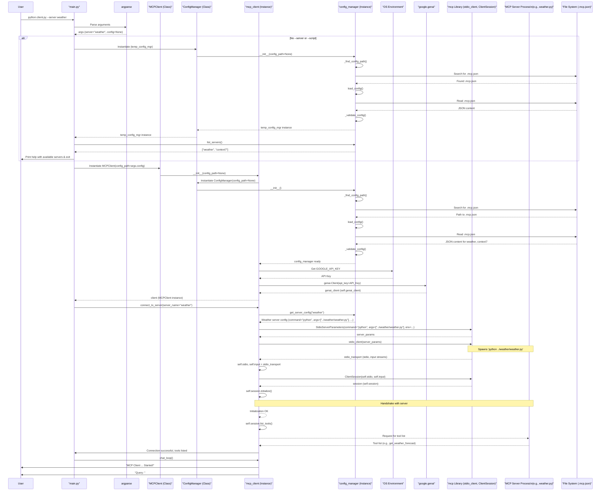
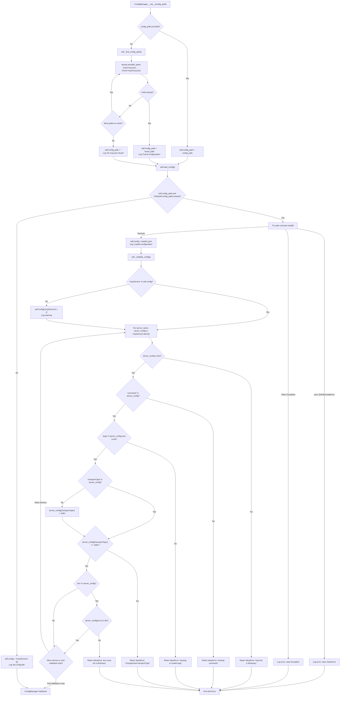
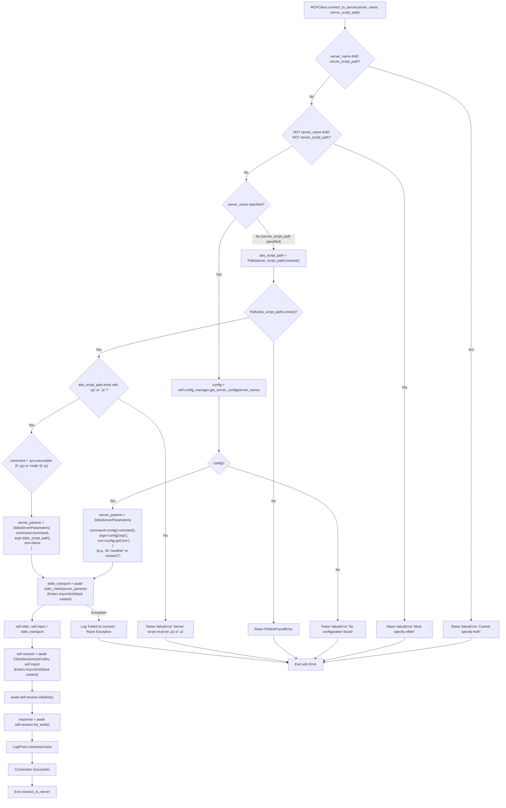
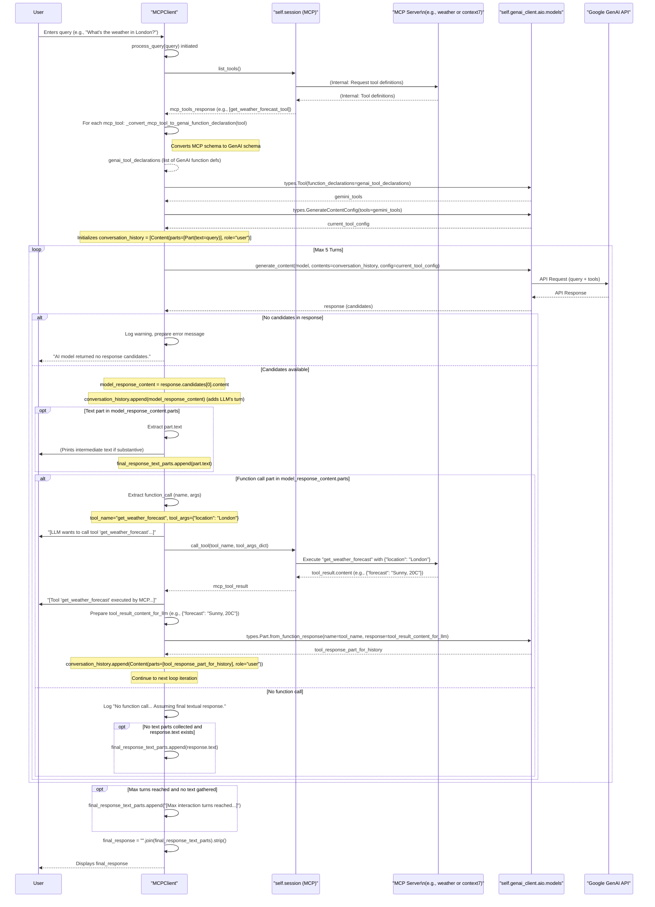
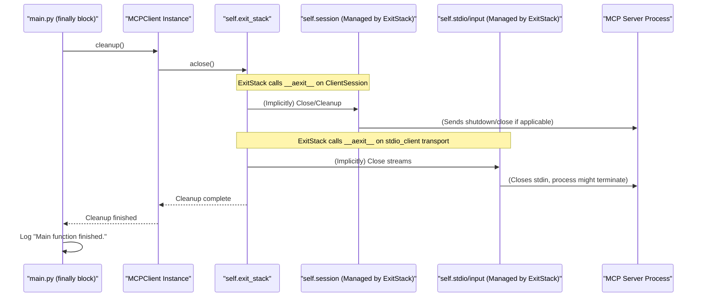

Okay, this is a comprehensive script! Let's break it down into several Mermaid diagrams to illustrate the different flows and component interactions.

I'll provide:

1.  **High-Level System Overview:** Shows the main components and their general interaction.
2.  **Initialization and Connection Flow (Sequence Diagram):** Details the script startup, config loading, and connection to an MCP server.
3.  **`ConfigManager` Logic (Flowchart):** Explains how `mcp.json` is found and parsed.
4.  **`connect_to_server` Logic (Flowchart):** Details the decision-making for connecting via server name or script path.
5.  **Core `process_query` Loop (Sequence Diagram):** This is the heart of the interaction with GenAI and MCP tools. This will be the most detailed.
6.  **Tool Conversion Logic (Simplified Flowchart/Notes):** `_convert_mcp_tool_to_genai_function_declaration`.
7.  **Cleanup Flow (Sequence Diagram):** How resources are released.

Let's include specifics for `weather` and `context7` where applicable.

---

### 1. High-Level System Overview

---

### 2. Initialization and Connection Flow (Sequence Diagram)

This diagram shows the startup, argument parsing, `MCPClient` instantiation, GenAI client setup, and connection to a specific MCP server (e.g., "weather").

---

### 3. `ConfigManager` Logic (Flowchart)

Illustrates `__init__`, `_find_config_path`, `load_config`, and `_validate_config`.

---

### 4. `connect_to_server` Logic (Flowchart)

---

### 5. Core `process_query` Loop (Sequence Diagram)

This diagram details the interaction between the `MCPClient`, the GenAI API, and the MCP Server during a single query processing, including potential tool calls.

---

### 6. Tool Conversion Logic (`_convert_mcp_tool_to_genai_function_declaration`)

This is more of a data mapping process. A simplified flowchart/notes:

```mermaid
graph TD
    Start["_convert_mcp_tool_to_genai_function_declaration(mcp_tool)"] --> InitSchema["parameters_schema = {'type': 'object', 'properties': {}}"];
    
    InitSchema --> CheckInputSchema{"mcp_tool.inputSchema and is dict?"};
    CheckInputSchema -- Yes --> IterateProps["For name, schema_prop in mcp_tool.inputSchema.properties.items()"];
    IterateProps --> PropValid{"schema_prop is dict?"};
    PropValid -- No --> SkipProp["Log warning, skip property"] --> NextPropOrEndLoop;
    PropValid -- Yes --> GetType["prop_type_str = schema_prop.get('type', 'string').lower()"];
    GetType --> ValidateType{"prop_type_str in valid_types (string, number, ...)? "};
    ValidateType -- No --> DefaultType["prop_type_str = 'string'\nLog warning"];
    ValidateType -- Yes --> CreateCurrentProp["current_prop_schema = {'type': prop_type_str}"];
    DefaultType --> CreateCurrentProp;
    
    CreateCurrentProp --> AddDescription{"'description' in schema_prop?"};
    AddDescription -- Yes --> SetDescription["current_prop_schema['description'] = schema_prop['description']"];
    AddDescription -- No --> AddEnum;
    SetDescription --> AddEnum{"'enum' in schema_prop and is list?"};
    AddEnum -- Yes --> SetEnum["current_prop_schema['enum'] = schema_prop['enum']"];
    AddEnum -- No --> CheckArray;
    SetEnum --> CheckArray;

    CheckArray{"prop_type_str == 'array'?"};
    CheckArray -- Yes --> CheckArrayItems{"'items' in schema_prop and is dict?"};
    CheckArrayItems -- Yes --> SetArrayItems["current_prop_schema['items'] = schema_prop['items']"];
    CheckArrayItems -- No --> DefaultArrayItems["current_prop_schema['items'] = {'type': 'string'}\nLog debug"];
    SetArrayItems --> AddToGenAIProps;
    DefaultArrayItems --> AddToGenAIProps;
    CheckArray -- No --> AddToGenAIProps["genai_properties[name] = current_prop_schema"];
    
    AddToGenAIProps --> NextPropOrEndLoop{"More properties?"};
    NextPropOrEndLoop -- Yes --> IterateProps;
    NextPropOrEndLoop -- No --> SetGenAIProps["parameters_schema['properties'] = genai_properties"];
    
    SetGenAIProps --> GetRequired["required_list = mcp_tool.inputSchema.get('required', [])"];
    GetRequired --> ValidateRequired{"required_list is list of strings and not empty?"};
    ValidateRequired -- Yes --> SetRequired["parameters_schema['required'] = required_list"];
    ValidateRequired -- No --> SetToolDescription;
    SetRequired --> SetToolDescription;

    CheckInputSchema -- No --> LogNoSchema["Log warning 'No input schema...'"] --> SetToolDescription;

    SetToolDescription --> CheckMCPDesc{"mcp_tool.description valid and not empty?"};
    CheckMCPDesc -- Yes --> UseMCPDesc["description = mcp_tool.description"];
    CheckMCPDesc -- No --> DefaultDesc["description = f'Tool to perform {mcp_tool.name}'\nLog warning"];
    
    UseMCPDesc --> AssembleDeclaration;
    DefaultDesc --> AssembleDeclaration["Return GenAI Function Declaration:\n{\n  'name': mcp_tool.name,\n  'description': description,\n  'parameters': parameters_schema\n}"];
    AssembleDeclaration --> End["End Conversion"];
```

---

### 7. Cleanup Flow (Sequence Diagram)

---

These diagrams should provide a good understanding of the script's internal flows, decision points, and interactions with external services like the MCP servers and the Google GenAI API. The inclusion of `weather` and `context7` server details from your `.mcp.json` helps ground the examples.
