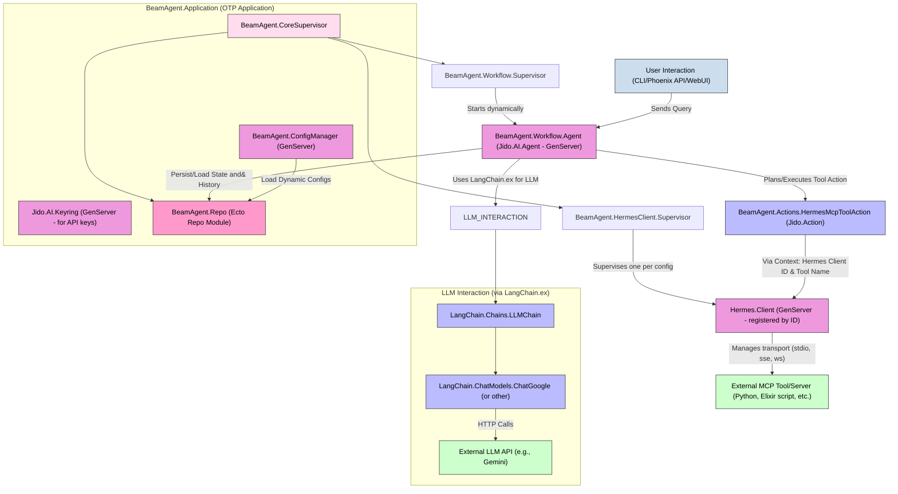

Okay, this is an exciting endeavor! We'll synthesize the provided documents into a master plan for building an amazing Elixir/BEAM/OTP monolith multi-agent system, leveraging Jido, Jido.AI, Hermes MCP, and LangChain.ex as core components. This plan aims to incorporate the learnings from your thought process and set a clear path towards advanced features.

## Master Plan: BeamAgent - An Elixir Multi-Agent System

**Vision:** To build a highly robust, concurrent, fault-tolerant, and extensible multi-agent system on the Elixir/BEAM/OTP platform. This system will use Jido/Jido.AI as its core agent framework, LangChain.ex for sophisticated LLM interactions, and Hermes MCP for standardized tool communication, eventually incorporating advanced AI capabilities like CoT, Graph RAG, and a comprehensive MCP implementation.

**Core Principles:**

1.  **OTP First:** Leverage GenServers, Supervisors, and Applications for concurrency, fault-tolerance, and scalability.
2.  **Process-Oriented:** Each agent, workflow, and external connection manager will be an isolated Elixir process.
3.  **Message Passing:** Primary mode of inter-process communication.
4.  **Configuration Driven:** System behavior defined through Elixir configs, dynamic database entries, and environment variables.
5.  **Extensibility:** Designed for easy addition of new agent types, LLM providers, tools, and workflows.
6.  **Observability:** Built-in logging and a clear path for telemetry and monitoring.
7.  **Database as Source of Truth:** For persistent configurations, agent states, conversation histories, and execution logs.

---

### I. Technology Stack

*   **Core Framework:** Elixir/OTP
*   **Agent Framework:** Jido & Jido.AI
*   **LLM Interaction:** LangChain.ex (specifically `LangChain.ChatModels.ChatGoogle` for Gemini, and others as needed)
*   **Tool Communication Protocol:** Hermes MCP
*   **Database:** PostgreSQL (recommended) with Ecto
*   **Web Interface/API (Future):** Phoenix Framework
*   **JSON Handling:** Jason
*   **CLI Parsing:** Optimus (or Elixir's `OptionParser`)

---

### II. High-Level System Architecture

---

### III. Detailed Component Breakdown

1.  **Configuration Management (`BeamAgent.ConfigManager` & `Jido.AI.Keyring`)**
    *   **`config/config.exs`, `config/{env}.exs`**: Static application configuration, Logger settings, Ecto repo config, initial Hermes client definitions.
    *   **`config/workflows.json` (or DB Table)**: Definitions for workflows (LLM model, Hermes clients used, initial prompt templates). Loaded by `BeamAgent.ConfigManager`.
    *   **`.env`**: For sensitive API keys (e.g., `GEMINI_API_KEY`). `Jido.AI.Keyring` will load these. `LangChain.ex` also respects environment variables for its keys.
    *   **Database (`workflows` table, `mcp_server_configs` table)**: For dynamic and user-manageable workflow and MCP server configurations. `BeamAgent.ConfigManager` can also source from here.

2.  **OTP Application & Core Supervision (`BeamAgent.Application`, `BeamAgent.CoreSupervisor`)**
    *   `BeamAgent.Application`: Main entry point, starts `Jido.AI.Keyring`, `BeamAgent.ConfigManager`, `BeamAgent.Repo` (Ecto), and `BeamAgent.CoreSupervisor`.
    *   `BeamAgent.CoreSupervisor`: Supervises `BeamAgent.HermesClient.Supervisor` and `BeamAgent.Workflow.Supervisor`.

3.  **Hermes MCP Client Subsystem (`BeamAgent.HermesClient.*`)**
    *   **`BeamAgent.HermesClient.Supervisor`**:
        *   Reads Hermes client configurations from `config.exs` (and potentially DB via `ConfigManager`).
        *   Starts one `Hermes.Client` GenServer for each configured MCP server.
        *   Registers each `Hermes.Client` with a unique name/ID (e.g., via `Registry` or named processes like `{Hermes.Client, client_id_atom}`).
    *   **`Hermes.Client` (from `hermes_mcp` library)**:
        *   Manages the underlying transport (stdio, SSE, WebSocket) to an external MCP server.
        *   Handles JSON-RPC framing, `initialize` calls, tool listing, and tool execution.

4.  **Workflow & Agent Subsystem (`BeamAgent.Workflow.*`)**
    *   **`BeamAgent.Workflow.Supervisor`**:
        *   A `DynamicSupervisor` (or a regular one if workflows are statically defined).
        *   Manages `BeamAgent.Workflow.Agent` instances.
        *   Starts agents based on definitions from `ConfigManager` (sourced from `workflows.json` or DB).
        *   Registers agents with a `Registry` (e.g., `BeamAgent.Workflow.Registry`).
    *   **`BeamAgent.Workflow.Agent` (implements `Jido.AI.Agent`)**:
        *   The primary orchestrator for a given workflow.
        *   **`init/1`**:
            *   Receives `workflow_name` and loads its configuration (initial prompt, LangChain model ID, Hermes clients to use) via `ConfigManager`.
            *   Initializes its `LangChain.Chains.LLMChain` with the specified `LangChain.ChatModels.ChatGoogle` (or other) model.
            *   Dynamically discovers tools available from its designated `Hermes.Client` instances by calling `Hermes.Client.list_tools/1`.
            *   Converts these discovered MCP tools into a list of `LangChain.Function` structs, using `BeamAgent.Actions.HermesMcpToolAction` as the target module and providing necessary context (Hermes client ID, actual MCP tool name). Stores these as `available_langchain_mcp_tools`.
        *   **`handle_signal/2` (e.g., for `jido.ai.chat.response` or custom signals):**
            *   Receives user query.
            *   Constructs initial `LangChain.Message` list.
            *   Adds the `available_langchain_mcp_tools` to its `LLMChain` instance.
            *   Calls `LLMChain.run(chain, mode: :while_needs_response)` to drive the conversation. LangChain will internally handle the loop of LLM reasoning, tool invocation (calling `HermesMcpToolAction.run/2`), and feeding results back to the LLM.
            *   Persists conversation history (user, assistant, tool calls/responses) to the database via Ecto.
            *   Returns the final LLM response to the caller.
        *   **State Management:** Can store transient state in its GenServer state. Crucial long-term state (e.g., accumulated observations for RAG, user preferences) should be persisted in the DB.

5.  **Jido Action for Hermes MCP Tools (`BeamAgent.Actions.HermesMcpToolAction`)**
    *   Implements `Jido.Action`.
    *   **`to_tool/1`**: This function is critical. It will be called by `LangChain.Function.new!/1` *for each dynamically discovered MCP tool*. The context passed to `Function.new!/1` (containing the specific MCP tool's name, description, schema, and the `hermes_client_id` it belongs to) must be used here to generate the correct LangChain-compatible function schema (`parameters_schema`).
    *   **`run/2(params, context)`**:
        *   The `context` will contain `{hermes_client_id: atom(), mcp_tool_name: String.t(), action_metadata: map()}` (where `action_metadata` holds the original name, description, schema for this tool instance).
        *   Retrieves the `Hermes.Client` PID using `hermes_client_id`.
        *   Calls `Hermes.Client.call_tool(pid, mcp_tool_name, params)`.
        *   Formats the result from Hermes into a structure `LangChain.Function` expects (typically a string or a JSON-serializable map/list).

6.  **LangChain.ex Integration**
    *   **Model Initialization:** `LangChain.ChatModels.ChatGoogle.new!(model: "gemini-1.5-flash-latest")`. API keys are handled by LangChain via its config or environment variables (also picked up by `Jido.AI.Keyring`).
    *   **Chain Execution:** `LLMChain.run(chain, mode: :while_needs_response)` is the core interaction.
    *   **Tool Definition:** `LangChain.Function.new!(%{module: BeamAgent.Actions.HermesMcpToolAction, context: tool_specific_context})` for each MCP tool.

7.  **Database Layer (`BeamAgent.Repo` & Ecto Schemas)**
    *   **Ecto Schemas:**
        *   `BeamAgent.Schemas.WorkflowDefinition`: Name, description, initial_prompt_template, langchain_model_id, list of associated Hermes client IDs.
        *   `BeamAgent.Schemas.HermesClientConfig`: Name/ID, transport type, transport options (command, URL, etc.), client_info. (Can be partially in `config.exs` and extended/overridden by DB).
        *   `BeamAgent.Schemas.ExecutionLog`: Tracks a full workflow execution: ID, workflow_definition_id, start_time, end_time, status, initial user query, final response.
        *   `BeamAgent.Schemas.MessageLog`: Individual messages within an execution: execution_log_id, turn_number, role (user, assistant, tool_request, tool_response), content (text, tool call details, tool response details), timestamp.
        *   `BeamAgent.Schemas.AgentState` (Optional): For more complex agents that need to persist specific state beyond conversation history.
    *   **Repository (`BeamAgent.Repo`)**: Standard Ecto repo module for DB operations.
    *   **Interaction:** `Workflow.Agent` will use `BeamAgent.Repo` to:
        *   Load its definition (if dynamic).
        *   Create/Update `ExecutionLog` entries.
        *   Append to `MessageLog`.
        *   Load/Save `AgentState`.

---

### IV. Key Interaction Flow: User Query to Response with Tool Use

1.  **User Input:** User sends a query via CLI or future Phoenix interface.
2.  **Routing:** Request reaches a specific `BeamAgent.Workflow.Agent` instance.
3.  **Agent `handle_signal`:**
    a.  Creates/updates an `ExecutionLog` entry in the DB.
    b.  Logs the user query to `MessageLog`.
    c.  Prepares initial `LangChain.Message` list.
    d.  Ensures its `LLMChain` instance has the correct `LangChain.Function` tools (dynamically configured at agent init or re-checked).
4.  **LangChain Execution:** Calls `LLMChain.run(chain_with_tools_and_messages, mode: :while_needs_response)`.
5.  **LLM Reasoning (LangChain internal):**
    a.  `LangChain.ChatModels.ChatGoogle` sends prompt (with tool schemas) to Gemini.
    b.  Gemini responds, either with text or a request to call one of the MCP tools.
6.  **Tool Call (LangChain internal via `HermesMcpToolAction`):**
    a.  If Gemini requests a tool, LangChain identifies the corresponding `LangChain.Function` and calls its `function` (which is `BeamAgent.Actions.HermesMcpToolAction.run/2`).
    b.  The `context` provided to `Function.new!/1` (containing `hermes_client_id` and actual `mcp_tool_name`) is passed to `run/2`.
    c.  `HermesMcpToolAction.run/2`:
        i.  Logs the tool request to `MessageLog` (via the Agent or directly if context allows).
        ii. Uses `hermes_client_id` to find the `Hermes.Client` PID.
        iii.Calls `Hermes.Client.call_tool(pid, mcp_tool_name, llm_provided_args)`.
    d.  `Hermes.Client` sends the JSON-RPC request to the external MCP tool and receives the response.
    e.  `HermesMcpToolAction.run/2` returns the tool's output to LangChain.
    f.  Logs the tool response to `MessageLog`.
7.  **LLM Continues (LangChain internal):** LangChain sends the tool's output back to Gemini. This loop continues if more tool calls are needed.
8.  **Final LLM Response (LangChain):** Gemini provides a final textual response.
9.  **Agent Processes Result:**
    a.  `LLMChain.run/2` returns the final `chain_state` to `Workflow.Agent`.
    b.  The agent extracts the final text response.
    c.  Logs the assistant's final response to `MessageLog`.
    d.  Updates the `ExecutionLog` with status and final response.
10. **Output to User:** The final response is sent back to the user.

---

### V. Development Stages (High-Level Roadmap)

1.  **Stage 0: Core Setup (as in `ELIXIR-HERMES-LANGCHAIN-JIDO_code.md`)**
    *   Project, dependencies, basic OTP app structure.
    *   `Jido.AI.Keyring` setup.
    *   Basic `ConfigLoader` for `workflows.json`.
    *   `HermesClient.Supervisor` and ability to start one `Hermes.Client` for a stdio tool.
2.  **Stage 1: Single Workflow Agent MVP**
    *   Implement `BeamAgent.Workflow.Agent` with `LangChain.ex` (Gemini).
    *   Implement `BeamAgent.Actions.HermesMcpToolAction` with dynamic tool schema generation for LangChain.
    *   Ability to run one predefined workflow from CLI, making one LLM call and one MCP tool call.
    *   Minimal logging.
3.  **Stage 2: Database Integration**
    *   Set up Ecto and PostgreSQL.
    *   Define schemas for `WorkflowDefinition`, `ExecutionLog`, `MessageLog`.
    *   Modify `ConfigManager` to optionally load workflows from DB.
    *   Modify `Workflow.Agent` to persist execution logs and message history.
4.  **Stage 3: Dynamic Tool Discovery & Advanced Agent State**
    *   Refine dynamic tool discovery in `Workflow.Agent.init/1` to robustly fetch and convert tools from multiple Hermes clients.
    *   Implement `AgentState` persistence if needed for specific agent types.
5.  **Stage 4: Multi-Agent Orchestration & Advanced Jido Workflows**
    *   Design and implement Jido-based orchestrators (Chain, Router, Parallel) as specialized `BeamAgent.Workflow.Agent` types. These agents would themselves use LangChain for planning/routing and then dispatch tasks to other `BeamAgent.Workflow.Agent` instances.
6.  **Stage 5: Phoenix Web Interface & API**
    *   Develop Phoenix controllers, channels, and potentially LiveView components for:
        *   Managing workflow definitions and Hermes client configs (if in DB).
        *   Interactive chat with agents.
        *   Viewing execution history and logs.
        *   Visual agent/workflow builder (long-term).
7.  **Stage 6: Advanced AI Features**
    *   **CoT:** Integrate Chain-of-Thought prompting techniques within `Workflow.Agent`'s interaction with LangChain.
    *   **Graph RAG:**
        *   Requires integrating a graph database (e.g., Neo4j) and vector database.
        *   Develop Jido Actions/LangChain tools for querying these databases.
        *   Modify `Workflow.Agent` to incorporate retrieved context into prompts.
    *   **Advanced Pipelines:** Build more complex sequences and conditional logic using Jido orchestrators.
    *   **Elixir-Native MCP Tools:** Develop more sophisticated tools directly in Elixir that conform to the MCP specification and are managed by Hermes.

---

### VI. Future Enhancements ("Goodies")

*   **Chain of Thought (CoT):** Prompts sent via LangChain.ex will be engineered to elicit CoT reasoning from the LLM. The intermediate reasoning steps can be logged from the LLM's output.
*   **Graph RAG:**
    *   Integrate a graph database (e.g., Neo4j, Memgraph) and a vector database (e.g., Qdrant, Weaviate) via Ecto or native Elixir clients.
    *   Develop `Jido.Action`s (exposed as LangChain tools) to:
        *   Query the graph DB for relationships and structured data.
        *   Perform semantic search on the vector DB.
    *   The `Workflow.Agent` will use these tools to fetch relevant context based on the query/conversation, then inject this context into the prompts for the primary LLM.
*   **Advanced Pipelines (Jido Workflows):**
    *   Implement `Jido.Workflow` or custom `Jido.AI.Agent` based orchestrators (e.g., `BeamAgent.Workflow.Orchestrator`, `BeamAgent.Workflow.ChainRouter`) that manage sequences, branches, and parallel execution of other `BeamAgent.Workflow.Agent` instances. This aligns with the ideas from `FULL-BEAM-REBUILD.md`.
*   **Complete MCP Implementation:**
    *   Hermes MCP provides a solid client and protocol foundation.
    *   Develop more Elixir-native tools that are MCP-compliant.
    *   Potentially build a more feature-rich Elixir MCP *server* library if existing ones don't meet all needs for complex tool management.

This master plan provides a comprehensive roadmap, starting from the solid foundation of your `ELIXIR-HERMES-LANGCHAIN-JIDO_code.md` explorations and scaling up to a sophisticated, database-backed, multi-agent system with advanced AI capabilities. The iterative stages allow for progressive development and validation.Okay, this is an exciting endeavor! We'll synthesize the provided documents into a master plan for building an amazing Elixir/BEAM/OTP monolith multi-agent system, leveraging Jido, Jido.AI, Hermes MCP, and LangChain.ex as core components. This plan aims to incorporate the learnings from your thought process and set a clear path towards advanced features.

## Master Plan: BeamAgent - An Elixir Multi-Agent System

**Vision:** To build a highly robust, concurrent, fault-tolerant, and extensible multi-agent system on the Elixir/BEAM/OTP platform. This system will use Jido/Jido.AI as its core agent framework, LangChain.ex for sophisticated LLM interactions, and Hermes MCP for standardized tool communication, eventually incorporating advanced AI capabilities like CoT, Graph RAG, and a comprehensive MCP implementation.

**Core Principles:**

1.  **OTP First:** Leverage GenServers, Supervisors, and Applications for concurrency, fault-tolerance, and scalability.
2.  **Process-Oriented:** Each agent, workflow, and external connection manager will be an isolated Elixir process.
3.  **Message Passing:** Primary mode of inter-process communication.
4.  **Configuration Driven:** System behavior defined through Elixir configs, dynamic database entries, and environment variables.
5.  **Extensibility:** Designed for easy addition of new agent types, LLM providers, tools, and workflows.
6.  **Observability:** Built-in logging and a clear path for telemetry and monitoring.
7.  **Database as Source of Truth:** For persistent configurations, agent states, conversation histories, and execution logs.

---

### I. Technology Stack

*   **Core Framework:** Elixir/OTP
*   **Agent Framework:** Jido & Jido.AI
*   **LLM Interaction:** LangChain.ex (specifically `LangChain.ChatModels.ChatGoogle` for Gemini, and others as needed)
*   **Tool Communication Protocol:** Hermes MCP
*   **Database:** PostgreSQL (recommended) with Ecto
*   **Web Interface/API (Future):** Phoenix Framework
*   **JSON Handling:** Jason
*   **CLI Parsing:** Optimus (or Elixir's `OptionParser`)

---

### II. High-Level System Architecture

---

### III. Detailed Component Breakdown

1.  **Configuration Management (`BeamAgent.ConfigManager` & `Jido.AI.Keyring`)**
    *   **`config/config.exs`, `config/{env}.exs`**: Static application configuration, Logger settings, Ecto repo config, initial Hermes client definitions.
    *   **`config/workflows.json` (or DB Table)**: Definitions for workflows (LLM model, Hermes clients used, initial prompt templates). Loaded by `BeamAgent.ConfigManager`.
    *   **`.env`**: For sensitive API keys (e.g., `GEMINI_API_KEY`). `Jido.AI.Keyring` will load these. `LangChain.ex` also respects environment variables for its keys.
    *   **Database (`workflows` table, `mcp_server_configs` table)**: For dynamic and user-manageable workflow and MCP server configurations. `BeamAgent.ConfigManager` can also source from here.

2.  **OTP Application & Core Supervision (`BeamAgent.Application`, `BeamAgent.CoreSupervisor`)**
    *   `BeamAgent.Application`: Main entry point, starts `Jido.AI.Keyring`, `BeamAgent.ConfigManager`, `BeamAgent.Repo` (Ecto), and `BeamAgent.CoreSupervisor`.
    *   `BeamAgent.CoreSupervisor`: Supervises `BeamAgent.HermesClient.Supervisor` and `BeamAgent.Workflow.Supervisor`.

3.  **Hermes MCP Client Subsystem (`BeamAgent.HermesClient.*`)**
    *   **`BeamAgent.HermesClient.Supervisor`**:
        *   Reads Hermes client configurations from `config.exs` (and potentially DB via `ConfigManager`).
        *   Starts one `Hermes.Client` GenServer for each configured MCP server.
        *   Registers each `Hermes.Client` with a unique name/ID (e.g., via `Registry` or named processes like `{Hermes.Client, client_id_atom}`).
    *   **`Hermes.Client` (from `hermes_mcp` library)**:
        *   Manages the underlying transport (stdio, SSE, WebSocket) to an external MCP server.
        *   Handles JSON-RPC framing, `initialize` calls, tool listing, and tool execution.

4.  **Workflow & Agent Subsystem (`BeamAgent.Workflow.*`)**
    *   **`BeamAgent.Workflow.Supervisor`**:
        *   A `DynamicSupervisor` (or a regular one if workflows are statically defined).
        *   Manages `BeamAgent.Workflow.Agent` instances.
        *   Starts agents based on definitions from `ConfigManager` (sourced from `workflows.json` or DB).
        *   Registers agents with a `Registry` (e.g., `BeamAgent.Workflow.Registry`).
    *   **`BeamAgent.Workflow.Agent` (implements `Jido.AI.Agent`)**:
        *   The primary orchestrator for a given workflow.
        *   **`init/1`**:
            *   Receives `workflow_name` and loads its configuration (initial prompt, LangChain model ID, Hermes clients to use) via `ConfigManager`.
            *   Initializes its `LangChain.Chains.LLMChain` with the specified `LangChain.ChatModels.ChatGoogle` (or other) model.
            *   Dynamically discovers tools available from its designated `Hermes.Client` instances by calling `Hermes.Client.list_tools/1`.
            *   Converts these discovered MCP tools into a list of `LangChain.Function` structs, using `BeamAgent.Actions.HermesMcpToolAction` as the target module and providing necessary context (Hermes client ID, actual MCP tool name). Stores these as `available_langchain_mcp_tools`.
        *   **`handle_signal/2` (e.g., for `jido.ai.chat.response` or custom signals):**
            *   Receives user query.
            *   Constructs initial `LangChain.Message` list.
            *   Adds the `available_langchain_mcp_tools` to its `LLMChain` instance.
            *   Calls `LLMChain.run(chain, mode: :while_needs_response)` to drive the conversation. LangChain will internally handle the loop of LLM reasoning, tool invocation (calling `HermesMcpToolAction.run/2`), and feeding results back to the LLM.
            *   Persists conversation history (user, assistant, tool calls/responses) to the database via Ecto.
            *   Returns the final LLM response to the caller.
        *   **State Management:** Can store transient state in its GenServer state. Crucial long-term state (e.g., accumulated observations for RAG, user preferences) should be persisted in the DB.

5.  **Jido Action for Hermes MCP Tools (`BeamAgent.Actions.HermesMcpToolAction`)**
    *   Implements `Jido.Action`.
    *   **`to_tool/1`**: This function is critical. It will be called by `LangChain.Function.new!/1` *for each dynamically discovered MCP tool*. The context passed to `Function.new!/1` (containing the specific MCP tool's name, description, schema, and the `hermes_client_id` it belongs to) must be used here to generate the correct LangChain-compatible function schema (`parameters_schema`).
    *   **`run/2(params, context)`**:
        *   The `context` will contain `{hermes_client_id: atom(), mcp_tool_name: String.t(), action_metadata: map()}` (where `action_metadata` holds the original name, description, schema for this tool instance).
        *   Retrieves the `Hermes.Client` PID using `hermes_client_id`.
        *   Calls `Hermes.Client.call_tool(pid, mcp_tool_name, params)`.
        *   Formats the result from Hermes into a structure `LangChain.Function` expects (typically a string or a JSON-serializable map/list).

6.  **LangChain.ex Integration**
    *   **Model Initialization:** `LangChain.ChatModels.ChatGoogle.new!(model: "gemini-1.5-flash-latest")`. API keys are handled by LangChain via its config or environment variables (also picked up by `Jido.AI.Keyring`).
    *   **Chain Execution:** `LLMChain.run(chain, mode: :while_needs_response)` is the core interaction.
    *   **Tool Definition:** `LangChain.Function.new!(%{module: BeamAgent.Actions.HermesMcpToolAction, context: tool_specific_context})` for each MCP tool.

7.  **Database Layer (`BeamAgent.Repo` & Ecto Schemas)**
    *   **Ecto Schemas:**
        *   `BeamAgent.Schemas.WorkflowDefinition`: Name, description, initial_prompt_template, langchain_model_id, list of associated Hermes client IDs.
        *   `BeamAgent.Schemas.HermesClientConfig`: Name/ID, transport type, transport options (command, URL, etc.), client_info. (Can be partially in `config.exs` and extended/overridden by DB).
        *   `BeamAgent.Schemas.ExecutionLog`: Tracks a full workflow execution: ID, workflow_definition_id, start_time, end_time, status, initial user query, final response.
        *   `BeamAgent.Schemas.MessageLog`: Individual messages within an execution: execution_log_id, turn_number, role (user, assistant, tool_request, tool_response), content (text, tool call details, tool response details), timestamp.
        *   `BeamAgent.Schemas.AgentState` (Optional): For more complex agents that need to persist specific state beyond conversation history.
    *   **Repository (`BeamAgent.Repo`)**: Standard Ecto repo module for DB operations.
    *   **Interaction:** `Workflow.Agent` will use `BeamAgent.Repo` to:
        *   Load its definition (if dynamic).
        *   Create/Update `ExecutionLog` entries.
        *   Append to `MessageLog`.
        *   Load/Save `AgentState`.

---

### IV. Key Interaction Flow: User Query to Response with Tool Use

1.  **User Input:** User sends a query via CLI or future Phoenix interface.
2.  **Routing:** Request reaches a specific `BeamAgent.Workflow.Agent` instance.
3.  **Agent `handle_signal`:**
    a.  Creates/updates an `ExecutionLog` entry in the DB.
    b.  Logs the user query to `MessageLog`.
    c.  Prepares initial `LangChain.Message` list.
    d.  Ensures its `LLMChain` instance has the correct `LangChain.Function` tools (dynamically configured at agent init or re-checked).
4.  **LangChain Execution:** Calls `LLMChain.run(chain_with_tools_and_messages, mode: :while_needs_response)`.
5.  **LLM Reasoning (LangChain internal):**
    a.  `LangChain.ChatModels.ChatGoogle` sends prompt (with tool schemas) to Gemini.
    b.  Gemini responds, either with text or a request to call one of the MCP tools.
6.  **Tool Call (LangChain internal via `HermesMcpToolAction`):**
    a.  If Gemini requests a tool, LangChain identifies the corresponding `LangChain.Function` and calls its `function` (which is `BeamAgent.Actions.HermesMcpToolAction.run/2`).
    b.  The `context` provided to `Function.new!/1` (containing `hermes_client_id` and actual `mcp_tool_name`) is passed to `run/2`.
    c.  `HermesMcpToolAction.run/2`:
        i.  Logs the tool request to `MessageLog` (via the Agent or directly if context allows).
        ii. Uses `hermes_client_id` to find the `Hermes.Client` PID.
        iii.Calls `Hermes.Client.call_tool(pid, mcp_tool_name, llm_provided_args)`.
    d.  `Hermes.Client` sends the JSON-RPC request to the external MCP tool and receives the response.
    e.  `HermesMcpToolAction.run/2` returns the tool's output to LangChain.
    f.  Logs the tool response to `MessageLog`.
7.  **LLM Continues (LangChain internal):** LangChain sends the tool's output back to Gemini. This loop continues if more tool calls are needed.
8.  **Final LLM Response (LangChain):** Gemini provides a final textual response.
9.  **Agent Processes Result:**
    a.  `LLMChain.run/2` returns the final `chain_state` to `Workflow.Agent`.
    b.  The agent extracts the final text response.
    c.  Logs the assistant's final response to `MessageLog`.
    d.  Updates the `ExecutionLog` with status and final response.
10. **Output to User:** The final response is sent back to the user.

---

### V. Development Stages (High-Level Roadmap)

1.  **Stage 0: Core Setup (as in `ELIXIR-HERMES-LANGCHAIN-JIDO_code.md`)**
    *   Project, dependencies, basic OTP app structure.
    *   `Jido.AI.Keyring` setup.
    *   Basic `ConfigLoader` for `workflows.json`.
    *   `HermesClient.Supervisor` and ability to start one `Hermes.Client` for a stdio tool.
2.  **Stage 1: Single Workflow Agent MVP**
    *   Implement `BeamAgent.Workflow.Agent` with `LangChain.ex` (Gemini).
    *   Implement `BeamAgent.Actions.HermesMcpToolAction` with dynamic tool schema generation for LangChain.
    *   Ability to run one predefined workflow from CLI, making one LLM call and one MCP tool call.
    *   Minimal logging.
3.  **Stage 2: Database Integration**
    *   Set up Ecto and PostgreSQL.
    *   Define schemas for `WorkflowDefinition`, `ExecutionLog`, `MessageLog`.
    *   Modify `ConfigManager` to optionally load workflows from DB.
    *   Modify `Workflow.Agent` to persist execution logs and message history.
4.  **Stage 3: Dynamic Tool Discovery & Advanced Agent State**
    *   Refine dynamic tool discovery in `Workflow.Agent.init/1` to robustly fetch and convert tools from multiple Hermes clients.
    *   Implement `AgentState` persistence if needed for specific agent types.
5.  **Stage 4: Multi-Agent Orchestration & Advanced Jido Workflows**
    *   Design and implement Jido-based orchestrators (Chain, Router, Parallel) as specialized `BeamAgent.Workflow.Agent` types. These agents would themselves use LangChain for planning/routing and then dispatch tasks to other `BeamAgent.Workflow.Agent` instances.
6.  **Stage 5: Phoenix Web Interface & API**
    *   Develop Phoenix controllers, channels, and potentially LiveView components for:
        *   Managing workflow definitions and Hermes client configs (if in DB).
        *   Interactive chat with agents.
        *   Viewing execution history and logs.
        *   Visual agent/workflow builder (long-term).
7.  **Stage 6: Advanced AI Features**
    *   **CoT:** Integrate Chain-of-Thought prompting techniques within `Workflow.Agent`'s interaction with LangChain.
    *   **Graph RAG:**
        *   Requires integrating a graph database (e.g., Neo4j) and vector database.
        *   Develop Jido Actions/LangChain tools for querying these databases.
        *   Modify `Workflow.Agent` to incorporate retrieved context into prompts.
    *   **Advanced Pipelines:** Build more complex sequences and conditional logic using Jido orchestrators.
    *   **Elixir-Native MCP Tools:** Develop more sophisticated tools directly in Elixir that conform to the MCP specification and are managed by Hermes.

---

### VI. Future Enhancements ("Goodies")

*   **Chain of Thought (CoT):** Prompts sent via LangChain.ex will be engineered to elicit CoT reasoning from the LLM. The intermediate reasoning steps can be logged from the LLM's output.
*   **Graph RAG:**
    *   Integrate a graph database (e.g., Neo4j, Memgraph) and a vector database (e.g., Qdrant, Weaviate) via Ecto or native Elixir clients.
    *   Develop `Jido.Action`s (exposed as LangChain tools) to:
        *   Query the graph DB for relationships and structured data.
        *   Perform semantic search on the vector DB.
    *   The `Workflow.Agent` will use these tools to fetch relevant context based on the query/conversation, then inject this context into the prompts for the primary LLM.
*   **Advanced Pipelines (Jido Workflows):**
    *   Implement `Jido.Workflow` or custom `Jido.AI.Agent` based orchestrators (e.g., `BeamAgent.Workflow.Orchestrator`, `BeamAgent.Workflow.ChainRouter`) that manage sequences, branches, and parallel execution of other `BeamAgent.Workflow.Agent` instances. This aligns with the ideas from `FULL-BEAM-REBUILD.md`.
*   **Complete MCP Implementation:**
    *   Hermes MCP provides a solid client and protocol foundation.
    *   Develop more Elixir-native tools that are MCP-compliant.
    *   Potentially build a more feature-rich Elixir MCP *server* library if existing ones don't meet all needs for complex tool management.

This master plan provides a comprehensive roadmap, starting from the solid foundation of your `ELIXIR-HERMES-LANGCHAIN-JIDO_code.md` explorations and scaling up to a sophisticated, database-backed, multi-agent system with advanced AI capabilities. The iterative stages allow for progressive development and validation.
