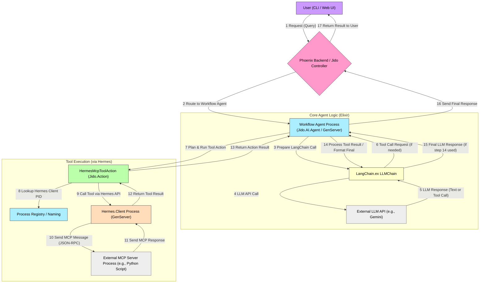
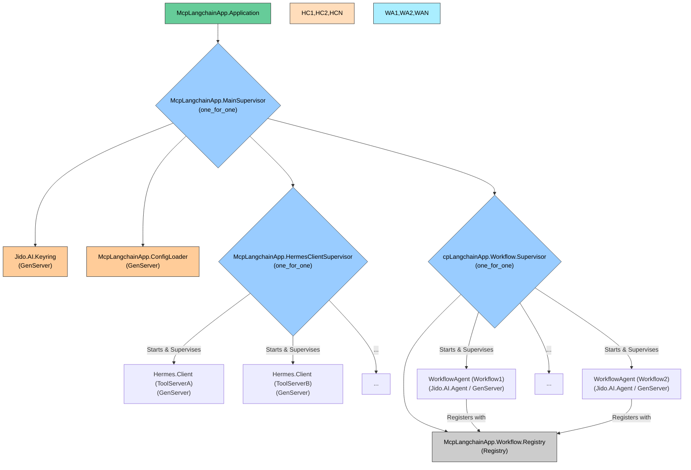
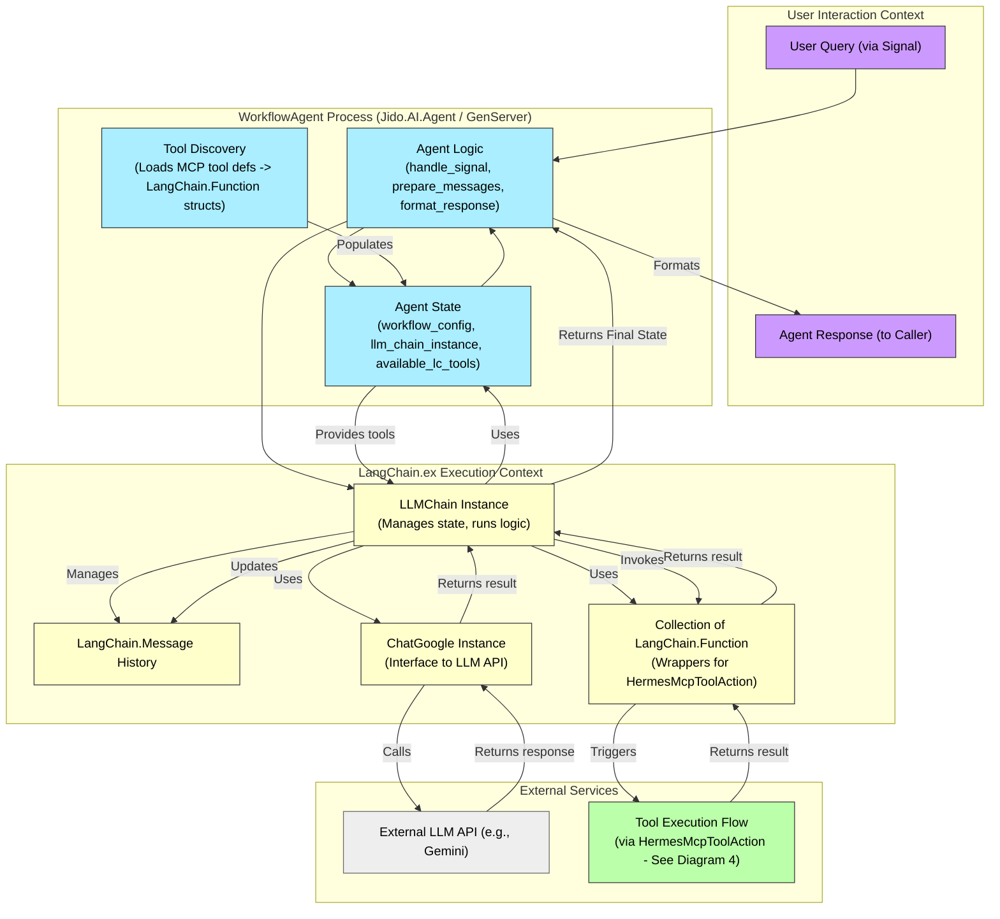
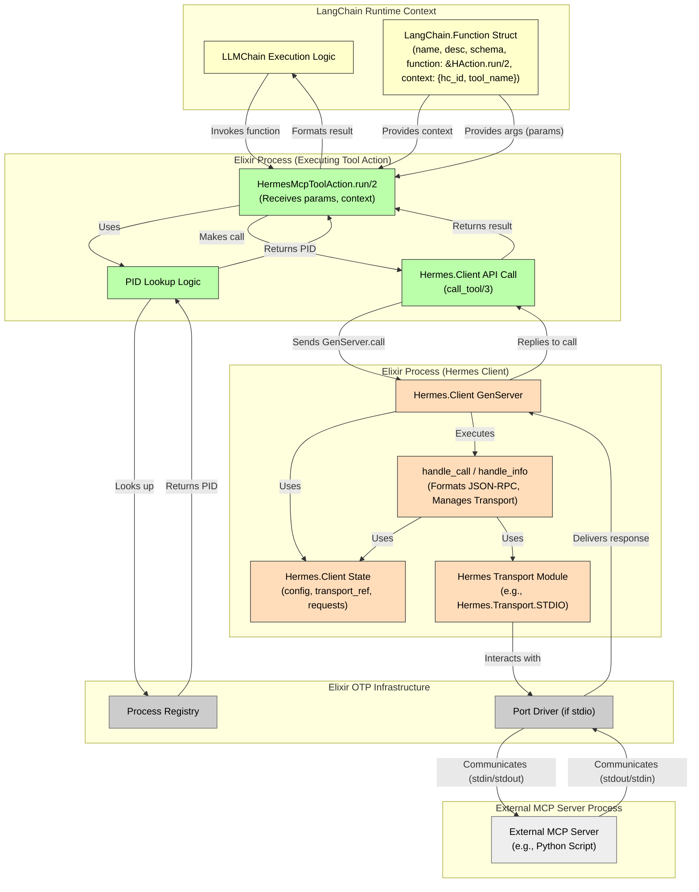

Okay, let's create a series of architectural diagrams visualizing your new vision, focusing specifically on the integrations and data flows involving **Hermes MCP**, **Jido**, **Jido.AI**, and **LangChain.ex**.

We'll start high-level and drill down into the specific interactions between these components.

---

### Diagram 1: High-Level System Overview

This diagram shows the main subsystems and their primary interactions for a user request involving both LLM reasoning and MCP tool use.

**Explanation (Level 1):**

1.  A user interacts via a CLI or Web UI, sending a request to the Phoenix backend.
2.  The backend identifies the target workflow and routes the request to the corresponding `Workflow Agent` process (a `Jido.AI.Agent`).
3.  The `Workflow Agent` prepares the interaction for the LLM using `LangChain.ex` components (`LLMChain`, `Messages`).
4.  `LLMChain` calls the external LLM API (e.g., Gemini via `ChatGoogle`).
5.  The LLM API responds, either with a direct textual answer or a request to use a tool.
6.  If a tool is requested, `LLMChain` passes this back to the `Workflow Agent` (or handles it internally depending on `mode`).
7.  The `Workflow Agent` identifies the correct `Jido.Action` (`HermesMcpToolAction`) configured for the specific MCP tool requested. It plans and executes this action.
8.  `HermesMcpToolAction` needs the PID of the `Hermes.Client` responsible for the target MCP server. It looks this up (e.g., via `Process.whereis` using a known registration name).
9.  The action calls the `Hermes.Client` API (e.g., `Hermes.Client.call_tool/3`).
10. `Hermes.Client` formats the request according to the Hermes MCP specification and sends it to the external MCP server process via the configured transport (stdio, SSE, etc.).
11. The external MCP server processes the request and sends back an MCP response.
12. `Hermes.Client` receives, parses the response, and returns the result to the `HermesMcpToolAction`.
13. The `HermesMcpToolAction` formats the result and returns it to the `Workflow Agent`.
14. The `Workflow Agent` adds the tool result to the conversation history and may send it back to the LLM via `LLMChain` for summarization or further reasoning.
15. The LLM provides a final response (if step 14 occurred).
16. The `Workflow Agent` sends the final response back to the Phoenix backend.
17. The backend returns the result to the user.

---

### Diagram 2: Elixir OTP Supervision Tree

This diagram shows how the core components are supervised within the Elixir application.

**Explanation (Level 2):**

*   The main OTP `Application` starts the `MainSupervisor`.
*   `MainSupervisor` starts and supervises critical singleton components (`Keyring`, `ConfigLoader`) and the main service supervisors (`HermesClientSupervisor`, `Workflow.Supervisor`). A `one_for_one` strategy is common here.
*   `HermesClientSupervisor` uses a `one_for_one` strategy to manage individual `Hermes.Client` processes. Each client connects to a specific external MCP server configured in `config.exs`. If one client crashes, only it is restarted.
*   `Workflow.Supervisor` uses a `one_for_one` strategy to manage the actual `WorkflowAgent` processes. It also typically starts a `Registry` for naming and discovering these agents. Each agent represents a defined workflow (e.g., from `workflows.json`).

---

### Diagram 3: Workflow Agent - LangChain.ex Integration Detail

This sequence diagram focuses on how the `WorkflowAgent` uses `LangChain.ex` to interact with the LLM and handle tool calls initiated by the LLM.

**Explanation (Level 3):**

1.  The `WorkflowAgent` receives the user query.
2.  It prepares the initial list of `LangChain.Message` structs.
3.  It retrieves the pre-configured list of `LangChain.Function` structs (`available_langchain_mcp_tools`) representing the MCP tools for this workflow. Each of these structs points to `&HermesMcpToolAction.run/2` as its execution function and contains the specific context (`hermes_client_id`, `mcp_tool_name`) needed by `run/2`.
4.  It adds the messages and tools to its `LLMChain` instance.
5.  It calls `LLMChain.run` with `mode: :while_needs_response`.
6.  `LLMChain` internally calls the `ChatModel` (e.g., `ChatGoogle`).
7.  `ChatModel` makes the actual API call to the LLM.
8.  The LLM responds, potentially requesting a tool call.
9.  `LLMChain` receives the response. If a tool is requested, it finds the matching `LangChain.Function` (`LcFunc`) from the tools added earlier.
10. `LLMChain` invokes the `.function` field of the `LangChain.Function` struct, which is `&HermesMcpToolAction.run/2`, passing the arguments extracted from the LLM response and the `context` stored in the `LangChain.Function` struct.
11. `HermesMcpToolAction.run/2` executes the actual tool call via Hermes (detailed in Diagram 4) and returns the result (`{:ok, content}` or `{:error, reason}`) back to `LLMChain`.
12. `LLMChain` formats this result as a `LangChain.Message` (tool result role) and adds it to the conversation history.
13. `LLMChain` calls the `ChatModel` again with the updated history.
14. The LLM responds with the final text answer.
15. `LLMChain` receives this final response. Since no more tools are requested, the `:while_needs_response` loop completes.
16. `LLMChain` returns the final state (`{:ok, final_chain_state}`) to the `WorkflowAgent`.
17. The `WorkflowAgent` extracts the final textual answer and sends it back to the original caller.

---

### Diagram 4: Hermes MCP Tool Execution Detail

This sequence diagram drills down into step 10/11 of Diagram 3, showing how `HermesMcpToolAction` interacts with `Hermes.Client`.

**Explanation (Level 4):**

1.  `LLMChain` invokes `HermesMcpToolAction.run/2`.
2.  The action extracts the target `hermes_client_id` (atom) and `mcp_tool_name` (string) from the context passed by `LangChain.Function`.
3.  It uses `Process.whereis/1` with the expected registration name (`{Hermes.Client, hermes_client_id}`) to find the PID of the correct `Hermes.Client` GenServer.
4.  It calls the public API function `Hermes.Client.call_tool/3`.
5.  This triggers the `handle_call` callback inside the `Hermes.Client` GenServer.
6.  The `Hermes.Client` creates a unique request ID, stores the caller (`HAction`'s process), formats the MCP JSON-RPC `call_tool` request payload according to Hermes spec.
7.  It sends the payload via the appropriate `Hermes.Transport` mechanism (e.g., `Port.command`).
8.  The transport delivers the message to the external MCP server process.
9.  The external MCP server executes the tool and sends back a standard MCP JSON-RPC response.
10. The transport delivers the response back to the `Hermes.Client` process (e.g., via `handle_info` for a Port).
11. `Hermes.Client` parses the response, matches it to the original request using the ID, and extracts the result or error.
12. `Hermes.Client` replies to the original `GenServer.call` from `HAction` with a structured `Hermes.MCP.Response` or error tuple.
13. `HAction` receives the reply.
14. It formats the result into the `{:ok, content}` or `{:error, reason}` format expected by LangChain.ex's `Function` execution logic.
15. It returns this formatted result to the `LLMChain` runtime.

---

These diagrams illustrate the flow of control and data, emphasizing how Jido, Jido.AI, LangChain.ex, and Hermes MCP integrate within an Elixir/OTP architecture to create your advanced AI assistant.
