Okay, let's break down the `fast-agent` software design through a series of Mermaid diagrams, starting from a high level and drilling down.

## Diagram Series: Fast-Agent Software Design

### 1. Level 1: High-Level System Architecture

This diagram shows the major components of the Fast-Agent ecosystem and how they relate to each other and external services.

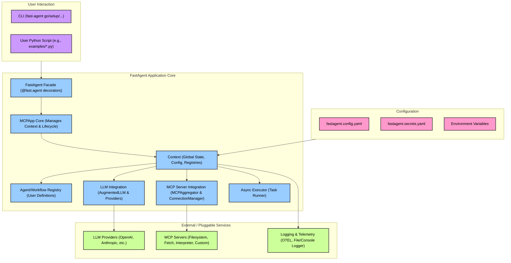

**Explanation (Level 1):**

*   **User Interaction**: Users interact with the system either via the CLI or by writing Python scripts that utilize the `FastAgent` framework.
*   **FastAgent Application Core**: This is the heart of the system.
    *   `FastAgent Facade`: The primary interface for developers (e.g., using `@fast.agent` decorators).
    *   `MCPApp Core`: Manages the application lifecycle and the central `Context`.
    *   `Context`: Holds global state like configuration, server/task registries, and the executor.
    *   `Agent/Workflow Registry`: Stores definitions of agents and workflows provided by the user.
    *   `LLM Integration`: Handles communication with various LLM providers through an `AugmentedLLM` abstraction.
    *   `MCP Server Integration`: Manages connections and interactions with MCP (Model Context Protocol) servers.
    *   `Async Executor`: Responsible for running asynchronous tasks.
*   **Configuration**: The system's behavior is configured through YAML files (`fastagent.config.yaml` for general settings, `fastagent.secrets.yaml` for sensitive data) and environment variables.
*   **External / Pluggable Services**:
    *   `LLM Providers`: External services like OpenAI, Anthropic, etc., that provide language model capabilities.
    *   `MCP Servers`: These can be external services or locally run processes (like the Python interpreter or filesystem server examples) that expose tools, resources, or prompts via MCP.
    *   `Logging & Telemetry`: Systems for logging application events and (optionally) collecting telemetry data (e.g., OpenTelemetry).

### 2. Level 2: FastAgent Application Core - Internal Structure

This diagram drills into the `FastAgent Application Core`, showing how its main internal components are structured and interact.

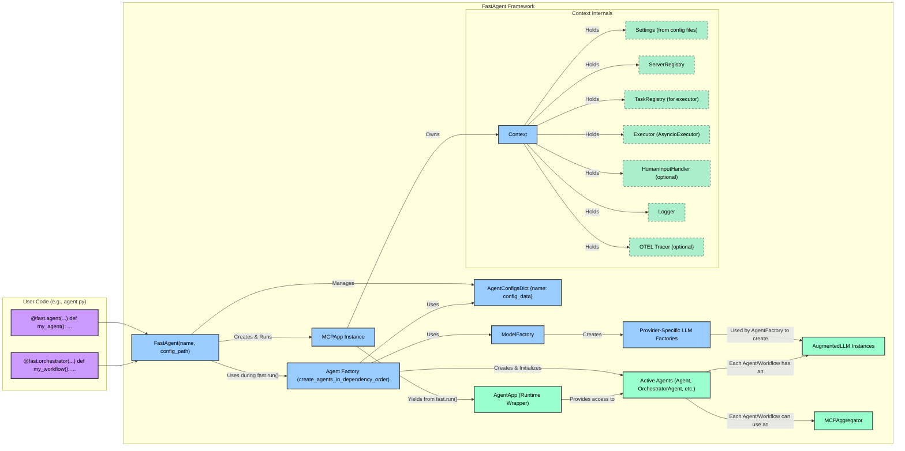

**Explanation (Level 2):**

*   **User Code**: Developers define agents and workflows using decorators (`@fast.agent`, `@fast.orchestrator`, etc.) on functions.
*   **FastAgent Framework**:
    *   The `FastAgent` instance acts as a facade. It collects configurations from these decorators into an `AgentConfigsDict`.
    *   When `fast.run()` is called, it creates an `MCPApp Instance`.
    *   The `MCPApp` owns the central `Context`, which holds:
        *   `Settings`: Parsed configuration from YAML files and environment variables.
        *   `ServerRegistry`: Manages configurations and connections for MCP servers.
        *   `TaskRegistry`: Used by the `Executor`.
        *   `Executor`: Handles asynchronous task execution.
        *   Optional `HumanInputHandler`, `Logger`, and `OTEL Tracer`.
    *   The `Agent Factory` (`create_agents_in_dependency_order`) is responsible for instantiating the actual agent objects.
        *   It uses the `AgentConfigsDict` and a `ModelFactory`.
        *   `ModelFactory` provides factories for creating specific `AugmentedLLM` instances (e.g., for OpenAI, Anthropic) based on model strings.
        *   The factory creates `ActiveAgents` (concrete instances of `Agent`, `OrchestratorAgent`, etc.), attaches the appropriate `LLMInstances` to them, and initializes them (which often involves connecting to MCP servers via an `MCPAggregator`).
    *   Finally, `fast.run()` yields an `AgentApp` instance, which is a runtime wrapper providing easy access to the `ActiveAgents`.

### 3. Level 3: Agent Definition and Initialization Flow (`fast.run()`)

This sequence diagram details the process from agent definition by the user to the point where agents are initialized and ready for interaction within the `fast.run()` context.

```mermaid
sequenceDiagram
    participant User
    participant FastAgentDecorator["@fast.agent / @fast.orchestrator etc."]
    participant FastAgent
    participant MCPApp
    participant ContextModule["context.py"]
    participant AgentFactoryModule["agent_factory.py"]
    participant AgentClasses["Agent / WorkflowAgent Classes"]
    participant LLMClasses["AugmentedLLM & ProviderLLM Classes"]
    participant MCPAggregator
    participant MCPConnManager["MCPConnectionManager"]
    participant ServerRegistryMod["mcp_server_registry.py"]

    User->>FastAgentDecorator: Defines agent `my_agent` (e.g., `@fast.agent("my_agent", ...)`)
    FastAgentDecorator->>FastAgent: Stores `my_agent` config in `FastAgent.agents` dictionary

    User->>FastAgent: Calls `async with fast.run() as app_runtime:`
    FastAgent->>MCPApp: Creates `MCPApp` instance
    FastAgent->>MCPApp: `await app.initialize()`
    MCPApp->>ContextModule: `await initialize_context(config_path_or_settings)`
    ContextModule->>ContextModule: Loads `Settings` (from YAML, secrets, env)
    ContextModule->>ContextModule: Configures Logger, OTEL (optional)
    ContextModule->>ContextModule: Creates `Executor`
    ContextModule->>ServerRegistryMod: Creates `ServerRegistry`
    ContextModule-->>MCPApp: Returns initialized `Context` object
    MCPApp-->>FastAgent: `MCPApp` and `Context` initialized

    FastAgent->>AgentFactoryModule: `await create_agents_in_dependency_order(mcp_app, FastAgent.agents, model_factory_fn)`
    AgentFactoryModule->>AgentFactoryModule: Determines agent initialization order based on dependencies
    loop For each agent_config in dependency order
        AgentFactoryModule->>AgentFactoryModule: `create_agents_by_type(...)` for current agent (e.g., `my_agent`)
        AgentFactoryModule->>ModelFactory: `get_model_factory(agent_config.model)` (from `llm.model_factory.py`)
        ModelFactory-->>AgentFactoryModule: Returns `llm_factory_function` (e.g., for OpenAI)
        
        AgentFactoryModule->>AgentClasses: Instantiates `Agent("my_agent", agent_config, context)` (or specific workflow agent class)
        AgentClasses-->>AgentFactoryModule: `my_agent_instance`
        
        AgentFactoryModule->>AgentClasses: `await my_agent_instance.attach_llm(llm_factory_function, agent_config.default_request_params)`
        AgentClasses->>LLMClasses: `llm_factory_function` creates `AugmentedLLM` instance (e.g., `OpenAIAugmentedLLM`)
        LLMClasses-->>AgentClasses: `llm_instance`
        AgentClasses-->>AgentFactoryModule: `llm_instance` attached to `my_agent_instance`
        
        AgentFactoryModule->>AgentClasses: `await my_agent_instance.initialize()` (calls `__aenter__` on `BaseAgent`/`MCPAggregator`)
        AgentClasses->>MCPAggregator: `await self.load_servers()` (if not already initialized by another agent via context)
        MCPAggregator->>ServerRegistryMod: Gets server configurations from `Context.server_registry`
        opt Persistent MCP Connections (self.connection_persistence is True)
            MCPAggregator->>MCPConnManager: `await self._persistent_connection_manager.get_server(server_name)`
            MCPConnManager->>MCPConnManager: Launches server process task if new (e.g., stdio server)
            MCPConnManager->>ServerRegistryMod: Uses `transport_context_factory` (stdio_client, sse_client)
            MCPConnManager-->>MCPAggregator: `ServerConnection` (with `ClientSession`)
        end
        MCPAggregator->>MCPAggregator: Fetches tools/prompts from all connected servers (via `ClientSession.list_tools()`, etc.)
        MCPAggregator-->>AgentClasses: Servers loaded and tools/prompts indexed
        AgentClasses-->>AgentFactoryModule: `my_agent_instance` fully initialized
    end
    AgentFactoryModule-->>FastAgent: Returns `active_agents` (dictionary of initialized agent instances)
    FastAgent->>AgentAppRuntime: Creates `AgentApp(active_agents)` runtime wrapper
    FastAgent-->>User: Yields `app_runtime` (AgentApp instance)

    User->>AgentAppRuntime: Interacts with agents (e.g., `app_runtime.my_agent.send()`)

    Note right of User: When `fast.run()` context exits (end of `async with` block)
    FastAgent->>MCPApp: `await app.cleanup()`
    MCPApp->>ContextModule: `await cleanup_context()` (e.g., shuts down logger)
    loop For each agent in `active_agents`
        FastAgent->>AgentClasses: `await agent.shutdown()` (calls `__aexit__` on `BaseAgent`/`MCPAggregator`)
        AgentClasses->>MCPAggregator: `await self.close()`
        opt Persistent MCP Connections
            MCPAggregator->>MCPConnManager: `await self._persistent_connection_manager.disconnect_all()`
        end
    end
```

## Simplified:

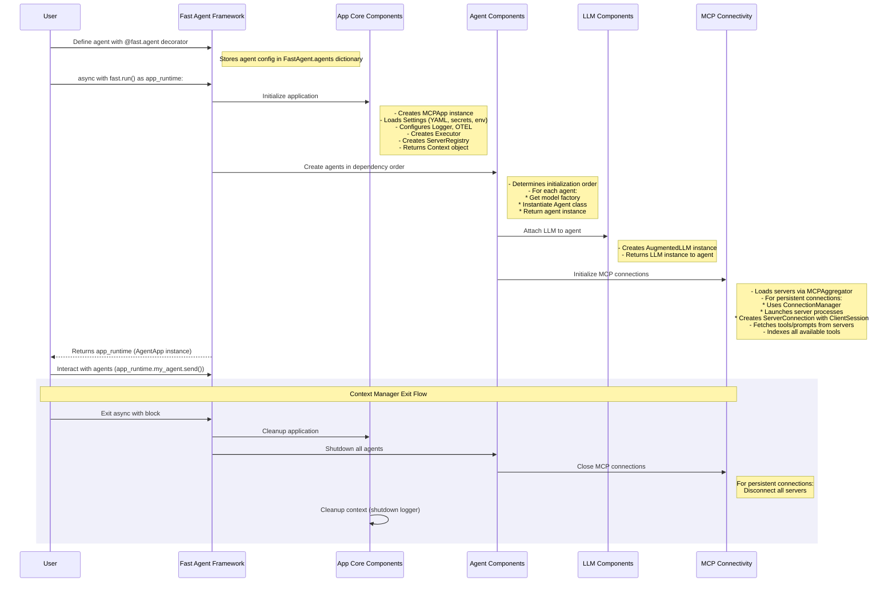

**Explanation (Level 3):**

1.  **Agent Definition**: The user defines an agent (e.g., `my_agent`) using a decorator like `@fast.agent`. The decorator captures the agent's configuration (name, instruction, model, servers it uses) and stores it in the `FastAgent` instance's internal registry (`FastAgent.agents`).
2.  **`fast.run()` Invocation**: The user calls `async with fast.run() as app_runtime:`.
3.  **MCPApp Initialization**:
    *   The `FastAgent` creates an `MCPApp` instance.
    *   `MCPApp.initialize()` is called, which in turn calls `context.initialize_context()`.
    *   `initialize_context` loads settings from configuration files (`fastagent.config.yaml`, `fastagent.secrets.yaml`, environment variables) into a `Settings` object. It then creates and populates the `Context` object with these settings, and initializes logging, OpenTelemetry (if enabled), the `Executor`, and the `ServerRegistry` (which knows about MCP server configurations).
4.  **Agent Instantiation (`create_agents_in_dependency_order`)**:
    *   The `FastAgent` calls the agent factory module.
    *   The factory determines the correct order to initialize agents if there are dependencies between them (e.g., an orchestrator depends on its worker agents).
    *   For each agent configuration:
        *   It gets an LLM factory function from `ModelFactory` based on the `agent_config.model` string (e.g., `"openai.gpt-4.1"` or `"anthropic.claude-3-haiku"`).
        *   It instantiates the appropriate `Agent` class (e.g., `Agent`, `OrchestratorAgent`).
        *   It calls `agent.attach_llm()`, which uses the LLM factory to create a specific `AugmentedLLM` instance (e.g., `OpenAIAugmentedLLM`) and attaches it to the agent.
        *   It calls `await agent.initialize()`. This is crucial:
            *   The `Agent`'s `initialize` (often via `BaseAgent.__aenter__`) calls `MCPAggregator.load_servers()`.
            *   `MCPAggregator` (if it hasn't already loaded servers for this context) iterates through its configured `server_names`.
            *   For each server, if `connection_persistence` is true, it uses the `MCPConnectionManager` to get or establish a connection. The `MCPConnectionManager` might launch local MCP server processes (like `stdio_client` for an interpreter) and manages the `ClientSession`.
            *   The `MCPAggregator` then uses these sessions to `list_tools` and `list_prompts` from each server, building an internal index.
5.  **Runtime `AgentApp` Yielded**:
    *   Once all agents are instantiated and initialized, the factory returns a dictionary of these `active_agents`.
    *   `FastAgent` wraps these active agents in an `AgentApp` instance.
    *   This `AgentApp` instance (`app_runtime`) is yielded to the user's `async with` block.
6.  **User Interaction**: The user can now interact with the agents via `app_runtime.agent_name.send()`, etc.
7.  **Shutdown**: When the `async with` block exits:
    *   `MCPApp.cleanup()` is called (e.g., shuts down logging).
    *   Each active agent's `shutdown()` method is called. This typically involves the `MCPAggregator.close()`, which, if using persistent connections, tells the `MCPConnectionManager` to disconnect from servers and terminate any managed processes.

### 4. Level 4: Agent Interaction - A Single Agent Call Data Flow (e.g., `agent.send()`)

This diagram shows the data flow when a user makes a simple call to an agent, including potential tool usage.

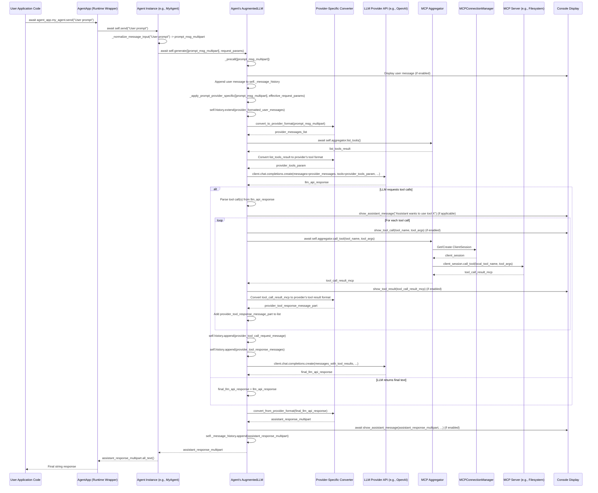

### Simplified:

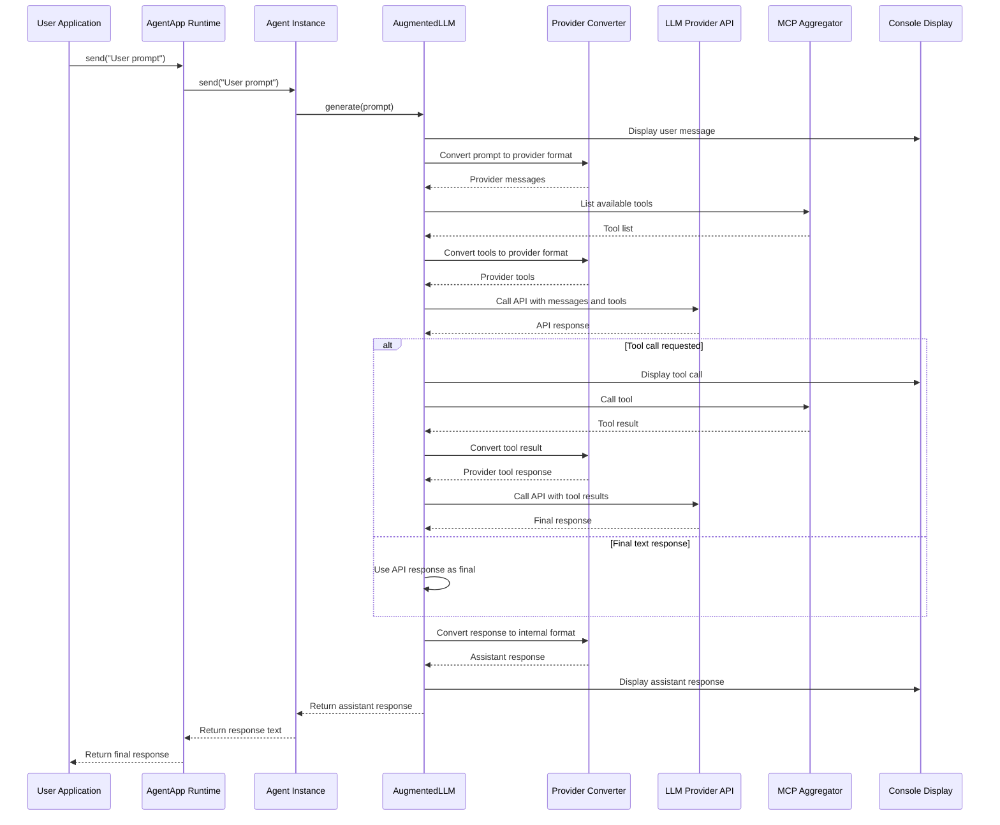

**Explanation (Level 4):**

1.  **User Call**: The user's application code calls a method like `send()` on an agent accessed through the `AgentApp` runtime wrapper.
2.  **Agent Processing**: The `Agent` instance normalizes the input to `PromptMessageMultipart`. It then calls `generate()` on its `AugmentedLLM` instance.
3.  **AugmentedLLM Pre-call**: The `AugmentedLLM` performs pre-call actions:
    *   Displays the user's message to the console (if enabled).
    *   Adds the user's message to its internal `_message_history` (the generic, framework-level history).
4.  **Provider-Specific Logic (`_apply_prompt_provider_specific`)**: This is where the specific LLM provider's logic (e.g., in `OpenAIAugmentedLLM` or `AnthropicAugmentedLLM`) takes over.
    *   **History Management**: The provider-specific LLM extends its own internal history (`self.history`), which often stores messages in the provider's native format.
    *   **Message Conversion**: Incoming `PromptMessageMultipart` objects are converted to the LLM provider's specific message format (e.g., OpenAI's list of message dictionaries) using a `ProviderConverter`.
    *   **Tool Listing**: The `MCPAggregator.list_tools()` is called to get all available tools. These are also converted to the provider's tool format.
    *   **LLM API Call**: An API call is made to the external LLM provider with the formatted messages and tools.
5.  **Tool Handling Loop (if LLM requests tools)**:
    *   If the LLM's response indicates a tool call is needed:
        *   The `AugmentedLLM` parses these requests.
        *   It displays the assistant's intention to call a tool (if enabled).
        *   For each requested tool:
            *   It displays the tool call details (if enabled).
            *   It calls `MCPAggregator.call_tool()`. The aggregator resolves the (potentially namespaced) tool name to the correct MCP server and local tool name.
            *   The `MCPAggregator` uses the `MCPConnectionManager` (for persistent connections) or `gen_client` (for temporary ones) to get a `ClientSession` to the target MCP Server.
            *   The `ClientSession` executes the tool call on the `MCPServer`.
            *   The `MCPServer` returns the `tool_call_result`.
            *   The `AugmentedLLM` displays this result (if enabled).
            *   The result is converted back into the LLM provider's format for a tool response message.
            *   This tool response is added to the provider-specific history.
        *   The `AugmentedLLM` makes another API call to the LLM provider, now including the tool call results. This loop can continue for multiple tool calls up to `max_iterations`.
6.  **Final LLM Response**: Once the LLM provides a final text response (not a tool call):
    *   This provider-specific response is converted back to a `PromptMessageMultipart` (`assistant_response_multipart`).
    *   The assistant's response is displayed (if enabled).
    *   The `assistant_response_multipart` is added to the generic `_message_history`.
7.  **Return**: The `assistant_response_multipart` is returned up the call stack, eventually becoming a string response for the user.

### 5. Level 5: Orchestrator Agent Workflow

This diagram illustrates how an `OrchestratorAgent` processes a task, plans, delegates to child agents, and synthesizes results.

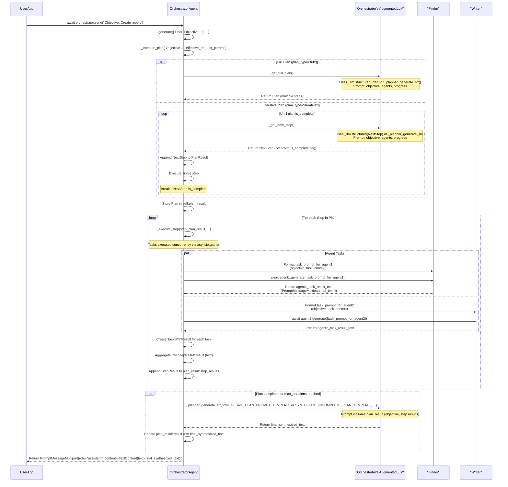

### Simplified:

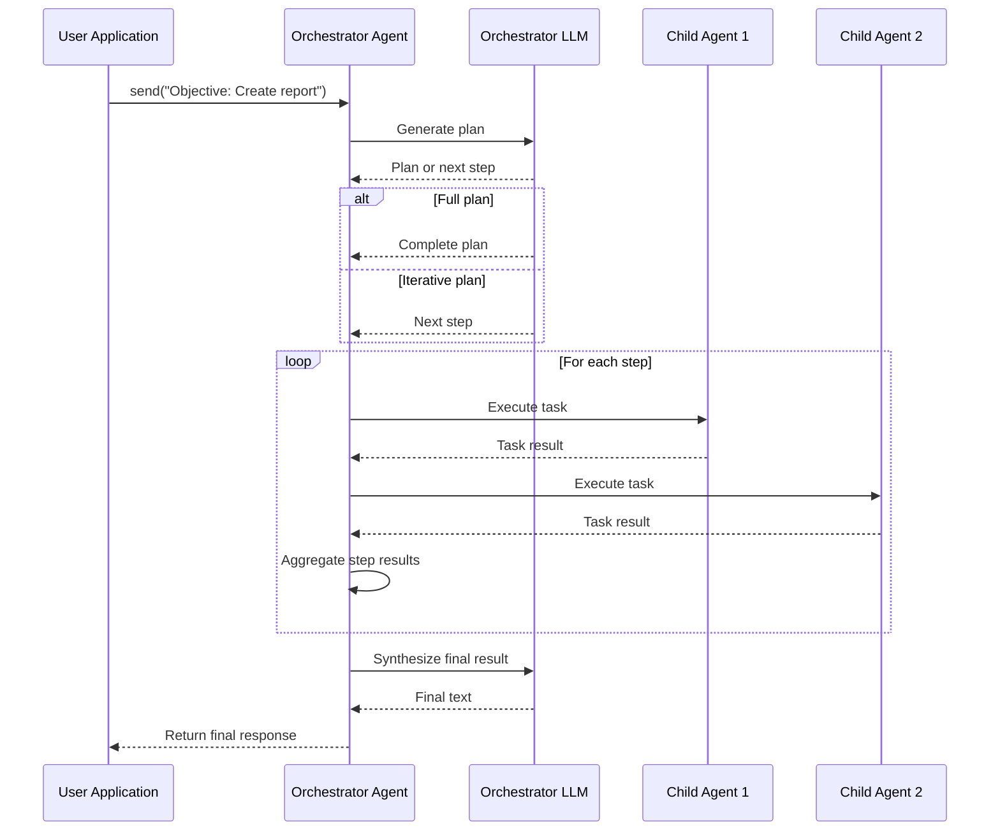

### Simplified more:

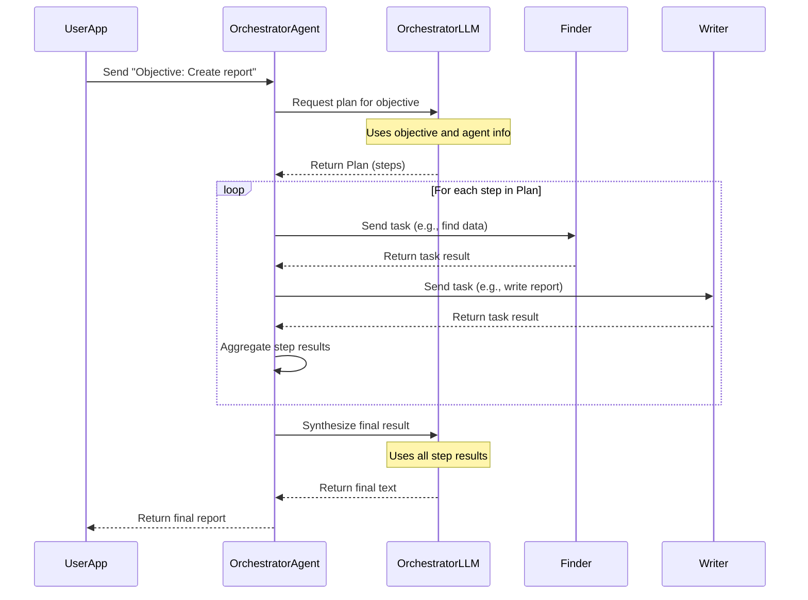

### Somewhat simplified:

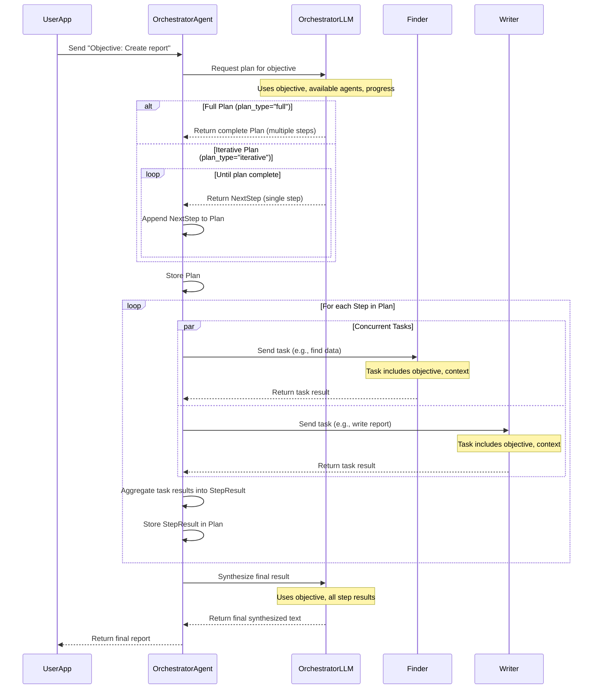

**Explanation (Level 5):**

1.  **User Request**: The user sends an objective to the `OrchestratorAgent`.
2.  **Plan Execution Start**: The `OrchestratorAgent.generate()` method calls `_execute_plan()`.
3.  **Planning Phase**:
    *   **Full Plan**: If `plan_type` is "full", `_get_full_plan()` is called. This method itself uses the orchestrator's LLM (via `_llm.structured(Plan)` or `_planner_generate_str` if structured parsing fails) to generate a complete multi-step `Plan`. The prompt to the LLM includes the main objective, descriptions of available child agents, and any progress so far.
    *   **Iterative Plan**: If `plan_type` is "iterative", the orchestrator enters a loop. In each iteration, `_get_next_step()` is called, which again uses the orchestrator's LLM to generate just the single `NextStep`. This step is then executed. The loop continues until the `NextStep` indicates the plan is complete or `max_iterations` is reached.
4.  **Step Execution (`_execute_step`)**:
    *   For each `Step` in the generated plan (or the single `NextStep` in iterative mode):
        *   The tasks within that `Step` are executed concurrently using `asyncio.gather`.
        *   For each `AgentTask`:
            *   The orchestrator constructs a detailed prompt for the designated child agent. This prompt includes the overall objective, the specific task description for that agent, and context from previously executed steps (formatted from `PlanResult`).
            *   It calls `child_agent.generate()` with this prompt.
            *   The child agent processes its task (which might involve its own LLM calls or tool uses) and returns a result text.
        *   The results from all tasks in the step are collected into `TaskWithResult` objects and added to a `StepResult`.
        *   The `StepResult` itself might have its `result` field (a textual summary of the step) populated (though current implementation seems to rely more on the final synthesis).
        *   This `StepResult` is appended to the main `PlanResult`.
5.  **Final Synthesis**:
    *   Once the plan is marked as complete (either by a full plan or the last iterative step) or `max_iterations` is reached:
        *   The `OrchestratorAgent` calls its own LLM one last time using `_planner_generate_str()`.
        *   The prompt for this synthesis step (e.g., `SYNTHESIZE_PLAN_PROMPT_TEMPLATE`) includes the entire `PlanResult` (objective, all step descriptions, and all task results).
        *   The LLM generates a final, cohesive response based on all the work done. If `max_iterations` was reached without completion, a different template (`SYNTHESIZE_INCOMPLETE_PLAN_TEMPLATE`) is used to frame the response.
6.  **Return to User**: The `final_synthesized_text` is wrapped in a `PromptMessageMultipart` and returned, which `send()` then typically converts to a plain string for the user.

### 6. Level 6: MCP Server Interaction (Focus on `MCPAggregator.call_tool()`)

This diagram details how an `MCPAggregator` (used by an `Agent`) interacts with an MCP Server to execute a tool.

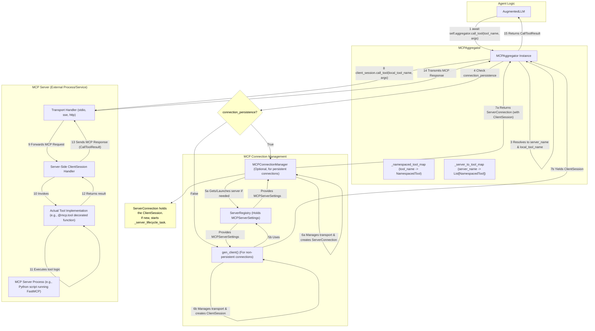

**Explanation (Level 6):**

1.  **Agent Request**: The `AugmentedLLM` (on behalf of an agent) decides to call a tool and invokes `self.aggregator.call_tool(tool_name, args)`.
2.  **Tool Resolution**: The `MCPAggregator` uses its internal maps (`_namespaced_tool_map`, `_server_to_tool_map`) via `_parse_resource_name` to determine which `server_name` hosts the `tool_name` and what the `local_tool_name` is on that server.
3.  **Connection Handling**:
    *   **Persistent**: If `connection_persistence` is true, the aggregator uses its `MCPConnectionManager`.
        *   `get_server()` is called. If a healthy connection to `server_name` doesn't exist, the manager launches/connects to it.
        *   Launching involves using `ServerRegistry` to get `MCPServerSettings` (command, transport type, URL, etc.).
        *   The `MCPConnectionManager` uses the appropriate transport client (e.g., `stdio_client`, `sse_client`) to establish communication streams and creates a `ServerConnection` object, which holds the `ClientSession`. A background task (`_server_lifecycle_task`) manages this connection.
        *   The `ClientSession` is returned.
    *   **Non-Persistent**: If `connection_persistence` is false (or `gen_client` is used directly), a temporary connection is established.
        *   `gen_client` also uses `ServerRegistry` and the transport clients.
        *   It yields an active `ClientSession` for the duration of the `async with` block.
4.  **Tool Invocation**: The `MCPAggregator` uses the obtained `ClientSession` to call `client_session.call_tool(local_tool_name, args)`. This sends an MCP `tools/call` request over the established transport to the `MCPServer`.
5.  **Server-Side Execution**:
    *   The `MCPServer`'s transport handler (e.g., stdio, SSE listener) receives the request.
    *   It passes the MCP message to its server-side `ClientSession` handler.
    *   The server-side session identifies the tool request and invokes the actual tool implementation function (the one decorated with `@mcp.tool` in the server's code).
    *   The tool function executes and returns its result.
6.  **Response**:
    *   The server-side session handler packages the tool's result into an MCP `CallToolResult` response.
    *   This response is sent back over the transport to the `MCPAggregator`'s `ClientSession`.
7.  **Return to Agent**: The `MCPAggregator` receives the `CallToolResult` and returns it to the `AugmentedLLM`.

### 7. Configuration Data Flow (Overview)

This diagram shows how configuration is loaded and utilized by different parts of the application.

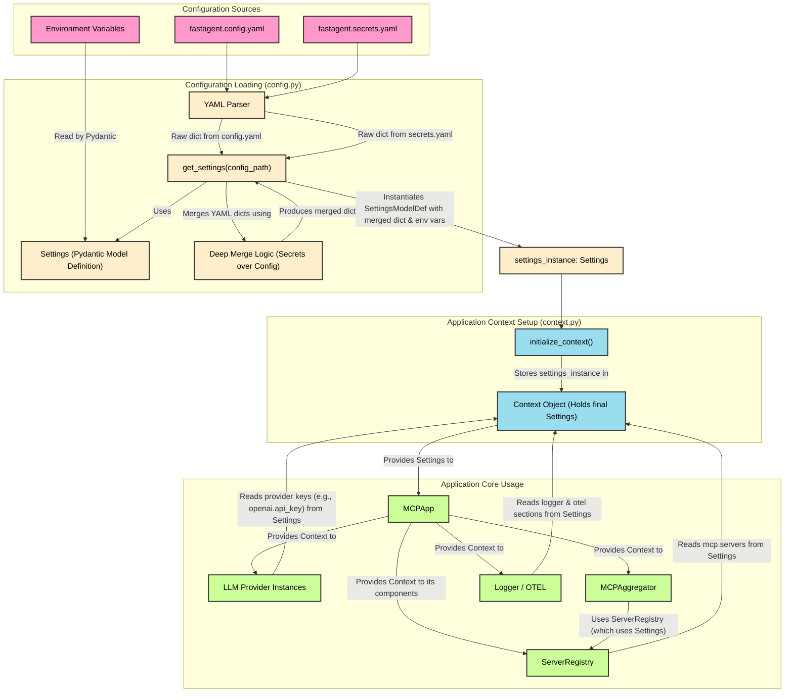

**Explanation (Configuration Data Flow):**

1.  **Sources**: Configuration comes from `fastagent.config.yaml` (general settings), `fastagent.secrets.yaml` (API keys, sensitive data), and environment variables.
2.  **Loading (`config.py:get_settings`)**:
    *   The `get_settings` function is the main entry point for loading configuration.
    *   It uses a `YAMLParser` to read `fastagent.config.yaml` and `fastagent.secrets.yaml`.
    *   `DeepMerge` logic combines these, with `secrets.yaml` values overriding those in `config.yaml` for the same keys.
    *   The `Settings` Pydantic model definition (which also specifies environment variable mappings like `FASTAGENT_OPENAI__API_KEY` for `openai.api_key`) is instantiated with this merged dictionary. Pydantic handles parsing, validation, and incorporating environment variables (which typically have the highest precedence over file-based settings for a given field if both are present, though `get_settings`'s manual merge gives file secrets precedence).
3.  **Context Setup (`context.py:initialize_context`)**:
    *   `initialize_context` takes the loaded `Settings` instance.
    *   It creates a `Context` object and stores the `settings_instance` within it.
4.  **Application Core Usage**:
    *   The `MCPApp` instance holds this `Context`.
    *   Various core components access the `Settings` object via the `Context`:
        *   `ServerRegistry` reads the `mcp.servers` section to know about available MCP servers.
        *   LLM Provider instances (e.g., `OpenAIAugmentedLLM`) read their specific sections (e.g., `openai.api_key`, `anthropic.base_url`) for API keys and other configurations.
        *   `MCPAggregator` uses the `ServerRegistry` to interact with configured MCP servers.
        *   The `Logger` and OpenTelemetry setup read the `logger` and `otel` sections respectively.

This series of diagrams should provide a comprehensive overview of the `fast-agent` software architecture and its key data flows and operational sequences.Okay, this is a comprehensive task! Based on the provided files, here's a series of Mermaid diagrams describing the `fast-agent` software architecture and data flows, starting from a high level and drilling down.
