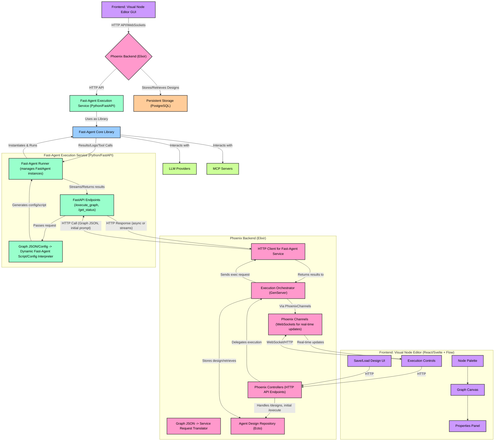
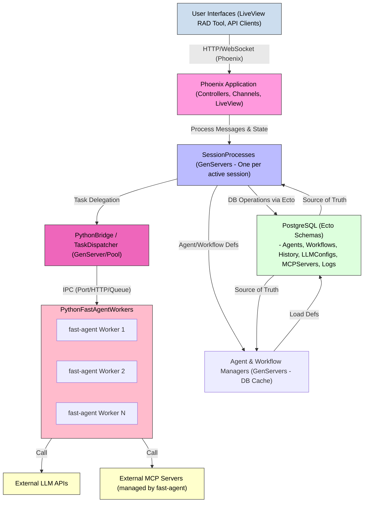

Okay, let's map out how a fully-featured visual agent builder using `fast-agent` as its core library would look if the **backend were built with Elixir/Phoenix** instead of Python/FastAPI. The frontend (React/Svelte + Flow library) would largely remain the same in its core visual components, but its API interactions would target the Phoenix backend.

The key challenge and architectural shift is how the Elixir/Phoenix backend will interact with the Python-based `fast-agent` library.

**Recommendation for Elixir-Python Interaction:**

Directly embedding a Python runtime within an Elixir/Phoenix application for complex libraries like `fast-agent` (with its `asyncio` event loop and dependencies) is non-trivial and can lead to performance/stability issues. The most robust and scalable approaches are:

1.  **Python as a Separate Service (Microservice):**
    *   The `fast-agent` execution engine runs as a separate Python service (or multiple instances for scalability).
    *   The Phoenix backend communicates with this Python service via:
        *   **HTTP API:** The Python service exposes an API (e.g., using FastAPI) that the Phoenix backend calls.
        *   **Message Queue:** (e.g., RabbitMQ, Kafka) for asynchronous task delegation and result retrieval.
        *   **gRPC:** For efficient, typed inter-process communication.
    *   **This is the generally recommended approach for production systems** due to better separation of concerns, independent scaling, and fault isolation.

2.  **ErlPort / Pyrlang / similar:**
    *   Libraries that allow Elixir/Erlang to call Python functions directly.
    *   Can be more complex to manage dependencies, Python's GIL, and `asyncio` event loops from Elixir.
    *   Might be suitable if the interaction is very tight and performance for small, frequent calls is critical, but generally adds more operational complexity for a library as substantial as `fast-agent`.

For a "fully featured system," **Python as a Separate Service via an HTTP API (using FastAPI on the Python side) is the most practical and maintainable recommendation.**

## System Design: Visual Fast-Agent Builder (Phoenix Backend)



**Detailed Components & Data Flow (Phoenix Backend):**

1.  **Frontend (Visual Node Editor):**
    *   Largely the same as the Python backend version (React/Svelte + React Flow/Svelte Flow).
    *   **API Interaction:** Instead of hitting a Python API, it communicates with the Phoenix backend via:
        *   **HTTP API:** For CRUD operations on designs, fetching MCP server/LLM model lists, and initiating executions.
        *   **Phoenix Channels (WebSockets):** For real-time streaming of execution output, logs, status updates, and potentially collaborative editing features.

2.  **Phoenix Backend (Elixir):**
    *   **Phoenix Controllers:** Handle standard HTTP requests for:
        *   `/designs`: CRUD for agent designs (graph JSON).
        *   `/execute`: Initiates an agent execution.
        *   `/config/mcp_servers`: Lists available MCP servers (sourced from its own config or DB).
        *   `/config/llm_models`: Lists available LLM models.
    *   **Phoenix Channels:**
        *   Manages WebSocket connections with the frontend.
        *   Used for streaming execution logs, intermediate results, and status updates from the `ExecutionOrchestrator`.
        *   Can receive "stop" commands from the frontend to terminate an ongoing execution.
    *   **Agent Design Repository (Ecto):**
        *   Uses Ecto to interact with a persistent database (e.g., PostgreSQL).
        *   Stores, retrieves, and manages user-created agent designs (the graph JSON, metadata).
    *   **Graph JSON -> Service Request Translator (`GraphTranslatorBE`):**
        *   When an execution is triggered, this component takes the graph JSON.
        *   It might do some initial validation or transformation if needed, but primarily it prepares the graph JSON and initial prompt to be sent to the `Fast-Agent Execution Service`.
    *   **Execution Orchestrator (`ExecutionOrchestrator` - GenServer):**
        *   A GenServer (or a pool of them) responsible for managing the lifecycle of an agent execution.
        *   Receives an execution request (graph JSON, initial prompt, user ID) from a Controller.
        *   Makes an HTTP request to the `Fast-Agent Execution Service` via `PythonServiceClient`.
        *   Handles the asynchronous response from the Python service (which might be a stream or a long-polling mechanism if the execution is lengthy).
        *   Forwards progress, logs, and final results to the appropriate Phoenix Channel for the user.
        *   Manages timeouts and cancellation signals (relaying them to the Python service).
    *   **Python Service Client (`PythonServiceClient` - e.g., using HTTPoison or Tesla):**
        *   An Elixir module responsible for making HTTP calls to the `Fast-Agent Execution Service`.

3.  **Fast-Agent Execution Service (Python/FastAPI):**
    *   **This is a separate, standalone Python service.** It can be scaled independently.
    *   **FastAPI Endpoints:**
        *   `/execute_graph (POST)`:
            *   Receives: Graph JSON, initial user prompt, execution ID (from Phoenix), potentially dynamic config overrides (LLM model, server details).
            *   Triggers the `GraphInterpreterPy`.
            *   Returns an execution ID and streams results back, or uses a callback URL, or long polling.
        *   `/get_status/{execution_id} (GET)`: For polling status if not using streaming.
        *   `/cancel_execution/{execution_id} (POST)`: To stop an ongoing execution.
    *   **Graph JSON/Config -> Dynamic Fast-Agent Script/Config Interpreter (`GraphInterpreterPy`):**
        *   Similar to the Python-backend version, this component takes the graph JSON.
        *   It dynamically generates a Python script string that defines the `fast-agent` agents and workflows.
        *   Alternatively, if `fast-agent` evolves to support direct configuration loading without decorators, this component could generate that configuration object.
    *   **Fast-Agent Runner (`FastAgentRunnerPy`):**
        *   Manages a pool of `FastAgent` instances or creates them on-demand.
        *   Takes the generated script/config from `GraphInterpreterPy`.
        *   Sets up the necessary `fastagent.config.yaml` for the Python environment (API keys might be passed securely or read from env vars accessible to this service). It could dynamically write a temporary config file for each run based on parameters from the Phoenix backend.
        *   Executes the `fast-agent` logic:
            ```python
            # In FastAgentRunnerPy
            # ...
            # fast_instance = FastAgent(name=f"exec_{execution_id}", config_path=temp_config_file)
            # exec(generated_python_script_string, {'fast': fast_instance}) # To define agents on fast_instance
            # async with fast_instance.run() as app_runtime:
            #     result = await app_runtime.entry_point_agent.send(initial_prompt)
            #     # Stream result back or store it for polling
            ```
        *   Crucially, this runner needs to capture logs, stdout/stderr, and intermediate results from `fast-agent` to stream them back to the Phoenix backend (via the FastAPI response).

4.  **`fast-agent` Core Library (Python):**
    *   Used as a library within the `Fast-Agent Execution Service`. Its internal workings are the same as previously described.

5.  **LLM Providers & MCP Servers:**
    *   Accessed by the `Fast-Agent Core Library` within the Python service.

6.  **Persistent Storage (e.g., PostgreSQL):**
    *   Managed by the Phoenix backend using Ecto. Stores agent designs, user data, etc.

**Execution Flow Example (Phoenix Backend):**

1.  Frontend sends graph JSON and initial prompt to a Phoenix Controller via HTTP POST to `/execute`.
2.  Phoenix Controller validates the request and hands it off to an `ExecutionOrchestrator` GenServer, perhaps creating a new one or using a pool. The GenServer gets a unique execution ID.
3.  `ExecutionOrchestrator` calls the `PythonServiceClient`.
4.  `PythonServiceClient` makes an HTTP POST request to the `Fast-Agent Execution Service`'s `/execute_graph` endpoint, sending the graph JSON, initial prompt, and the execution ID.
5.  **Inside Fast-Agent Execution Service (Python/FastAPI):**
    a.  The `/execute_graph` endpoint receives the request.
    b.  `GraphInterpreterPy` generates the `fast-agent` Python script.
    c.  `FastAgentRunnerPy` sets up a `FastAgent` instance (potentially with a dynamically generated config file based on parameters), executes the script, and runs the main agent/workflow: `async with fast.run() ... await app_runtime.entry_agent.send(...)`.
    d.  As `fast-agent` runs, the runner captures logs and intermediate outputs.
    e.  It streams these outputs back to the `PythonServiceClient` (e.g., using HTTP streaming response, or by writing to a shared pub/sub system that the `PythonServiceClient` can also subscribe to). The final result is also sent.
6.  `PythonServiceClient` (in Elixir) receives the streamed data/final result.
7.  `ExecutionOrchestrator` receives this data from `PythonServiceClient`.
8.  `ExecutionOrchestrator` broadcasts updates (logs, progress, final result) via the appropriate Phoenix Channel to the connected Frontend client.
9.  Frontend displays the live updates and the final result.

**Why this separation (Phoenix Backend + Python Execution Service)?**

*   **Language Strengths:**
    *   **Elixir/Phoenix:** Excellent for concurrency, real-time communication (Channels), and robust, scalable web backends. Ideal for managing user sessions, designs, and orchestrating long-running tasks.
    *   **Python (`fast-agent`):** The existing strength for AI/ML, LLM interaction, and the `fast-agent` library itself.
*   **Isolation:** Errors or heavy load in the Python agent execution service won't directly bring down the main Phoenix application server.
*   **Scalability:** The Python execution service can be scaled independently (e.g., more instances) based on agent processing demand.
*   **Maintainability:** Clear separation of concerns.

**Key Implementation Details for Phoenix Backend:**

*   **Dynamic Configuration for Fast-Agent Service:** The Phoenix backend needs a way to tell the Python service which LLM keys, MCP server URLs, etc., to use for a particular execution if these are user-configurable in your GUI. This could be done by:
    *   The Python service reading its own `fastagent.config.yaml` but allowing overrides via the API request from Phoenix.
    *   The Python service dynamically writing a temporary `fastagent.config.yaml` for each run.
*   **Streaming Results:** For good UX, logs and intermediate steps from `fast-agent` execution should be streamed. This means the `/execute_graph` endpoint in the Python service should support streaming responses (e.g., `StreamingResponse` in FastAPI), and the Elixir HTTP client and Phoenix Channel setup must handle this.
*   **Error Propagation:** Errors from the Python service need to be cleanly propagated back to the Phoenix backend and then to the frontend.
*   **Security:** The communication between Phoenix and the Python service should be secured, especially if they run on different machines (e.g., internal network, mTLS).

This architecture provides a robust, scalable, and maintainable way to build a visual tool on top of the `fast-agent` library using Elixir/Phoenix for the main application backend.


# Take 2

Excellent! Moving this vision to Elixir/Phoenix introduces a different set of strengths and patterns, particularly around concurrency, fault tolerance, and real-time capabilities. `fast-agent` (or your fork) would likely become a component managed by the Elixir system, possibly as an external service or a tightly integrated Port/NIF if performance is paramount and you're willing to tackle the complexity.

Here's a high-level architecture for a DB-first multi-agent framework built with Elixir/Phoenix, where the `fast-agent` (fork) acts as a specialized Python-based agent execution engine.

---

## DB-First Multi-Agent Framework with Elixir/Phoenix & `fast-agent`

**Core Principle:** Elixir/Phoenix manages the overall system, user interactions, real-time updates, and orchestration of agent tasks. The database remains the source of truth. The Python `fast-agent` fork is treated as a pool of worker "engines" for executing the core LLM/MCP logic, managed and invoked by Elixir.

### I. High-Level Architectural Layers

1.  **Database Layer (Source of Truth):**
    *   PostgreSQL is a common and excellent choice with Ecto (Elixir's DB wrapper).
    *   Stores agent definitions, workflow structures, session state, message history, logs, etc. (Similar schema concepts as before, but managed via Ecto schemas).
2.  **Elixir/OTP Application Layer (Core Logic & Orchestration):**
    *   **Phoenix Framework:** For web APIs, user interfaces (potentially your visual RAD tool's backend), and real-time communication (Channels).
    *   **Ecto:** For database interaction (schemas, queries, changesets).
    *   **OTP (GenServers, Supervisors, Applications):** For managing agent lifecycles, concurrent sessions, task distribution, and fault tolerance.
    *   **Task Orchestration Module:** Manages the execution of workflows defined in the DB.
3.  **Python `fast-agent` Execution Engines (Pool of Workers):**
    *   Your forked `fast-agent`, designed to be callable or run as a service.
    *   Each instance (or a pool of them) executes individual agent turns or specific tasks as directed by the Elixir layer.
    *   Still interacts with LLMs and MCP servers.
    *   **Crucially, its configuration and state persistence would be driven by parameters/data passed from Elixir, which Elixir gets from the main DB.**
4.  **Communication Bridge (Elixir <-> Python):**
    *   Mechanism for Elixir to invoke Python `fast-agent` functions/scripts and get results back.
    *   Options:
        *   **Ports/erlport:** Robust, out-of-process communication.
        *   **gRPC/HTTP API:** If `fast-agent` instances are run as separate microservices.
        *   **NIFs (Native Implemented Functions):** For very tight, high-performance integration (more complex).
        *   **Message Queue (RabbitMQ, Kafka):** For decoupled, asynchronous task processing.
5.  **User Interface Layer(s):**
    *   Visual RAD tool (could be a Phoenix LiveView app, or a separate SPA talking to Phoenix APIs).
    *   CLIs, other service consumers.

### II. Key Elixir/OTP Components

*   **`AgentManager` (GenServer):**
    *   Responsible for fetching agent definitions from the DB (via Ecto).
    *   Caches agent configurations (or parts of them) for quick access.
    *   Provides an API for other parts of the Elixir system to get agent details.
*   **`WorkflowManager` (GenServer):**
    *   Similar to `AgentManager`, but for high-level workflow definitions.
    *   Can parse workflow structures (e.g., a chain of agents) from the DB.
*   **`SessionManager` (GenServer or DynamicSupervisor):**
    *   Manages active user/agent sessions.
    *   Each active session could be its own `SessionProcess` (GenServer).
*   **`SessionProcess` (GenServer per active session):**
    *   **State:** Holds the current `session_id`, `user_id` (if any), current `agent_id` or `workflow_id` being executed, and potentially a short-term working memory or pointer to the conversation history in the DB.
    *   **Responsibilities:**
        *   Receives user input (e.g., via Phoenix Channel or API call).
        *   Loads relevant agent/workflow definition and conversation history from DB via Ecto.
        *   Orchestrates the execution of an agent turn:
            *   Formats the request for the Python `fast-agent` engine.
            *   Sends the task to the `PythonBridge` or `TaskDispatcher`.
            *   Receives results (LLM response, tool calls).
            *   If tool calls are requested:
                *   If the tools are Elixir-native (see below), executes them directly.
                *   If tools are Python-based MCP servers managed by `fast-agent`, the `fast-agent` engine handles them.
                *   If tools are external MCP servers, Elixir might manage connections or delegate to `fast-agent`.
            *   Persists new messages and state updates to the DB via Ecto.
            *   Sends the final response back to the user (e.g., via Phoenix Channel).
*   **`PythonBridge` / `TaskDispatcher` (GenServer or Pool of Workers like `poolboy`):**
    *   Manages communication with the Python `fast-agent` execution engines.
    *   Handles serialization/deserialization of data between Elixir and Python.
    *   If using Ports, manages the Port processes.
    *   If `fast-agent` is a service, this makes HTTP/gRPC calls.
    *   Could manage a pool of `fast-agent` workers for concurrency.
*   **`MCPManager` (GenServer, optional):**
    *   If some MCP servers are better managed by Elixir (e.g., they are Elixir applications or have Elixir client libraries), this component would manage those connections.
    *   Tools from these servers could be exposed to `fast-agent` or used directly by Elixir processes.
*   **Ecto Schemas:**
    *   Mirrors the DB tables: `Agent`, `Workflow`, `MessageHistory`, `LLMConfig`, `MCPServer`, etc.
    *   Define relationships and validations.
*   **Phoenix Components:**
    *   **Controllers/Channels:** Handle HTTP requests and WebSocket connections for user interaction.
    *   **LiveView (Optional):** For building the visual RAD tool or other real-time UIs directly in Elixir.
    *   **API Endpoints:** For programmatic access and for the visual tool's frontend if it's a separate SPA.

### III. `fast-agent` Fork Modifications (for Elixir Integration)

The `fast-agent` fork needs to be adaptable to be invoked by Elixir.

1.  **Callable Entry Point:**
    *   Modify `fast-agent`'s main execution logic so that a specific agent's `generate` (or a similar core processing function) can be called programmatically with:
        *   Agent name/ID (to load its specific config parts).
        *   Full conversation history (passed from Elixir, which got it from the DB).
        *   User query.
        *   Instruction (potentially dynamic, from DB).
        *   LLM configuration (model, provider, API key ref, passed from Elixir).
        *   List of MCP server configurations (names and connection details, passed from Elixir).
    *   It should return a structured response (e.g., JSON) containing the LLM's text output, any tool call requests, and errors.
2.  **Configuration Injection:**
    *   `fast-agent` instances (when run as workers) should not rely on `fastagent.config.yaml` directly for dynamic parts. Instead, they receive their necessary configuration (agent instruction, LLM to use, MCP servers to connect to) as arguments from the Elixir caller.
    *   Static parts of `fast-agent`'s config (like default LLM provider base URLs if not overridden) could still be in a minimal YAML or set via environment variables when the Python worker starts.
3.  **Statelessness (Per-Request):**
    *   Each call from Elixir to a `fast-agent` worker should ideally be as stateless as possible regarding conversation. Elixir manages the state persistence in the main DB. The `fast-agent` worker receives history, processes, returns results, and doesn't *need* to keep its own long-term memory (though its internal `AugmentedLLM` will still build up history for a single multi-turn LLM interaction).
4.  **Communication Protocol with Elixir:**
    *   If using Ports: Implement logic to read requests from stdin and write JSON responses to stdout.
    *   If an API: Expose an HTTP/gRPC endpoint.

### IV. Interaction Flow (Example: User sends a message)

1.  User sends a message via GUI/API.
2.  Phoenix Controller/Channel receives the message, identifies `session_id` and `user_id`.
3.  The request is routed to the appropriate `SessionProcess` (or one is started).
4.  `SessionProcess`:
    a.  Loads agent/workflow definition and conversation history for the `session_id` from the DB using Ecto.
    b.  Determines the current agent to process the message.
    c.  Formats the input (query, history, agent instruction, LLM config, relevant MCP server details) for the Python `fast-agent` worker.
    d.  Sends a task to `PythonBridge`/`TaskDispatcher` with this data.
5.  `PythonBridge`:
    a.  Selects an available `fast-agent` Python worker.
    b.  Sends the formatted data to the Python worker (e.g., via Port, HTTP).
6.  **Python `fast-agent` Worker:**
    a.  Receives the request.
    b.  Dynamically configures an `Agent` instance (or uses a pre-configured one if pooling).
    c.  Sets the conversation history on the `AugmentedLLM`.
    d.  Calls `agent.generate()`.
    e.  The `AugmentedLLM` interacts with the actual LLM API and any *Python-managed* MCP servers.
    f.  Returns a structured response (text, tool calls) to the `PythonBridge`.
7.  `PythonBridge` receives the response from Python and sends it back to the `SessionProcess`.
8.  `SessionProcess`:
    a.  Parses the response.
    b.  **Persists** the new user message and the assistant's response (including tool calls/results if any) to the `MessageHistory` table in the DB via Ecto.
    c.  If there are tool calls that need to be handled by Elixir-native tools or external services managed by Elixir, it executes them. (This is less likely if `fast-agent` handles all MCP).
    d.  Sends the final user-facing response back through Phoenix (Channel/Controller).
9.  GUI/User receives the response.

### V. GUI Recommendation

*   **Phoenix LiveView:**
    *   **Pros:**
        *   Build highly interactive, real-time UIs directly in Elixir.
        *   Seamless integration with OTP processes (like `SessionProcess`) for state updates.
        *   Can use JavaScript hooks for integrating more complex JS-based diagramming libraries if needed (e.g., wrapping React Flow or Mermaid.js for display).
        *   Keeps the entire stack more cohesive.
    *   **Cons:**
        *   Building a very complex drag-and-drop node editor from scratch in LiveView might be more involved than using a dedicated JS library.
*   **Separate SPA (React/Vue/Svelte) + Phoenix API:**
    *   **Pros:** Leverage mature JS node-based editor libraries (React Flow, Svelte Flow).
    *   Clear separation of concerns.
    *   **Cons:** Requires managing two codebases, more complex state synchronization between frontend and Phoenix backend (Channels still help here).

**Recommendation:** Start with **Phoenix LiveView**. Its real-time capabilities are a natural fit for an interactive agent-building tool. You can achieve a lot of the visual representation and configuration with LiveView components. For the drag-and-drop canvas, explore LiveView JS hooks to integrate a simpler JS library or build custom interactions. If that becomes a bottleneck, then consider a separate SPA.

### VI. Mermaid Diagram: Elixir/Phoenix DB-First Framework



This Elixir-centric approach provides excellent scalability, fault tolerance, and real-time features, while still leveraging the specialized LLM/MCP interaction capabilities of your `fast-agent` fork. The database as the source of truth ensures data integrity and consistency across the distributed components. The main challenge lies in the efficient and robust communication bridge between Elixir and Python.
