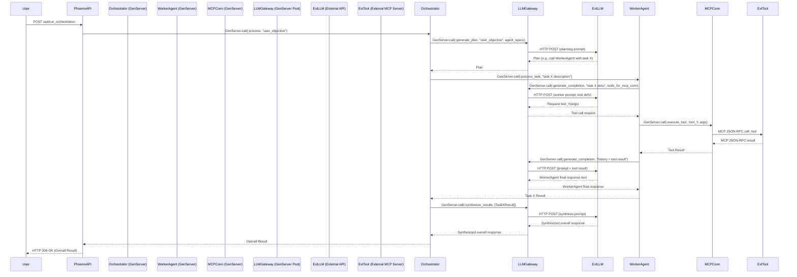
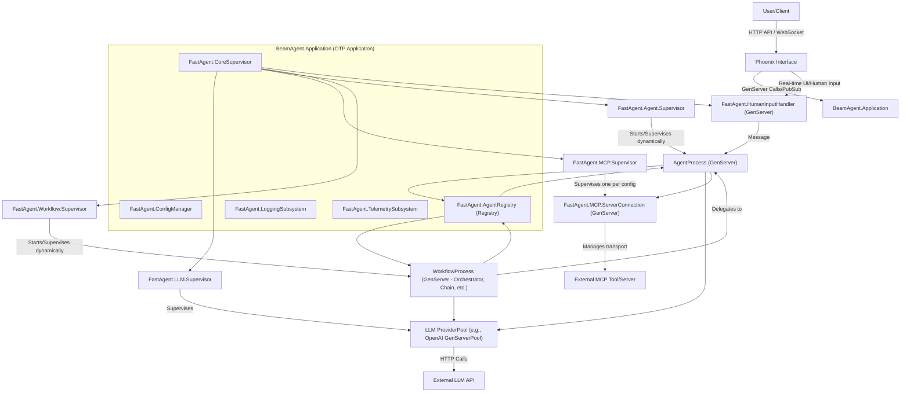
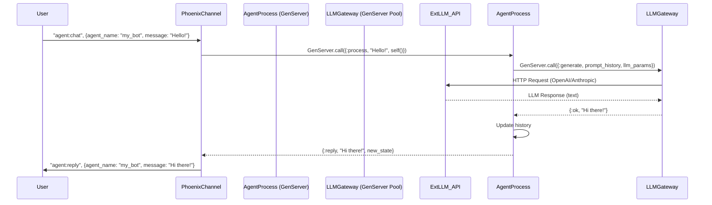
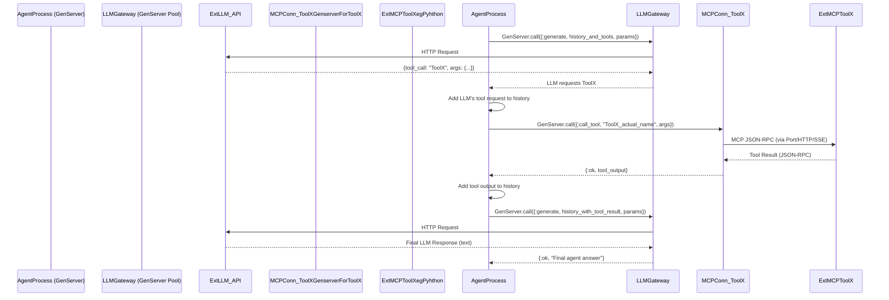

Okay, this is a fantastic challenge! Porting `fast-agent` to Elixir/Phoenix with a strong OTP foundation is exactly how you'd build a robust, concurrent, and fault-tolerant multi-agent system on the BEAM.

Let's break down the design spec.

## Project Name: `BeamAgent` (or `ElixirAgent`, `OtpAgent`)

## Core Philosophy:

*   **Agent as a Process:** Every individual agent, workflow, and even MCP server connection will be an OTP process (likely a `GenServer` or supervised by one), ensuring isolation, concurrency, and independent failure/restart.
*   **Supervision is Key:** A robust supervision tree will manage the lifecycle of all components.
*   **Message Passing:** Communication between agents and components will primarily use Elixir's message passing.
*   **Configuration Driven:** The system will be highly configurable, drawing inspiration from the `fastagent.config.schema.json`.
*   **Extensibility:** Designed for new agent types, LLM providers, and MCP server types to be added easily.
*   **Observability:** Built-in logging and telemetry (OTel).

## High-Level System Architecture:

```
+-----------------------------+       +-------------------------+       +--------------------------+
|     Phoenix Web Interface   |------>|   BeamAgent.Application |------>| FastAgent.Agent.Registry |
| (UI, API, Channels)       |<------|    (OTP Application)    |<------| (Agent Discovery)        |
+-----------------------------+       +-------------------------+       +--------------------------+
                                           |         ^
                                           | Supervision Tree
                                           v
       +--------------------------------------------------------------------------------------------+
       |                                   BeamAgent.CoreSupervisor                                   |
       +--------------------------------------------------------------------------------------------+
         |                |                        |                           |                   |
         v                v                        v                           v                   v
+-----------------+ +---------------------+ +------------------------+ +---------------------+ +--------------------+
| FastAgent.Config| | FastAgent.LLM.      | | FastAgent.MCP.         | | FastAgent.Agent.    | | FastAgent.Workflow.|
| (ETS/Persisted) | | Supervisor          | | Supervisor             | | Supervisor          | | Supervisor         |
+-----------------+ +---------------------+ +------------------------+ +---------------------+ +--------------------+
                          |                        |                           | (DynamicSupervisor) | (DynamicSupervisor)
                          v                        v                           v                   v
                  +-----------------+      +------------------------+  +---------------------+ +---------------------+
                  | ProviderPools   |      | MCP.ServerConnection   |  | ConcreteAgentProcess| | WorkflowProcess   |
                  | (e.g. OpenAI,   |      | (GenServer per defined |  | (GenServer)         | | (Orchestrator,     |
                  | Anthropic)      |      | MCP Server in config)  |  |                     | | Chain, Parallel, etc)|
                  +-----------------+      +------------------------+  +---------------------+ +---------------------+
                                                |       ^
                                                | Transport Handler (Stdio Port, HTTP Client, SSE Client)
                                                v       |
                                           +-----------------+
                                           | External MCP    |
                                           | Tool / Server   |
                                           +-----------------+
```

## 1. Configuration Management (`FastAgent.Config`)

*   **Source:** Load from `fastagent.config.yaml` and `fastagent.secrets.yaml` (or equivalent Elixir config files like `config/config.exs`, `config/runtime.exs`). The JSON schema provided is an excellent basis for Elixir structs.
*   **Storage:**
    *   Initial load into the Application environment.
    *   For frequently accessed, less dynamic parts, an ETS table managed by a `GenServer` (`FastAgent.ConfigServer`) can provide fast lookups.
    *   Secrets should be handled carefully, possibly injected at runtime or via environment variables.
*   **Structure:** Define Elixir structs mapping to the JSON schema definitions (`AnthropicSettings`, `MCPServerSettings`, etc.).
    *   `MCPServerSettings` will be critical. Each "server" entry here will likely translate to a supervised `GenServer` process.
    *   Provider settings (OpenAI, Anthropic) will dictate which LLM client modules are used and how they are configured.

## 2. Core `BeamAgent.Application` & `FastAgent.SupervisorTree`

*   **`BeamAgent.Application`**: The main OTP application. Its `start/2` callback will initiate the top-level supervisor.
*   **`FastAgent.CoreSupervisor`**: The root supervisor.
    *   Supervises `FastAgent.ConfigServer` (if used), `FastAgent.AgentRegistry`, `FastAgent.LLM.Supervisor`, `FastAgent.MCP.Supervisor`, `FastAgent.Agent.Supervisor`, `FastAgent.Workflow.Supervisor`.
*   **`FastAgent.AgentRegistry`**: A `Registry` (Elixir's built-in) to keep track of agent PIDs by their names, allowing dynamic discovery and communication.

## 3. LLM Interaction (`FastAgent.LLM.*`)

*   **`FastAgent.LLM.Supervisor`**: Supervises individual LLM provider gateways/pools.
*   **`FastAgent.LLM.ProviderGateway` (e.g., `FastAgent.LLM.OpenAI`, `FastAgent.LLM.Anthropic`):**
    *   Each could be a `GenServer` or use a pool (like `Poolboy`) of `GenServer` workers if needing to manage concurrent requests to a single API key or handle rate limiting.
    *   Responsible for:
        *   Holding API keys and base URLs (from config).
        *   Formatting requests specific to the provider API.
        *   Making HTTP calls (using Tesla, Finch, or HTTPoison).
        *   Parsing responses.
        *   Handling provider-specific error mapping.
        *   Converting between `PromptMessageMultipart` and provider-specific message formats.
*   **`FastAgent.LLM.ModelRouter` (Module):** A utility module (or logic within agents) to select the appropriate `ProviderGateway` based on the model string (e.g., "openai.gpt-4o", "anthropic.claude-3.5-sonnet").

## 4. MCP Server Connections (`FastAgent.MCP.*`)

*   **`FastAgent.MCP.Supervisor`**: Supervises `FastAgent.MCP.ServerConnection` processes.
*   **`FastAgent.MCP.ServerConnection` (`GenServer`)**:
    *   One `GenServer` process *per defined MCP server in the configuration*.
    *   **State:** Holds its configuration (`MCPServerSettings`), connection status, and a reference to its transport handler (Port, HTTP client process, SSE client process).
    *   **`init/1`:** Based on `transport` in `MCPServerSettings`:
        *   `stdio`: Starts an Elixir `Port` to manage the external `command` and `args`. Handles data serialization/deserialization over stdio.
        *   `http`/`sse`: Uses an HTTP client (e.g., Finch, Tesla, Mint) or an SSE client library to connect to the `url` with `headers` and `auth`.
    *   **API:** `handle_call/cast` for `call_tool`, `list_tools`, `get_prompt`, `list_prompts`, `read_resource`, `list_resources`. Translates these into MCP JSON-RPC messages.
    *   **Fault Tolerance:** If the external process/connection dies, the `GenServer` can attempt to restart it based on a supervision strategy.
    *   **`roots`:** Information about `roots` would be passed to the external MCP server during its MCP `initialize` phase. The Elixir side acts as a client, so it doesn't directly *manage* these roots in terms of file access itself but ensures the server is aware of what it *should* have access to.

## 5. Agents (`FastAgent.Agent.*`)

*   **`FastAgent.Agent.Supervisor`**: A `DynamicSupervisor` for starting, stopping, and supervising individual agent instances.
*   **`FastAgent.Agent.Server` (`GenServer`)**: Base implementation for a single agent.
    *   **Definition in code:** Uses a macro like `use FastAgent.Agent, name: :my_agent, instruction: "...", mcp_servers: [:tool1], llm_model: "claude-3.5-sonnet"` within a user's module. This macro generates the `GenServer` callbacks.
    *   **State:** `agent_name`, `instruction`, `llm_model_string`, `request_params`, `mcp_server_names` (list of registered names for `FastAgent.MCP.ServerConnection` processes), `message_history` (list of `PromptMessageMultipart`), PID of its `LLMProvider` interface.
    *   **`init/1`:** Receives config. Registers with `FastAgent.AgentRegistry`. Identifies its `LLMProvider` and PIDs of its `MCPServerConnection`s.
    *   **API (`handle_call` for synchronous, `handle_cast` for async):**
        *   `send(message_content)`: Core message processing.
        *   `generate(prompt_message_multiparts, request_params_override)`: Lower-level LLM interaction.
        *   `structured_output(prompt, pydantic_model, request_params_override)`
        *   `get_history()`: Returns `message_history`.
        *   `set_history(messages)`: Allows state transfer.
        *   `apply_mcp_prompt(prompt_name, args)`: Fetches prompt from relevant MCP server.
        *   `list_mcp_prompts()`
        *   `call_mcp_tool(tool_name, args)`
    *   **Interaction Logic:**
        1.  Receives a message.
        2.  Constructs prompts (including history if `use_history` is true).
        3.  Gets list of available tools/prompts from its associated `MCPServerConnection` processes.
        4.  Calls the appropriate `FastAgent.LLM.ProviderGateway` with prompts and tools.
        5.  If LLM requests a tool call:
            *   Identifies the correct `MCPServerConnection` (via `FastAgent.AgentRegistry` or direct PIDs).
            *   Sends `{:call_tool, tool_name, args}` message to it.
            *   Receives tool result.
            *   Sends result back to `LLMProvider` for continuation.
        6.  Updates `message_history`.
        7.  Returns final response.
    *   **Human Input:** If `human_input: true`, and the LLM requests the `__human_input__` tool, the agent would:
        *   Pause its current operation.
        *   Send a message to a designated `FastAgent.HumanInput.Handler` (another GenServer, possibly interfacing with Phoenix Channels).
        *   Wait for a reply from the `HumanInputHandler` before resuming.

## 6. Workflows (`FastAgent.Workflow.*`)

These are specialized agents, also `GenServer`s, inheriting or composing `FastAgent.Agent.Server` logic where applicable.
*   **`FastAgent.Workflow.Supervisor`**: A `DynamicSupervisor` for workflow processes.

*   **`FastAgent.Workflow.OrchestratorServer` (`GenServer`)**
    *   **State:** List of PIDs/registered names of worker agents, `plan_type`.
    *   **Logic:**
        1.  Uses its *own* LLM interaction to generate a plan (list of steps, tasks per step, target agent for task).
        2.  For "full" plan: executes all steps.
        3.  For "iterative" plan: executes one step, re-plans.
        4.  Executes tasks in a step:
            *   If parallel: `Task.async_stream` to send messages to worker agents.
            *   If sequential: Await each call.
        5.  Collects results.
        6.  Uses its LLM to synthesize results or plan next step.

*   **`FastAgent.Workflow.ChainServer` (`GenServer`)**
    *   **State:** Ordered list of PIDs/registered names of agents in the chain, `cumulative` flag.
    *   **Logic:** Sequentially calls each agent. If `cumulative`, appends previous agent's output to the input for the next.

*   **`FastAgent.Workflow.ParallelServer` (`GenServer`)**
    *   **State:** List of PIDs/registered names for `fan_out` agents, PID/name of `fan_in` agent.
    *   **Logic:** Uses `Task.async_stream` to send the same input to all `fan_out` agents. Collects all responses. Sends collected responses to the `fan_in` agent.

*   **`FastAgent.Workflow.RouterServer` (`GenServer`)**
    *   **State:** List of PIDs/registered names of target agents.
    *   **Logic:** Uses its LLM with the descriptions of target agents to select one. Forwards the original user input to the selected agent.

*   **`FastAgent.Workflow.EvaluatorOptimizerServer` (`GenServer`)**
    *   **State:** PIDs/names of `generator` and `evaluator` agents, `max_refinements`, `min_rating`.
    *   **Logic:** Loop:
        1.  Call `generator_agent` with current input/feedback.
        2.  Call `evaluator_agent` with generator's output.
        3.  If rating >= `min_rating` or refinements >= `max_refinements`, return.
        4.  Else, use evaluator's feedback to refine input for generator, loop.

## 7. Logging & Observability

*   **Elixir `Logger`**: Used throughout.
*   **Custom `Logger` Backend for Progress:** Similar to `rich_progress` in Python, a custom backend can be written to format and display agent/workflow progress. This could also be done via Telemetry events consumed by a dedicated process.
*   **`Telemetry`**: Emit `:telemetry` events for key actions (agent calls, tool uses, LLM requests, errors).
*   **OpenTelemetry (`otel`)**: Integrate Elixir's OTEL libraries. Spans can be created around agent calls, LLM interactions, and MCP tool calls. `FastAgent.Agent.Server` and other key GenServers should be instrumented.

## 8. Phoenix Integration

*   **API Endpoints:** Expose agents and workflows via HTTP APIs.
*   **Web UI:**
    *   Agent/Workflow configuration and management.
    *   Monitoring dashboard (consuming telemetry or log data).
*   **Phoenix Channels:**
    *   Real-time chat interface for interacting with agents.
    *   Real-time progress updates from agent workflows.
    *   Handling human-in-the-loop interactions.
    *   The `FastAgent.HumanInput.Handler` GenServer mentioned earlier would use Phoenix Channels to push requests to the UI and receive user responses.

## High-Level Diagram: Supervision Tree Sketch

```
BeamAgent.Application
  └── FastAgent.CoreSupervisor
      ├── FastAgent.ConfigServer (GenServer, optional, for dynamic config/ETS)
      ├── FastAgent.AgentRegistry (Registry)
      ├── FastAgent.HumanInput.Handler (GenServer, for Phoenix Channel interaction)
      ├── FastAgent.LLM.Supervisor
      │   └── FastAgent.LLM.ProviderPool (e.g., OpenAI, Anthropic - could be Poolboy pools of GenServers)
      ├── FastAgent.MCP.Supervisor
      │   └── FastAgent.MCP.ServerConnection (GenServer, one per defined MCP in config, manages Port/HTTP/SSE client)
      ├── FastAgent.Agent.Supervisor (DynamicSupervisor)
      │   ├── AgentA_PID (FastAgent.Agent.Server GenServer)
      │   └── AgentB_PID (FastAgent.Agent.Server GenServer)
      └── FastAgent.Workflow.Supervisor (DynamicSupervisor)
          ├── OrchestratorA_PID (FastAgent.Workflow.OrchestratorServer GenServer)
          └── ChainB_PID (FastAgent.Workflow.ChainServer GenServer)
```

## High-Level Diagram: Request Flow (Agent calling MCP tool via Orchestrator)



This design prioritizes OTP principles. Each "thing" (agent, workflow, connection) is a process. They communicate via messages. Supervisors ensure they keep running. This is a solid foundation for the "even better" part of your challenge. The BEAM's capabilities for concurrency and fault tolerance will naturally make this system more robust and scalable than a typical Python/asyncio setup.```

## Design Specification: BeamAgent - Elixir/Phoenix Port of FastAgent

**Project Goal:** To create a robust, concurrent, and fault-tolerant multi-agent system in Elixir/Phoenix, inspired by `fast-agent`, by leveraging core BEAM/OTP principles. This document outlines the design and high-level architecture.

**Core OTP Principles Applied:**

1.  **"Let it Crash" Philosophy:** Agents and external connections will be supervised. Failures will be isolated and can trigger restart strategies.
2.  **Process-Oriented:** Each agent, workflow, and MCP server connection will be an independent Elixir process (typically a `GenServer`), allowing for true concurrency and state isolation.
3.  **Supervision Trees:** A hierarchical supervision strategy will ensure system resilience and controlled startup/shutdown.
4.  **Message Passing:** Communication between processes will primarily use Elixir's built-in message passing (`GenServer.call/cast`).
5.  **Concurrency & Parallelism:** BEAM's lightweight processes and scheduler will naturally handle concurrent operations among many agents without complex async/await patterns. `Task.async_stream` can be used for parallel execution within workflows.
6.  **Distribution (Future):** The architecture can be extended to run agents across multiple BEAM nodes.
7.  **Hot Code Swapping (Future):** Agent logic could potentially be updated live.

---

### 1. System Architecture Overview



---

### 2. Configuration Management (`FastAgent.ConfigManager`)

*   **Source:** `config/config.exs`, `config/runtime.exs`. Inspired by `fastagent.config.schema.json`. Environment variables will be primary for secrets.
*   **Representation:** Elixir structs derived from the JSON schema (e.g., `FastAgent.Config.MCPServerSettings`, `FastAgent.Config.OpenAISettings`). TypedEctoSchema or similar could be used for validation.
*   **Access:**
    *   Loaded into Application environment at startup.
    *   A `FastAgent.ConfigManager` GenServer can provide a single source of truth and potentially support runtime updates for *some* non-critical settings.
    *   Key configurations (LLM keys, MCP server details) will be fetched by their respective manager processes at initialization.

---

### 3. Core OTP Application (`BeamAgent.Application`)

*   The main Elixir application.
*   The `start/2` callback initiates `FastAgent.CoreSupervisor`.
*   Holds global state if necessary (e.g., the PID of `FastAgent.ConfigManager`).

---

### 4. Top-Level Supervisor (`FastAgent.CoreSupervisor`)

*   Supervises core system components:
    *   `FastAgent.ConfigManager`
    *   `FastAgent.AgentRegistry` (Elixir `Registry` for named processes)
    *   `FastAgent.LLM.Supervisor`
    *   `FastAgent.MCP.Supervisor`
    *   `FastAgent.Agent.Supervisor`
    *   `FastAgent.Workflow.Supervisor`
    *   `FastAgent.LoggingSubsystem` (if it involves managed processes beyond Elixir's Logger)
    *   `FastAgent.HumanInputHandler` (if globally managed)

---

### 5. LLM Interaction Subsystem (`FastAgent.LLM.*`)

*   **`FastAgent.LLM.Supervisor`:**
    *   Supervises one `FastAgent.LLM.ProviderGateway` for each configured LLM provider (e.g., OpenAI, Anthropic).
*   **`FastAgent.LLM.ProviderGateway` (`GenServer` or Pool like `Poolboy`):**
    *   **State:** API key, base URL, rate-limiting state, client (e.g., Finch or Tesla).
    *   **Responsibilities:** Make HTTP requests to the LLM API, handle provider-specific authentication, error translation, request/response formatting.
    *   Translates Elixir-friendly data structures to provider-specific JSON and vice-versa.
*   **`FastAgent.LLM.ModelRouter` (Module):** Utility functions to determine which `ProviderGateway` to use based on a model string (e.g., "openai.gpt-4o").

---

### 6. MCP Server Connection Subsystem (`FastAgent.MCP.*`)

*   **`FastAgent.MCP.Supervisor`:**
    *   Supervises one `FastAgent.MCP.ServerConnection` GenServer for *each* MCP server defined in the configuration.
*   **`FastAgent.MCP.ServerConnection` (`GenServer`):**
    *   **State:** Its specific `MCPServerSettings`, connection state (PID of Port, HTTP client, SSE client state).
    *   **`init/1`:** Reads its config. Based on `transport`:
        *   `stdio`: Opens an Elixir `Port` to manage the external `command`. Data is framed/parsed as JSON-RPC over stdio. `stderr` is piped to Elixir's Logger.
        *   `http`/`sse`: Uses an HTTP client (e.g., Finch) or an SSE client library (e.g., `sse_client.ex`).
    *   **API (`handle_call`):** Exposes functions like `call_tool(name, args)`, `list_tools()`, `get_prompt(name, args)`, `list_prompts()`, etc.
    *   **Responsibilities:** Serializes requests to JSON-RPC, sends them over the transport, deserializes responses, handles MCP-level errors. Forwards `initialize` calls to the external server, including `roots` information.

---

### 7. Agent Definition and Runtime (`FastAgent.Agent.*`)

*   **Agent Definition (Macros):**
    *   A `use FastAgent.Agent, opts` macro will be provided.
    *   `opts` will include: `name` (atom, for registry), `instruction` (string), `mcp_servers` (list of atoms), `llm_model` (string), `use_history` (boolean), `human_input` (boolean).
    *   The macro will generate the `GenServer` boilerplate, `init/1`, and helper functions. Developers will implement `handle_message/2` or similar callbacks for agent-specific logic.
*   **`FastAgent.Agent.Supervisor` (`DynamicSupervisor`):**
    *   Responsible for starting, stopping, and monitoring individual concrete agent processes.
*   **`FastAgent.Agent.Process` (`GenServer`)**:
    *   **State:**
        *   `agent_name` (registered name)
        *   `instruction` (system prompt)
        *   `llm_model_string`
        *   `default_request_params` (struct)
        *   `mcp_server_pids_or_names` (resolved at init)
        *   `llm_gateway_pid_or_name` (resolved at init)
        *   `message_history` (list of `PromptMessageMultipart` structs)
        *   `supports_human_input` (boolean)
    *   **`init/1`:** Receives config, registers with `FastAgent.AgentRegistry`, resolves PIDs for its LLM gateway and MCP servers.
    *   **Core API (`handle_call`)**:
        *   `{:process, user_input_content, caller_pid}`: Main entry point.
            1.  Adds `user_input_content` to `message_history`.
            2.  Prepares LLM prompt: `instruction` + (optionally) tools schema + `message_history`.
            3.  Calls `LLMProviderGateway.generate_completion(prompt, request_params)`.
            4.  **Tool Use Loop:**
                *   If LLM response contains tool calls:
                    *   For each tool call: Route to the appropriate `MCP.ServerConnection` GenServer (`call_tool(name, args)`).
                    *   Collect tool results.
                    *   Send results back to `LLMProviderGateway.generate_completion(prompt_with_tool_results, request_params)`.
                    *   Repeat if more tool calls.
                *   If LLM response is human text:
                    *   Add assistant response to `message_history`.
                    *   Reply to `caller_pid`.
            5.  **Human Input:** If the LLM calls the `__human_input__` tool, the agent sends a request to `FastAgent.HumanInputHandler`, awaits a response, then feeds that back to the LLM.
    *   **Other APIs:**
        *   `{:get_history, caller_pid}`
        *   `{:load_history, messages, caller_pid}` (for state transfer)
        *   `{:apply_mcp_prompt, prompt_name, args, caller_pid}` (gets prompt from MCP server, then processes)

---

### 8. Workflow Implementations (`FastAgent.Workflow.*`)

*   These are specialized `GenServer`s, also managed by `FastAgent.Workflow.Supervisor` (DynamicSupervisor).
*   Defined using macros: `use FastAgent.Workflow.Orchestrator, name: :my_orch, worker_agents: [...]`, etc.
*   Internal LLMs (for planning/routing) will use the `FastAgent.LLM.*` subsystem.
*   Communication with worker agents via `GenServer.call/cast` using registered names from `FastAgent.AgentRegistry`.

*   **`FastAgent.Workflow.Orchestrator`:**
    *   **State:** List of worker agent names, `plan_type`, `current_plan`, `history_of_execution`.
    *   Uses its LLM to generate a plan (`Plan` struct with `Step` and `AgentTask` structs).
    *   Executes tasks in plan steps:
        *   Parallel tasks: `Task.async_stream/3` to call worker agents.
        *   Sequential tasks: `GenServer.call/3`.
    *   Synthesizes results or re-plans using its LLM.

*   **`FastAgent.Workflow.Chain`:**
    *   **State:** Ordered list of worker agent names, `cumulative` (bool).
    *   Iteratively calls `GenServer.call/3` on each agent in the sequence.
    *   If `cumulative`, concatenates history for the next agent.

*   **`FastAgent.Workflow.Parallel`:**
    *   **State:** List of `fan_out_agent_names`, `fan_in_agent_name`.
    *   Uses `Task.async_stream/3` to call all `fan_out` agents.
    *   Calls `fan_in` agent with collected results using `GenServer.call/3`.

*   **`FastAgent.Workflow.Router`:**
    *   **State:** List of target agent names/specs.
    *   Uses its LLM to choose an agent based on input and agent specs.
    *   Forwards the original input to the chosen agent via `GenServer.call/3`.

*   **`FastAgent.Workflow.EvaluatorOptimizer`:**
    *   **State:** `generator_agent_name`, `evaluator_agent_name`, `max_refinements`, `min_rating`.
    *   Loop: `GenServer.call(generator, ...)`, then `GenServer.call(evaluator, ...)`. Refine or finish.

---

### 9. State Management & History

*   Each `FastAgent.Agent.Process` and `FastAgent.Workflow.*` process holds its own state, including `message_history` as a list of `PromptMessageMultipart` structs.
*   History can be explicitly loaded/retrieved via messages for state transfer or debugging.
*   Long-term persistence could be added later (e.g., to Mnesia, Ecto/Postgres).

---

### 10. Logging and Observability (`FastAgent.LoggingSubsystem`, `FastAgent.TelemetrySubsystem`)

*   Utilize Elixir's built-in `Logger` for standard logging.
*   Configure `Logger` backends for console, file, and (optional) HTTP based on `LoggerSettings` from config.
*   **Progress Display:**
    *   A custom `Logger` backend or a separate `GenServer` subscribing to `:telemetry` events.
    *   This process would manage the terminal display, updating on events from agents/workflows (start, LLM call, tool call, finish).
*   **Telemetry:**
    *   Agents, Workflows, MCPConnections, LLMGateways will emit `:telemetry` events for significant actions (e.g., `[:beam_agent, :agent, :call, :start]`, `[:beam_agent, :llm, :request, :stop]`).
    *   Metrics can be derived from these events.
*   **OpenTelemetry (`otel`):**
    *   Integrate official Elixir OTEL libraries (`opentelemetry_api`, `opentelemetry`).
    *   Auto-instrumentation for HTTP clients (Finch/Tesla).
    *   Manual span creation within `Agent.Process` `handle_call` functions, LLM gateway requests, MCP tool calls.

---

### 11. Phoenix Integration

*   **API Endpoints (`BeamAgentWeb.Router`, `BeamAgentWeb.AgentController`):**
    *   RESTful or GraphQL APIs to interact with agents (send message, get history).
    *   Endpoints to list available agents, start/stop agent processes (if admin UI).
*   **WebSockets (`BeamAgentWeb.AgentChannel`):**
    *   For real-time interactive chat with agents.
    *   Client sends message -> Channel `handle_in` -> `GenServer.call` to agent process -> Agent replies -> Channel broadcasts response.
*   **Human-in-the-Loop (`FastAgent.HumanInputHandler` + Phoenix Channel):**
    *   When an agent requires human input, it sends a message to `FastAgent.HumanInputHandler`.
    *   `HumanInputHandler` broadcasts the request over a Phoenix Channel to connected UIs.
    *   User provides input in UI -> Channel `handle_in` -> `HumanInputHandler` receives -> `HumanInputHandler` replies to the waiting agent process.
*   **Dashboard UI:** Displaying logs, telemetry metrics, active agents.

---

### 12. High-Level Interaction Diagrams

#### Diagram 1: Basic Agent Interaction (Text In, Text Out)



#### Diagram 2: Agent Interaction with MCP Tool Call

```mermaid
sequenceDiagram
    participant AgentProcess (GenServer)
    participant LLMGateway (GenServer Pool)
    participant ExtLLM_API
    participant MCPConn_ToolX (GenServer for ToolX)
    participant ExtMCPToolX (e.gOkay, this is a fantastic challenge! Porting `fast-agent` to Elixir/Phoenix with a strong OTP foundation is exactly how you'd build a robust, concurrent, and fault-tolerant multi-agent system on the BEAM.

Let's break down the design spec.

## Project Name: `BeamAgent` (or `ElixirAgent`, `OtpAgent`)

## Core Philosophy:

*   **Agent as a Process:** Every individual agent, workflow, and even MCP server connection will be an OTP process (likely a `GenServer` or supervised by one), ensuring isolation, concurrency, and independent failure/restart.
*   **Supervision is Key:** A robust supervision tree will manage the lifecycle of all components.
*   **Message Passing:** Communication between agents and components will primarily use Elixir's message passing.
*   **Configuration Driven:** The system will be highly configurable, drawing inspiration from the `fastagent.config.schema.json`.
*   **Extensibility:** Designed for new agent types, LLM providers, and MCP server types to be added easily.
*   **Observability:** Built-in logging and telemetry (OTel).

## High-Level System Architecture:

```
+-----------------------------+       +-------------------------+       +--------------------------+
|     Phoenix Web Interface   |------>|   BeamAgent.Application |------>| FastAgent.Agent.Registry |
| (UI, API, Channels)       |<------|    (OTP Application)    |<------| (Agent Discovery)        |
+-----------------------------+       +-------------------------+       +--------------------------+
                                           |         ^
                                           | Supervision Tree
                                           v
       +--------------------------------------------------------------------------------------------+
       |                                   BeamAgent.CoreSupervisor                                   |
       +--------------------------------------------------------------------------------------------+
         |                |                        |                           |                   |
         v                v                        v                           v                   v
+-----------------+ +---------------------+ +------------------------+ +---------------------+ +--------------------+
| FastAgent.Config| | FastAgent.LLM.      | | FastAgent.MCP.         | | FastAgent.Agent.    | | FastAgent.Workflow.|
| (ETS/Persisted) | | Supervisor          | | Supervisor             | | Supervisor          | | Supervisor         |
+-----------------+ +---------------------+ +------------------------+ +---------------------+ +--------------------+
                          |                        |                           | (DynamicSupervisor) | (DynamicSupervisor)
                          v                        v                           v                   v
                  +-----------------+      +------------------------+  +---------------------+ +---------------------+
                  | ProviderPools   |      | MCP.ServerConnection   |  | ConcreteAgentProcess| | WorkflowProcess   |
                  | (e.g. OpenAI,   |      | (GenServer per defined |  | (GenServer)         | | (Orchestrator,     |
                  | Anthropic)      |      | MCP Server in config)  |  |                     | | Chain, Parallel, etc)|
                  +-----------------+      +------------------------+  +---------------------+ +---------------------+
                                                |       ^
                                                | Transport Handler (Stdio Port, HTTP Client, SSE Client)
                                                v       |
                                           +-----------------+
                                           | External MCP    |
                                           | Tool / Server   |
                                           +-----------------+
```

## 1. Configuration Management (`FastAgent.Config`)

*   **Source:** Load from `fastagent.config.yaml` and `fastagent.secrets.yaml` (or equivalent Elixir config files like `config/config.exs`, `config/runtime.exs`). The JSON schema provided is an excellent basis for Elixir structs.
*   **Storage:**
    *   Initial load into the Application environment.
    *   For frequently accessed, less dynamic parts, an ETS table managed by a `GenServer` (`FastAgent.ConfigServer`) can provide fast lookups.
    *   Secrets should be handled carefully, possibly injected at runtime or via environment variables.
*   **Structure:** Define Elixir structs mapping to the JSON schema definitions (`AnthropicSettings`, `MCPServerSettings`, etc.).
    *   `MCPServerSettings` will be critical. Each "server" entry here will likely translate to a supervised `GenServer` process.
    *   Provider settings (OpenAI, Anthropic) will dictate which LLM client modules are used and how they are configured.

## 2. Core `BeamAgent.Application` & `FastAgent.SupervisorTree`

*   **`BeamAgent.Application`**: The main OTP application. Its `start/2` callback will initiate the top-level supervisor.
*   **`FastAgent.CoreSupervisor`**: The root supervisor.
    *   Supervises `FastAgent.ConfigServer` (if used), `FastAgent.AgentRegistry`, `FastAgent.LLM.Supervisor`, `FastAgent.MCP.Supervisor`, `FastAgent.Agent.Supervisor`, `FastAgent.Workflow.Supervisor`.
*   **`FastAgent.AgentRegistry`**: A `Registry` (Elixir's built-in) to keep track of agent PIDs by their names, allowing dynamic discovery and communication.

## 3. LLM Interaction (`FastAgent.LLM.*`)

*   **`FastAgent.LLM.Supervisor`**: Supervises individual LLM provider gateways/pools.
*   **`FastAgent.LLM.ProviderGateway` (e.g., `FastAgent.LLM.OpenAI`, `FastAgent.LLM.Anthropic`):**
    *   Each could be a `GenServer` or use a pool (like `Poolboy`) of `GenServer` workers if needing to manage concurrent requests to a single API key or handle rate limiting.
    *   Responsible for:
        *   Holding API keys and base URLs (from config).
        *   Formatting requests specific to the provider API.
        *   Making HTTP calls (using Tesla, Finch, or HTTPoison).
        *   Parsing responses.
        *   Handling provider-specific error mapping.
        *   Converting between `PromptMessageMultipart` and provider-specific message formats.
*   **`FastAgent.LLM.ModelRouter` (Module):** A utility module (or logic within agents) to select the appropriate `ProviderGateway` based on the model string (e.g., "openai.gpt-4o", "anthropic.claude-3.5-sonnet").

## 4. MCP Server Connections (`FastAgent.MCP.*`)

*   **`FastAgent.MCP.Supervisor`**: Supervises `FastAgent.MCP.ServerConnection` processes.
*   **`FastAgent.MCP.ServerConnection` (`GenServer`)**:
    *   One `GenServer` process *per defined MCP server in the configuration*.
    *   **State:** Holds its configuration (`MCPServerSettings`), connection status, and a reference to its transport handler (Port, HTTP client process, SSE client process).
    *   **`init/1`:** Based on `transport` in `MCPServerSettings`:
        *   `stdio`: Starts an Elixir `Port` to manage the external `command` and `args`. Handles data serialization/deserialization over stdio.
        *   `http`/`sse`: Uses an HTTP client (e.g., Finch, Tesla, Mint) or an SSE client library to connect to the `url` with `headers` and `auth`.
    *   **API:** `handle_call/cast` for `call_tool`, `list_tools`, `get_prompt`, `list_prompts`, `read_resource`, `list_resources`. Translates these into MCP JSON-RPC messages.
    *   **Fault Tolerance:** If the external process/connection dies, the `GenServer` can attempt to restart it based on a supervision strategy.
    *   **`roots`:** Information about `roots` would be passed to the external MCP server during its MCP `initialize` phase. The Elixir side acts as a client, so it doesn't directly *manage* these roots in terms of file access itself but ensures the server is aware of what it *should* have access to.

## 5. Agents (`FastAgent.Agent.*`)

*   **`FastAgent.Agent.Supervisor`**: A `DynamicSupervisor` for starting, stopping, and supervising individual agent instances.
*   **`FastAgent.Agent.Server` (`GenServer`)**: Base implementation for a single agent.
    *   **Definition in code:** Uses a macro like `use FastAgent.Agent, name: :my_agent, instruction: "...", mcp_servers: [:tool1], llm_model: "claude-3.5-sonnet"` within a user's module. This macro generates the `GenServer` callbacks.
    *   **State:** `agent_name`, `instruction`, `llm_model_string`, `request_params`, `mcp_server_names` (list of registered names for `FastAgent.MCP.ServerConnection` processes), `message_history` (list of `PromptMessageMultipart`), PID of its `LLMProvider` interface.
    *   **`init/1`:** Receives config. Registers with `FastAgent.AgentRegistry`. Identifies its `LLMProvider` and PIDs of its `MCPServerConnection`s.
    *   **API (`handle_call` for synchronous, `handle_cast` for async):**
        *   `send(message_content)`: Core message processing.
        *   `generate(prompt_message_multiparts, request_params_override)`: Lower-level LLM interaction.
        *   `structured_output(prompt, pydantic_model, request_params_override)`
        *   `get_history()`: Returns `message_history`.
        *   `set_history(messages)`: Allows state transfer.
        *   `apply_mcp_prompt(prompt_name, args)`: Fetches prompt from relevant MCP server.
        *   `list_mcp_prompts()`
        *   `call_mcp_tool(tool_name, args)`
    *   **Interaction Logic:**
        1.  Receives a message.
        2.  Constructs prompts (including history if `use_history` is true).
        3.  Gets list of available tools/prompts from its associated `MCPServerConnection` processes.
        4.  Calls the appropriate `FastAgent.LLM.ProviderGateway` with prompts and tools.
        5.  If LLM requests a tool call:
            *   Identifies the correct `MCPServerConnection` (via `FastAgent.AgentRegistry` or direct PIDs).
            *   Sends `{:call_tool, tool_name, args}` message to it.
            *   Receives tool result.
            *   Sends result back to `LLMProvider` for continuation.
        6.  Updates `message_history`.
        7.  Returns final response.
    *   **Human Input:** If `human_input: true`, and the LLM requests the `__human_input__` tool, the agent would:
        *   Pause its current operation.
        *   Send a message to a designated `FastAgent.HumanInput.Handler` (another GenServer, possibly interfacing with Phoenix Channels).
        *   Wait for a reply from the `HumanInputHandler` before resuming.

## 6. Workflows (`FastAgent.Workflow.*`)

These are specialized agents, also `GenServer`s, inheriting or composing `FastAgent.Agent.Server` logic where applicable.
*   **`FastAgent.Workflow.Supervisor`**: A `DynamicSupervisor` for workflow processes.

*   **`FastAgent.Workflow.OrchestratorServer` (`GenServer`)**
    *   **State:** List of PIDs/registered names of worker agents, `plan_type`.
    *   **Logic:**
        1.  Uses its *own* LLM interaction to generate a plan (list of steps, tasks per step, target agent for task).
        2.  For "full" plan: executes all steps.
        3.  For "iterative" plan: executes one step, re-plans.
        4.  Executes tasks in a step:
            *   If parallel: `Task.async_stream` to send messages to worker agents.
            *   If sequential: Await each call.
        5.  Collects results.
        6.  Uses its LLM to synthesize results or plan next step.

*   **`FastAgent.Workflow.ChainServer` (`GenServer`)**
    *   **State:** Ordered list of PIDs/registered names of agents in the chain, `cumulative` flag.
    *   **Logic:** Sequentially calls each agent. If `cumulative`, appends previous agent's output to the input for the next.

*   **`FastAgent.Workflow.ParallelServer` (`GenServer`)**
    *   **State:** List of PIDs/registered names for `fan_out` agents, PID/name of `fan_in` agent.
    *   **Logic:** Uses `Task.async_stream` to send the same input to all `fan_out` agents. Collects all responses. Sends collected responses to the `fan_in` agent.

*   **`FastAgent.Workflow.RouterServer` (`GenServer`)**
    *   **State:** List of PIDs/registered names of target agents.
    *   **Logic:** Uses its LLM with the descriptions of target agents to select one. Forwards the original user input to the selected agent.

*   **`FastAgent.Workflow.EvaluatorOptimizerServer` (`GenServer`)**
    *   **State:** PIDs/names of `generator` and `evaluator` agents, `max_refinements`, `min_rating`.
    *   **Logic:** Loop:
        1.  Call `generator_agent` with current input/feedback.
        2.  Call `evaluator_agent` with generator's output.
        3.  If rating >= `min_rating` or refinements >= `max_refinements`, return.
        4.  Else, use evaluator's feedback to refine input for generator, loop.

## 7. Logging & Observability

*   **Elixir `Logger`**: Used throughout.
*   **Custom `Logger` Backend for Progress:** Similar to `rich_progress` in Python, a custom backend can be written to format and display agent/workflow progress. This could also be done via Telemetry events consumed by a dedicated process.
*   **`Telemetry`**: Emit `:telemetry` events for key actions (agent calls, tool uses, LLM requests, errors).
*   **OpenTelemetry (`otel`)**: Integrate Elixir's OTEL libraries. Spans can be created around agent calls, LLM interactions, and MCP tool calls. `FastAgent.Agent.Server` and other key GenServers should be instrumented.

## 8. Phoenix Integration

*   **API Endpoints:** Expose agents and workflows via HTTP APIs.
*   **Web UI:**
    *   Agent/Workflow configuration and management.
    *   Monitoring dashboard (consuming telemetry or log data).
*   **Phoenix Channels:**
    *   Real-time chat interface for interacting with agents.
    *   Real-time progress updates from agent workflows.
    *   Handling human-in-the-loop interactions.
    *   The `FastAgent.HumanInput.Handler` GenServer mentioned earlier would use Phoenix Channels to push requests to the UI and receive user responses.

## High-Level Diagram: Supervision Tree Sketch

```
BeamAgent.Application
  └── FastAgent.CoreSupervisor
      ├── FastAgent.ConfigServer (GenServer, optional, for dynamic config/ETS)
      ├── FastAgent.AgentRegistry (Registry)
      ├── FastAgent.HumanInput.Handler (GenServer, for Phoenix Channel interaction)
      ├── FastAgent.LLM.Supervisor
      │   └── FastAgent.LLM.ProviderPool (e.g., OpenAI, Anthropic - could be Poolboy pools of GenServers)
      ├── FastAgent.MCP.Supervisor
      │   └── FastAgent.MCP.ServerConnection (GenServer, one per defined MCP in config, manages Port/HTTP/SSE client)
      ├── FastAgent.Agent.Supervisor (DynamicSupervisor)
      │   ├── AgentA_PID (FastAgent.Agent.Server GenServer)
      │   └── AgentB_PID (FastAgent.Agent.Server GenServer)
      └── FastAgent.Workflow.Supervisor (DynamicSupervisor)
          ├── OrchestratorA_PID (FastAgent.Workflow.OrchestratorServer GenServer)
          └── ChainB_PID (FastAgent.Workflow.ChainServer GenServer)
```

## High-Level Diagram: Request Flow (Agent calling MCP tool via Orchestrator)


This design prioritizes OTP principles. Each "thing" (agent, workflow, connection) is a process. They communicate via messages. Supervisors ensure they keep running. This is a solid foundation for the "even better" part of your challenge. The BEAM's capabilities for concurrency and fault tolerance will naturally make this system more robust and scalable than a typical Python/asyncio setup.```

## Design Specification: BeamAgent - Elixir/Phoenix Port of FastAgent

**Project Goal:** To create a robust, concurrent, and fault-tolerant multi-agent system in Elixir/Phoenix, inspired by `fast-agent`, by leveraging core BEAM/OTP principles. This document outlines the design and high-level architecture.

**Core OTP Principles Applied:**

1.  **"Let it Crash" Philosophy:** Agents and external connections will be supervised. Failures will be isolated and can trigger restart strategies.
2.  **Process-Oriented:** Each agent, workflow, and MCP server connection will be an independent Elixir process (typically a `GenServer`), allowing for true concurrency and state isolation.
3.  **Supervision Trees:** A hierarchical supervision strategy will ensure system resilience and controlled startup/shutdown.
4.  **Message Passing:** Communication between processes will primarily use Elixir's built-in message passing (`GenServer.call/cast`).
5.  **Concurrency & Parallelism:** BEAM's lightweight processes and scheduler will naturally handle concurrent operations among many agents without complex async/await patterns. `Task.async_stream` can be used for parallel execution within workflows.
6.  **Distribution (Future):** The architecture can be extended to run agents across multiple BEAM nodes.
7.  **Hot Code Swapping (Future):** Agent logic could potentially be updated live.

---

### 1. System Architecture Overview

```mermaid
graph TD
    A[User/Client] -->|HTTP API / WebSocket| PHOENIX[Phoenix Interface]
    PHOENIX -->|GenServer Calls/PubSub| APP[BeamAgent.Application]

    subgraph BeamAgent.Application (OTP Application)
        direction LR
        SUP[FastAgent.CoreSupervisor]
        CONF[FastAgent.ConfigManager]
        REG[FastAgent.AgentRegistry (Registry)]
        LOG[FastAgent.LoggingSubsystem]
        OTEL[FastAgent.TelemetrySubsystem]
    end

    SUP --> LLM_SUP[FastAgent.LLM.Supervisor]
    SUP --> MCP_SUP[FastAgent.MCP.Supervisor]
    SUP --> AGENT_SUP[FastAgent.Agent.Supervisor]
    SUP --> WF_SUP[FastAgent.Workflow.Supervisor]

    LLM_SUP -->|Supervises| LLM_PROV_POOL[LLM ProviderPool (e.g., OpenAI GenServerPool)]
    MCP_SUP -->|Supervises one per config| MCP_CONN[FastAgent.MCP.ServerConnection (GenServer)]
    AGENT_SUP -->|Starts/Supervises dynamically| CONCRETE_AGENT[AgentProcess (GenServer)]
    WF_SUP -->|Starts/Supervises dynamically| WORKFLOW[WorkflowProcess (GenServer - Orchestrator, Chain, etc.)]

    MCP_CONN -->|Manages transport| EXT_MCP_TOOL[External MCP Tool/Server]
    LLM_PROV_POOL -->|HTTP Calls| EXT_LLM_API[External LLM API]

    CONCRETE_AGENT --> REG
    WORKFLOW --> REG
    REG --> CONCRETE_AGENT
    REG --> WORKFLOW
    CONCRETE_AGENT --> LLM_PROV_POOL
    CONCRETE_AGENT --> MCP_CONN
    WORKFLOW -->|Delegates to| CONCRETE_AGENT
    WORKFLOW --> LLM_PROV_POOL

    PHOENIX -->|Real-time UI/Human Input| HUMAN_INPUT[FastAgent.HumanInputHandler (GenServer)]
    HUMAN_INPUT -->|Message| CONCRETE_AGENT
    SUP --> HUMAN_INPUT
```

---

### 2. Configuration Management (`FastAgent.ConfigManager`)

*   **Source:** `config/config.exs`, `config/runtime.exs`. Inspired by `fastagent.config.schema.json`. Environment variables will be primary for secrets.
*   **Representation:** Elixir structs derived from the JSON schema (e.g., `FastAgent.Config.MCPServerSettings`, `FastAgent.Config.OpenAISettings`). TypedEctoSchema or similar could be used for validation.
*   **Access:**
    *   Loaded into Application environment at startup.
    *   A `FastAgent.ConfigManager` GenServer can provide a single source of truth and potentially support runtime updates for *some* non-critical settings.
    *   Key configurations (LLM keys, MCP server details) will be fetched by their respective manager processes at initialization.

---

### 3. Core OTP Application (`BeamAgent.Application`)

*   The main Elixir application.
*   The `start/2` callback initiates `FastAgent.CoreSupervisor`.
*   Holds global state if necessary (e.g., the PID of `FastAgent.ConfigManager`).

---

### 4. Top-Level Supervisor (`FastAgent.CoreSupervisor`)

*   Supervises core system components:
    *   `FastAgent.ConfigManager`
    *   `FastAgent.AgentRegistry` (Elixir `Registry` for named processes)
    *   `FastAgent.LLM.Supervisor`
    *   `FastAgent.MCP.Supervisor`
    *   `FastAgent.Agent.Supervisor`
    *   `FastAgent.Workflow.Supervisor`
    *   `FastAgent.LoggingSubsystem` (if it involves managed processes beyond Elixir's Logger)
    *   `FastAgent.HumanInputHandler` (if globally managed)

---

### 5. LLM Interaction Subsystem (`FastAgent.LLM.*`)

*   **`FastAgent.LLM.Supervisor`:**
    *   Supervises one `FastAgent.LLM.ProviderGateway` for each configured LLM provider (e.g., OpenAI, Anthropic).
*   **`FastAgent.LLM.ProviderGateway` (`GenServer` or Pool like `Poolboy`):**
    *   **State:** API key, base URL, rate-limiting state, client (e.g., Finch or Tesla).
    *   **Responsibilities:** Make HTTP requests to the LLM API, handle provider-specific authentication, error translation, request/response formatting.
    *   Translates Elixir-friendly data structures to provider-specific JSON and vice-versa.
*   **`FastAgent.LLM.ModelRouter` (Module):** Utility functions to determine which `ProviderGateway` to use based on a model string (e.g., "openai.gpt-4o").

---

### 6. MCP Server Connection Subsystem (`FastAgent.MCP.*`)

*   **`FastAgent.MCP.Supervisor`:**
    *   Supervises one `FastAgent.MCP.ServerConnection` GenServer for *each* MCP server defined in the configuration.
*   **`FastAgent.MCP.ServerConnection` (`GenServer`):**
    *   **State:** Its specific `MCPServerSettings`, connection state (PID of Port, HTTP client, SSE client state).
    *   **`init/1`:** Reads its config. Based on `transport`:
        *   `stdio`: Opens an Elixir `Port` to manage the external `command`. Data is framed/parsed as JSON-RPC over stdio. `stderr` is piped to Elixir's Logger.
        *   `http`/`sse`: Uses an HTTP client (e.g., Finch) or an SSE client library (e.g., `sse_client.ex`).
    *   **API (`handle_call`):** Exposes functions like `call_tool(name, args)`, `list_tools()`, `get_prompt(name, args)`, `list_prompts()`, etc.
    *   **Responsibilities:** Serializes requests to JSON-RPC, sends them over the transport, deserializes responses, handles MCP-level errors. Forwards `initialize` calls to the external server, including `roots` information.

---

### 7. Agent Definition and Runtime (`FastAgent.Agent.*`)

*   **Agent Definition (Macros):**
    *   A `use FastAgent.Agent, opts` macro will be provided.
    *   `opts` will include: `name` (atom, for registry), `instruction` (string), `mcp_servers` (list of atoms), `llm_model` (string), `use_history` (boolean), `human_input` (boolean).
    *   The macro will generate the `GenServer` boilerplate, `init/1`, and helper functions. Developers will implement `handle_message/2` or similar callbacks for agent-specific logic.
*   **`FastAgent.Agent.Supervisor` (`DynamicSupervisor`):**
    *   Responsible for starting, stopping, and monitoring individual concrete agent processes.
*   **`FastAgent.Agent.Process` (`GenServer`)**:
    *   **State:**
        *   `agent_name` (registered name)
        *   `instruction` (system prompt)
        *   `llm_model_string`
        *   `default_request_params` (struct)
        *   `mcp_server_pids_or_names` (resolved at init)
        *   `llm_gateway_pid_or_name` (resolved at init)
        *   `message_history` (list of `PromptMessageMultipart` structs)
        *   `supports_human_input` (boolean)
    *   **`init/1`:** Receives config, registers with `FastAgent.AgentRegistry`, resolves PIDs for its LLM gateway and MCP servers.
    *   **Core API (`handle_call`)**:
        *   `{:process, user_input_content, caller_pid}`: Main entry point.
            1.  Adds `user_input_content` to `message_history`.
            2.  Prepares LLM prompt: `instruction` + (optionally) tools schema + `message_history`.
            3.  Calls `LLMProviderGateway.generate_completion(prompt, request_params)`.
            4.  **Tool Use Loop:**
                *   If LLM response contains tool calls:
                    *   For each tool call: Route to the appropriate `MCP.ServerConnection` GenServer (`call_tool(name, args)`).
                    *   Collect tool results.
                    *   Send results back to `LLMProviderGateway.generate_completion(prompt_with_tool_results, request_params)`.
                    *   Repeat if more tool calls.
                *   If LLM response is human text:
                    *   Add assistant response to `message_history`.
                    *   Reply to `caller_pid`.
            5.  **Human Input:** If the LLM calls the `__human_input__` tool, the agent sends a request to `FastAgent.HumanInputHandler`, awaits a response, then feeds that back to the LLM.
    *   **Other APIs:**
        *   `{:get_history, caller_pid}`
        *   `{:load_history, messages, caller_pid}` (for state transfer)
        *   `{:apply_mcp_prompt, prompt_name, args, caller_pid}` (gets prompt from MCP server, then processes)

---

### 8. Workflow Implementations (`FastAgent.Workflow.*`)

*   These are specialized `GenServer`s, also managed by `FastAgent.Workflow.Supervisor` (DynamicSupervisor).
*   Defined using macros: `use FastAgent.Workflow.Orchestrator, name: :my_orch, worker_agents: [...]`, etc.
*   Internal LLMs (for planning/routing) will use the `FastAgent.LLM.*` subsystem.
*   Communication with worker agents via `GenServer.call/cast` using registered names from `FastAgent.AgentRegistry`.

*   **`FastAgent.Workflow.Orchestrator`:**
    *   **State:** List of worker agent names, `plan_type`, `current_plan`, `history_of_execution`.
    *   Uses its LLM to generate a plan (`Plan` struct with `Step` and `AgentTask` structs).
    *   Executes tasks in plan steps:
        *   Parallel tasks: `Task.async_stream/3` to call worker agents.
        *   Sequential tasks: `GenServer.call/3`.
    *   Synthesizes results or re-plans using its LLM.

*   **`FastAgent.Workflow.Chain`:**
    *   **State:** Ordered list of worker agent names, `cumulative` (bool).
    *   Iteratively calls `GenServer.call/3` on each agent in the sequence.
    *   If `cumulative`, concatenates history for the next agent.

*   **`FastAgent.Workflow.Parallel`:**
    *   **State:** List of `fan_out_agent_names`, `fan_in_agent_name`.
    *   Uses `Task.async_stream/3` to call all `fan_out` agents.
    *   Calls `fan_in` agent with collected results using `GenServer.call/3`.

*   **`FastAgent.Workflow.Router`:**
    *   **State:** List of target agent names/specs.
    *   Uses its LLM to choose an agent based on input and agent specs.
    *   Forwards the original input to the chosen agent via `GenServer.call/3`.

*   **`FastAgent.Workflow.EvaluatorOptimizer`:**
    *   **State:** `generator_agent_name`, `evaluator_agent_name`, `max_refinements`, `min_rating`.
    *   Loop: `GenServer.call(generator, ...)`, then `GenServer.call(evaluator, ...)`. Refine or finish.

---

### 9. State Management & History

*   Each `FastAgent.Agent.Process` and `FastAgent.Workflow.*` process holds its own state, including `message_history` as a list of `PromptMessageMultipart` structs.
*   History can be explicitly loaded/retrieved via messages for state transfer or debugging.
*   Long-term persistence could be added later (e.g., to Mnesia, Ecto/Postgres).

---

### 10. Logging and Observability (`FastAgent.LoggingSubsystem`, `FastAgent.TelemetrySubsystem`)

*   Utilize Elixir's built-in `Logger` for standard logging.
*   Configure `Logger` backends for console, file, and (optional) HTTP based on `LoggerSettings` from config.
*   **Progress Display:**
    *   A custom `Logger` backend or a separate `GenServer` subscribing to `:telemetry` events.
    *   This process would manage the terminal display, updating on events from agents/workflows (start, LLM call, tool call, finish).
*   **Telemetry:**
    *   Agents, Workflows, MCPConnections, LLMGateways will emit `:telemetry` events for significant actions (e.g., `[:beam_agent, :agent, :call, :start]`, `[:beam_agent, :llm, :request, :stop]`).
    *   Metrics can be derived from these events.
*   **OpenTelemetry (`otel`):**
    *   Integrate official Elixir OTEL libraries (`opentelemetry_api`, `opentelemetry`).
    *   Auto-instrumentation for HTTP clients (Finch/Tesla).
    *   Manual span creation within `Agent.Process` `handle_call` functions, LLM gateway requests, MCP tool calls.

---

### 11. Phoenix Integration

*   **API Endpoints (`BeamAgentWeb.Router`, `BeamAgentWeb.AgentController`):**
    *   RESTful or GraphQL APIs to interact with agents (send message, get history).
    *   Endpoints to list available agents, start/stop agent processes (if admin UI).
*   **WebSockets (`BeamAgentWeb.AgentChannel`):**
    *   For real-time interactive chat with agents.
    *   Client sends message -> Channel `handle_in` -> `GenServer.call` to agent process -> Agent replies -> Channel broadcasts response.
*   **Human-in-the-Loop (`FastAgent.HumanInputHandler` + Phoenix Channel):**
    *   When an agent requires human input, it sends a message to `FastAgent.HumanInputHandler`.
    *   `HumanInputHandler` broadcasts the request over a Phoenix Channel to connected UIs.
    *   User provides input in UI -> Channel `handle_in` -> `HumanInputHandler` receives -> `HumanInputHandler` replies to the waiting agent process.
*   **Dashboard UI:** Displaying logs, telemetry metrics, active agents.

---

### 12. High-Level Interaction Diagrams

#### Diagram 1: Basic Agent Interaction (Text In, Text Out)


#### Diagram 2: Agent Interaction with MCP Tool Call

```mermaid
sequenceDiagram
    participant AgentProcess (GenServer)
    participant LLMGateway (GenServer Pool)
    participant ExtLLM_API
    participant MCPConn_ToolX (GenServer for ToolX)
    participant ExtMCPToolX (e.g., Python script)

    AgentProcess->>LLMGateway: GenServer.call({:generate, history_and_tools, params})
    LLMGateway->>ExtLLM_API: HTTP Request
    ExtLLM_API-->>LLMGateway: {tool_call: "ToolX", args: {...}}
    LLMGateway-->>AgentProcess: LLM requests ToolX

    AgentProcess->>AgentProcess: Add LLM's tool request to history
    AgentProcess->>MCPConn_ToolX: GenServer.call({:call_tool, "ToolX_actual_name", args})
    MCPConn_ToolX->>ExtMCPToolX: MCP JSON-RPC (via Port/HTTP/SSE)
    ExtMCPToolX-->>MCPConn_ToolX: Tool Result (JSON-RPC)
    MCPConn_ToolX-->>AgentProcess: {:ok, tool_output}

    AgentProcess->>AgentProcess: Add tool output to history
    AgentProcess->>LLMGateway: GenServer.call({:generate, history_with_tool_result, params})
    LLMGateway->>ExtLLM_API: HTTP Request
    ExtLLM_API-->>LLMGateway: Final LLM Response (text)
    LLMGateway-->>AgentProcess: {:ok, "Final agent answer"}
```

This design provides a scalable, fault-tolerant, and highly concurrent foundation for a multi-agent system, leveraging the strengths of Elixir and OTP to go beyond the capabilities of `fast-agent`'s original Python/asyncio implementation.Okay, this is a fantastic challenge! Porting `fast-agent` to Elixir/Phoenix with a strong OTP foundation is exactly how you'd build a robust, concurrent, and fault-tolerant multi-agent system on the BEAM.

Let's break down the design spec.

## Project Name: `BeamAgent` (or `ElixirAgent`, `OtpAgent`)

## Core Philosophy:

*   **Agent as a Process:** Every individual agent, workflow, and even MCP server connection will be an OTP process (likely a `GenServer` or supervised by one), ensuring isolation, concurrency, and independent failure/restart.
*   **Supervision is Key:** A robust supervision tree will manage the lifecycle of all components.
*   **Message Passing:** Communication between agents and components will primarily use Elixir's message passing.
*   **Configuration Driven:** The system will be highly configurable, drawing inspiration from the `fastagent.config.schema.json`.
*   **Extensibility:** Designed for new agent types, LLM providers, and MCP server types to be added easily.
*   **Observability:** Built-in logging and telemetry (OTel).

## High-Level System Architecture:

```
+-----------------------------+       +-------------------------+       +--------------------------+
|     Phoenix Web Interface   |------>|   BeamAgent.Application |------>| FastAgent.Agent.Registry |
| (UI, API, Channels)       |<------|    (OTP Application)    |<------| (Agent Discovery)        |
+-----------------------------+       +-------------------------+       +--------------------------+
                                           |         ^
                                           | Supervision Tree
                                           v
       +--------------------------------------------------------------------------------------------+
       |                                   BeamAgent.CoreSupervisor                                   |
       +--------------------------------------------------------------------------------------------+
         |                |                        |                           |                   |
         v                v                        v                           v                   v
+-----------------+ +---------------------+ +------------------------+ +---------------------+ +--------------------+
| FastAgent.Config| | FastAgent.LLM.      | | FastAgent.MCP.         | | FastAgent.Agent.    | | FastAgent.Workflow.|
| (ETS/Persisted) | | Supervisor          | | Supervisor             | | Supervisor          | | Supervisor         |
+-----------------+ +---------------------+ +------------------------+ +---------------------+ +--------------------+
                          |                        |                           | (DynamicSupervisor) | (DynamicSupervisor)
                          v                        v                           v                   v
                  +-----------------+      +------------------------+  +---------------------+ +---------------------+
                  | ProviderPools   |      | MCP.ServerConnection   |  | ConcreteAgentProcess| | WorkflowProcess   |
                  | (e.g. OpenAI,   |      | (GenServer per defined |  | (GenServer)         | | (Orchestrator,     |
                  | Anthropic)      |      | MCP Server in config)  |  |                     | | Chain, Parallel, etc)|
                  +-----------------+      +------------------------+  +---------------------+ +---------------------+
                                                |       ^
                                                | Transport Handler (Stdio Port, HTTP Client, SSE Client)
                                                v       |
                                           +-----------------+
                                           | External MCP    |
                                           | Tool / Server   |
                                           +-----------------+
```

## 1. Configuration Management (`FastAgent.Config`)

*   **Source:** Load from `fastagent.config.yaml` and `fastagent.secrets.yaml` (or equivalent Elixir config files like `config/config.exs`, `config/runtime.exs`). The JSON schema provided is an excellent basis for Elixir structs.
*   **Storage:**
    *   Initial load into the Application environment.
    *   For frequently accessed, less dynamic parts, an ETS table managed by a `GenServer` (`FastAgent.ConfigServer`) can provide fast lookups.
    *   Secrets should be handled carefully, possibly injected at runtime or via environment variables.
*   **Structure:** Define Elixir structs mapping to the JSON schema definitions (`AnthropicSettings`, `MCPServerSettings`, etc.).
    *   `MCPServerSettings` will be critical. Each "server" entry here will likely translate to a supervised `GenServer` process.
    *   Provider settings (OpenAI, Anthropic) will dictate which LLM client modules are used and how they are configured.

## 2. Core `BeamAgent.Application` & `FastAgent.SupervisorTree`

*   **`BeamAgent.Application`**: The main OTP application. Its `start/2` callback will initiate the top-level supervisor.
*   **`FastAgent.CoreSupervisor`**: The root supervisor.
    *   Supervises `FastAgent.ConfigServer` (if used), `FastAgent.AgentRegistry`, `FastAgent.LLM.Supervisor`, `FastAgent.MCP.Supervisor`, `FastAgent.Agent.Supervisor`, `FastAgent.Workflow.Supervisor`.
*   **`FastAgent.AgentRegistry`**: A `Registry` (Elixir's built-in) to keep track of agent PIDs by their names, allowing dynamic discovery and communication.

## 3. LLM Interaction (`FastAgent.LLM.*`)

*   **`FastAgent.LLM.Supervisor`**: Supervises individual LLM provider gateways/pools.
*   **`FastAgent.LLM.ProviderGateway` (e.g., `FastAgent.LLM.OpenAI`, `FastAgent.LLM.Anthropic`):**
    *   Each could be a `GenServer` or use a pool (like `Poolboy`) of `GenServer` workers if needing to manage concurrent requests to a single API key or handle rate limiting.
    *   Responsible for:
        *   Holding API keys and base URLs (from config).
        *   Formatting requests specific to the provider API.
        *   Making HTTP calls (using Tesla, Finch, or HTTPoison).
        *   Parsing responses.
        *   Handling provider-specific error mapping.
        *   Converting between `PromptMessageMultipart` and provider-specific message formats.
*   **`FastAgent.LLM.ModelRouter` (Module):** A utility module (or logic within agents) to select the appropriate `ProviderGateway` based on the model string (e.g., "openai.gpt-4o", "anthropic.claude-3.5-sonnet").

## 4. MCP Server Connections (`FastAgent.MCP.*`)

*   **`FastAgent.MCP.Supervisor`**: Supervises `FastAgent.MCP.ServerConnection` processes.
*   **`FastAgent.MCP.ServerConnection` (`GenServer`)**:
    *   One `GenServer` process *per defined MCP server in the configuration*.
    *   **State:** Holds its configuration (`MCPServerSettings`), connection status, and a reference to its transport handler (Port, HTTP client process, SSE client process).
    *   **`init/1`:** Based on `transport` in `MCPServerSettings`:
        *   `stdio`: Starts an Elixir `Port` to manage the external `command` and `args`. Handles data serialization/deserialization over stdio.
        *   `http`/`sse`: Uses an HTTP client (e.g., Finch, Tesla, Mint) or an SSE client library to connect to the `url` with `headers` and `auth`.
    *   **API:** `handle_call/cast` for `call_tool`, `list_tools`, `get_prompt`, `list_prompts`, `read_resource`, `list_resources`. Translates these into MCP JSON-RPC messages.
    *   **Fault Tolerance:** If the external process/connection dies, the `GenServer` can attempt to restart it based on a supervision strategy.
    *   **`roots`:** Information about `roots` would be passed to the external MCP server during its MCP `initialize` phase. The Elixir side acts as a client *to* these MCP servers, but for `roots`, it means when an Elixir *agent* asks an MCP Server process to perform an action on a file, the URI must be resolvable *within the context of the MCP server's roots*.

## 5. Agents (`FastAgent.Agent.*`)

*   **`FastAgent.Agent.Supervisor`**: A `DynamicSupervisor` for starting, stopping, and supervising individual agent instances.
*   **`FastAgent.Agent.Server` (`GenServer`)**: Base implementation for a single agent.
    *   **Definition in code:** Uses a macro like `use FastAgent.Agent, name: :my_agent, instruction: "...", mcp_servers: [:tool1], llm_model: "claude-3.5-sonnet"` within a user's module. This macro generates the `GenServer` callbacks.
    *   **State:** `agent_name`, `instruction`, `llm_model_string`, `request_params`, `mcp_server_names` (list of registered names for `FastAgent.MCP.ServerConnection` processes), `message_history` (list of `PromptMessageMultipart` structs), PID of its `LLMProvider` interface.
    *   **`init/1`:** Receives config. Registers with `FastAgent.AgentRegistry`. Identifies its `LLMProvider` and PIDs of its `MCPServerConnection`s.
    *   **API (`handle_call` for synchronous, `handle_cast` for async):**
        *   `send(message_content)`: Core message processing.
        *   `generate(prompt_message_multiparts, request_params_override)`: Lower-level LLM interaction.
        *   `structured_output(prompt, pydantic_model, request_params_override)`
        *   `get_history()`: Returns `message_history`.
        *   `set_history(messages)`: Allows state transfer.
        *   `apply_mcp_prompt(prompt_name, args)`: Fetches prompt from relevant MCP server.
        *   `list_mcp_prompts()`
        *   `call_mcp_tool(tool_name, args)`
    *   **Interaction Logic:**
        1.  Receives a message.
        2.  Constructs prompts (including history if `use_history` is true).
        3.  Gets list of available tools/prompts from its associated `MCPServerConnection` processes.
        4.  Calls the appropriate `FastAgent.LLM.ProviderGateway` with prompts and tools.
        5.  If LLM requests a tool call:
            *   Identifies the correct `MCPServerConnection` (via `FastAgent.AgentRegistry` or direct PIDs).
            *   Sends `{:call_tool, tool_name, args}` message to it.
            *   Receives tool result.
            *   Sends result back to `LLMProvider` for continuation.
        6.  Updates `message_history`.
        7.  Returns final response.
    *   **Human Input:** If `human_input: true`, and the LLM requests the `__human_input__` tool, the agent would:
        *   Pause its current operation.
        *   Send a message to a designated `FastAgent.HumanInput.Handler` (another GenServer, possibly interfacing with Phoenix Channels).
        *   Wait for a reply from the `HumanInputHandler` before resuming.

## 6. Workflows (`FastAgent.Workflow.*`)

These are specialized agents, also `GenServer`s, inheriting or composing `FastAgent.Agent.Server` logic where applicable.
*   **`FastAgent.Workflow.Supervisor`**: A `DynamicSupervisor` for workflow processes.

*   **`FastAgent.Workflow.OrchestratorServer` (`GenServer`)**
    *   **State:** List of PIDs/registered names of worker agents, `plan_type`.
    *   **Logic:**
        1.  Uses its *own* LLM interaction to generate a plan (list of steps, tasks per step, target agent for task).
        2.  For "full" plan: executes all steps.
        3.  For "iterative" plan: executes one step, re-plans.
        4.  Executes tasks in a step:
            *   If parallel: `Task.async_stream/3` to send messages to worker agents.
            *   If sequential: Await each call.
        5.  Collects results.
        6.  Uses its LLM to synthesize results or plan next step.

*   **`FastAgent.Workflow.ChainServer` (`GenServer`)**
    *   **State:** Ordered list of PIDs/registered names of agents in the chain, `cumulative` (bool).
    *   **Logic:** Sequentially calls each agent. If `cumulative`, appends previous agent's output to the input for the next.

*   **`FastAgent.Workflow.ParallelServer` (`GenServer`)**
    *   **State:** List of PIDs/registered names for `fan_out` agents, PID/name of `fan_in` agent.
    *   **Logic:** Uses `Task.async_stream/3` to send the same input to all `fan_out` agents. Collects all responses. Sends collected responses to the `fan_in` agent.

*   **`FastAgent.Workflow.RouterServer` (`GenServer`)**
    *   **State:** List of PIDs/registered names of target agents.
    *   **Logic:** Uses its LLM with the descriptions of target agents to select one. Forwards the original user input to the selected agent.

*   **`FastAgent.Workflow.EvaluatorOptimizerServer` (`GenServer`)**
    *   **State:** PIDs/names of `generator` and `evaluator` agents, `max_refinements`, `min_rating`.
    *   **Logic:** Loop:
        1.  Call `generator_agent` with current input/feedback.
        2.  Call `evaluator_agent` with generator's output.
        3.  If rating >= `min_rating` or refinements >= `max_refinements`, return.
        4.  Else, use evaluator's feedback to refine input for generator, loop.

---

### 7. State Management & History

*   Each `FastAgent.Agent.Process` and `FastAgent.Workflow.*` process holds its own state, including `message_history` as a list of `PromptMessageMultipart` structs.
*   History can be explicitly loaded/retrieved via messages for state transfer or debugging.
*   Long-term persistence could be added later (e.g., to Mnesia, Ecto/Postgres).

---

### 8. Logging and Observability (`FastAgent.LoggingSubsystem`, `FastAgent.TelemetrySubsystem`)

*   Utilize Elixir's built-in `Logger` for standard logging.
*   Configure `Logger` backends for console, file, and (optional) HTTP based on `LoggerSettings` from config.
*   **Progress Display:**
    *   A custom `Logger` backend or a separate `GenServer` subscribing to `:telemetry` events.
    *   This process would manage the terminal display, updating on events from agents/workflows (start, LLM call, tool call, finish).
*   **Telemetry:**
    *   Agents, Workflows, MCPConnections, LLMGateways will emit `:telemetry` events for key actions (e.g., `[:beam_agent, :agent, :call, :start]`, `[:beam_agent, :llm, :request, :stop]`).
    *   Metrics can be derived from these events.
*   **OpenTelemetry (`otel`):**
    *   Integrate official Elixir OTEL libraries (`opentelemetry_api`, `opentelemetry`).
    *   Auto-instrumentation for HTTP clients (Finch/Tesla).
    *   Manual span creation within `Agent.Process` `handle_call` functions, LLM gateway requests, MCP tool calls.

---

### 9. Phoenix Integration

*   **API Endpoints (`BeamAgentWeb.Router`, `BeamAgentWeb.AgentController`):**
    *   RESTful or GraphQL APIs to interact with agents (send message, get history).
    *   Endpoints to list available agents, start/stop agent processes (if admin UI).
*   **WebSockets (`BeamAgentWeb.AgentChannel`):**
    *   For real-time interactive chat with agents.
    *   Client sends message -> Channel `handle_in` -> `GenServer.call` to agent process -> Agent replies -> Channel broadcasts response.
*   **Human-in-the-Loop (`FastAgent.HumanInputHandler` + Phoenix Channel):**
    *   When an agent requires human input, it sends a message to `FastAgent.HumanInputHandler`.
    *   `HumanInputHandler` broadcasts the request over a Phoenix Channel to connected UIs.
    *   User provides input in UI -> Channel `handle_in` -> `HumanInputHandler` receives -> `HumanInputHandler` replies to the waiting agent process.
*   **Dashboard UI:** Displaying logs, telemetry metrics, active agents.

---

### 10. High-Level Interaction Diagrams

#### Diagram 1: Basic Agent Interaction (Text In, Text Out)


#### Diagram 2: Agent Interaction with MCP Tool Call



This design provides a scalable, fault-tolerant, and highly concurrent foundation for a multi-agent system, leveraging the strengths of Elixir and OTP to go beyond the capabilities of `fast-agent`'s original Python/asyncio implementation. Python script)

