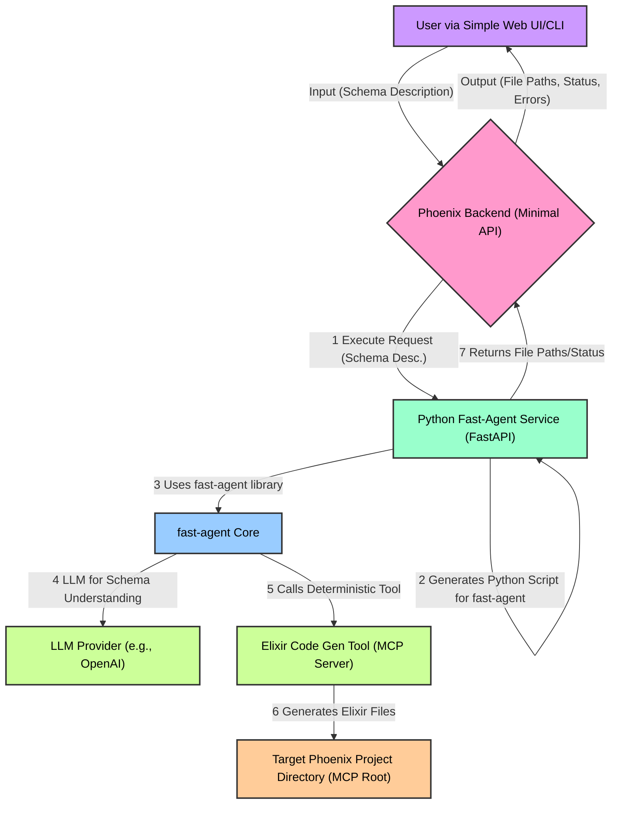
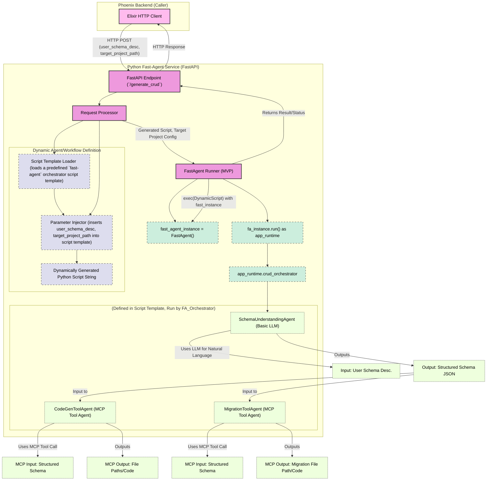

Okay, let's design the architecture for your prototype MVP (Minimum Viable Product) of an advanced AI code assistant, specifically for Elixir/Phoenix CRUD generation. We'll aim for simplicity in the MVP while laying the groundwork for future expansion, leveraging `fast-agent` strategically.

**Core MVP Goal:**

A system where a user can:

1.  Describe a simple data model/schema in natural language or a very simple structured input.
2.  Trigger an automated workflow that generates:
    *   The Ecto schema file.
    *   A basic Ecto migration file.
    *   (Stretch for MVP) A Phoenix context module with basic CRUD functions.
3.  The generated files are placed into a designated project directory.
4.  The user can see the generated files and any significant errors.

**MVP Architecture Recommendation:**

For the MVP, we'll use a simplified version of the Elixir/Phoenix backend + Python `fast-agent` service. We can even start with just the Python service and a CLI/simple web UI for interaction if an Elixir backend is too much for the absolute MVP. However, given your long-term vision for deep Elixir integration, structuring for it early is beneficial.

Let's assume an MVP with:

*   **Simple Frontend:** A basic web page (could even be static HTML + JS initially, or a simple Phoenix LiveView) to take user input.
*   **Phoenix Backend (Minimal):** Handles the request from the frontend and calls the Python service.
*   **Python `fast-agent` Service:** The core engine.

## Mermaid Diagrams for MVP Architecture

### 1. Level 1: MVP System Overview



**Explanation (Level 1 - MVP):**

*   **User:** Interacts via a very simple web UI or even a command-line script that calls the Phoenix backend.
*   **Phoenix Backend:** A minimal Phoenix application with an API endpoint to receive schema descriptions. Its main role is to pass the request to the Python `fast-agent` service and relay the results.
*   **Python Fast-Agent Service:** A FastAPI application. This is where the core logic resides for the MVP. It will dynamically construct and run a `fast-agent` workflow.
*   **`fast-agent` Core:** The `fast-agent` library used by the Python service.
*   **LLM Provider:** Used by a `fast-agent` agent for understanding the natural language schema description.
*   **Elixir Code Gen Tool (MCP Server):** A *separate process* (can be an Elixir script running `FastMCP` or a simple Python script initially calling `mix` commands) that exposes your deterministic code generation logic as an MCP tool.
*   **Target Phoenix Project Directory:** The location where generated Elixir files will be written, accessible to the Code Gen Tool (and `fast-agent` via MCP Roots).

---

### 2. Level 2: Python Fast-Agent Service - MVP Internals



**Explanation (Level 2 - MVP Python Service):**

1.  **Phoenix Backend Call:** The Phoenix backend's `PythonServiceClient` makes an HTTP POST request to the Python service's `/generate_crud` endpoint. The request includes the user's natural language schema description and the target project path (which will become an MCP Root).
2.  **Request Processor:**
    *   Receives the request.
    *   **Dynamic Agent/Workflow Definition:**
        *   Instead of a complex graph translator for the MVP, we use a pre-written Python script template for a `fast-agent` orchestrator designed for CRUD generation.
        *   `Script Template Loader`: Loads this template (e.g., `crud_orchestrator_template.py.tpl`).
        *   `Parameter Injector`: Injects the `user_schema_desc` and `target_project_path` into specific placeholders within this script template. For example, the `target_project_path` is used to dynamically define an MCP Root for the `filesystem` and `ElixirCodeGenTool` MCP servers.
        *   The result is a `DynamicScript` string ready to be executed.
3.  **FastAgent Runner (MVP):**
    *   Creates a unique `FastAgent` instance (`fast_agent_instance`).
    *   **Crucially, it needs to configure this instance dynamically with the `target_project_path` as an MCP Root.** This might involve dynamically creating a temporary `fastagent.config.yaml` for this run or hoping `fast-agent` evolves an API for dynamic server/root configuration. For MVP, writing a temp config is feasible.
    *   Executes the `DynamicScript` using `exec(DynamicScript, {'fast': fast_agent_instance})`. This defines the `SchemaUnderstandingAgent`, `CodeGenToolAgent`, `MigrationToolAgent`, and the main `crud_orchestrator` on `fast_agent_instance`.
    *   Invokes `async with fast_agent_instance.run() as app_runtime:`.
    *   Calls the main orchestrator: `await app_runtime.crud_orchestrator.send(user_schema_desc)`.
4.  **CRUD Orchestrator (defined in the dynamic script template):**
    *   **Step 1: `SchemaUnderstandingAgent`**
        *   Takes `user_schema_desc`.
        *   Uses an LLM to convert it to structured JSON (e.g., for Ecto fields and types).
        *   Output: Structured schema JSON. This JSON could be written to a temporary MCP Resource (e.g., `resource://session_xyz/schema_definition.json`).
    *   **Step 2: `CodeGenToolAgent`**
        *   Reads the structured schema JSON (from the MCP Resource).
        *   Makes an MCP `tools/call` to your `ElixirCodeGenTool` (which is an MCP server).
        *   The tool takes the schema and generates the `.ex` file(s) for the Ecto schema, (MVP stretch: and Phoenix Context).
        *   It writes these files directly into the `target_project_path` (via the MCP Root configured for that tool's MCP server).
        *   Output: Paths to generated files, or success/failure status.
    *   **Step 3: `MigrationToolAgent`**
        *   Reads the structured schema JSON.
        *   Makes an MCP `tools/call` to an `ElixirMigrationTool`.
        *   The tool generates the Ecto migration file (e.g., using `mix ecto.gen.migration` and then populating it based on the schema).
        *   Writes the migration file to `target_project_path/priv/repo/migrations/`.
        *   Output: Path to migration file.
5.  **Result Aggregation & Return:**
    *   The `FastAgentRunnerMVP` collects the outputs from the orchestrator (e.g., list of generated file paths, any errors).
    *   The FastAPI endpoint returns this information to the Phoenix backend.
6.  **Phoenix Backend & Frontend:**
    *   The Phoenix backend relays this status/result to the simple web UI.

---

### 3. Level 3: Key `fast-agent` Concepts in MVP Orchestrator Script Template

This is pseudo-code representing what the `DynamicScript` (generated by `ParameterInjector`) would look like.

```python
# DynamicScript (template populated by Phoenix backend)

import asyncio
from mcp_agent import FastAgent, Prompt
from mcp_agent.core.request_params import RequestParams
from mcp_agent.mcp.prompt_message_multipart import PromptMessageMultipart # If needed directly

# --- Parameters Injected by Phoenix Backend ---
USER_SCHEMA_DESCRIPTION = "{{ user_schema_description_from_phoenix }}"
TARGET_PROJECT_PATH_URI = "{{ target_project_path_uri_from_phoenix }}" # e.g., "file:///path/to/user/project"
# Potentially LLM model choice, API keys if not in a shared config, etc.
# --- End of Injected Parameters ---

# 'fast' is the FastAgent instance passed in via exec() by FastAgentRunnerMVP
# fast = FastAgent(name="dynamic_crud_run_{uuid}", config_path="path_to_temp_specific_config.yaml")

# Configuration for the dynamically created temp config (if used):
# mcp:
#   servers:
#     elixir_code_gen:
#       command: ["elixir", "path/to/your/mcp_code_gen_server.exs"] # Or however you run it
#       roots:
#         - uri: {{ TARGET_PROJECT_PATH_URI }} # Make project dir an MCP root
#           name: project_root
#     elixir_migration_gen:
#       command: ["elixir", "path/to/your/mcp_migration_server.exs"]
#       roots:
#         - uri: {{ TARGET_PROJECT_PATH_URI }}
#           name: project_root
#     filesystem: # For schema.json resource
#       command: ["npx", "-y", "@modelcontextprotocol/server-filesystem", "."] # Runs in a temp dir for this execution
#       roots:
#         - uri: "file:///temp_execution_data/" # A temporary root for this specific run
#           name: run_data


@fast.agent(
    name="SchemaUnderstandingAgent_MVP",
    instruction="You are an expert in database design and Phoenix/Ecto. Convert the user's natural language description into a structured JSON schema definition. The schema should list fields with their Ecto types (e.g., :string, :integer, :text, :boolean, :decimal, :references) and any specified relationships (e.g., belongs_to, has_many).",
    model="{{ llm_model_for_schema_understanding }}", # Can be configured or hardcoded for MVP
    servers=["filesystem"] # To write the schema.json
)
async def schema_understanding_agent_func(): pass # Body is trivial

@fast.agent(
    name="CodeGenToolAgent_MVP",
    instruction="You are a code generation orchestrator. Use the provided schema to call the Elixir code generation tool.",
    model="passthrough", # This agent doesn't need LLM intelligence, just tool invocation
    servers=["elixir_code_gen", "filesystem"] # To read schema.json and use code gen tool
)
async def code_gen_tool_agent_func(): pass

@fast.agent(
    name="MigrationToolAgent_MVP",
    instruction="You are a database migration orchestrator. Use the provided schema to call the Elixir migration generation tool.",
    model="passthrough",
    servers=["elixir_migration_gen", "filesystem"] # To read schema.json
)
async def migration_tool_agent_func(): pass

@fast.orchestrator(
    name="crud_orchestrator_mvp",
    instruction="""
    Overall objective: Generate Ecto schema, Phoenix context (optional for MVP), and migration for a new resource.
    1. Understand the user's schema description.
    2. Generate the Ecto schema file using the 'elixir_code_gen' tool.
    3. Generate the Ecto migration file using the 'elixir_migration_gen' tool.
    Report paths of generated files.
    """,
    agents=["SchemaUnderstandingAgent_MVP", "CodeGenToolAgent_MVP", "MigrationToolAgent_MVP"],
    model="{{ llm_model_for_orchestration }}", # A capable model for planning
    plan_type="full" # MVP starts with a full, simpler plan
)
async def crud_orchestrator_func(): pass

# This part is effectively called by FastAgentRunnerMVP
# async def main_execution_entry_point():
#     async with fast.run() as app:
#         result = await app.crud_orchestrator_mvp.send(USER_SCHEMA_DESCRIPTION)
#         # Runner service would capture and return this result
#         return result
```

**Detailed textual description of the MVP workflow (inside the `fast-agent` service after it receives a request):**

1.  **Initialization (`FastAgentRunnerMVP`):**
    *   Receives `user_schema_description` and `target_project_path_uri`.
    *   **Dynamic Configuration:** A temporary `fastagent.config.yaml` is created (or the main one is appropriately parameterized). This config MUST define:
        *   An `elixir_code_gen` MCP server that points to your deterministic Elixir Ecto schema/context generator script. It needs an MCP `Root` definition pointing to `target_project_path_uri` so it can write files there.
        *   An `elixir_migration_gen` MCP server (similar to above).
        *   A `filesystem` MCP server, possibly with a temporary root (e.g., `file:///temp_execution_data/{run_id}/`) where intermediate files like the structured schema definition can be stored as MCP resources.
    *   Loads the Python script template for the `crud_orchestrator_mvp`.
    *   Injects `USER_SCHEMA_DESCRIPTION` into
