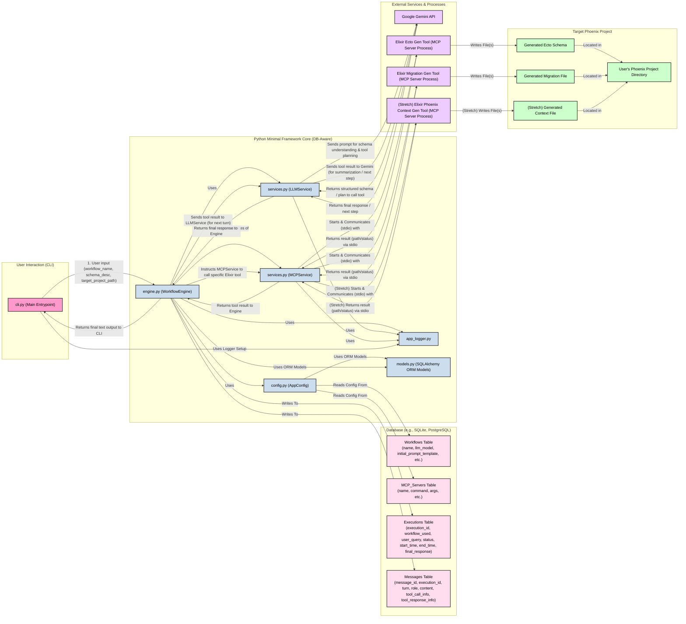

Okay, let's address both points.

**1) "Dream Stuff" Relevance:**

You are correct. For the immediate task of outlining a DB-first approach for your *current minimal Python framework* (as used in the Elixir/Phoenix CRUD generator MVP), the expansive "Cognitive Service Layer," "Much Bigger Vision," and detailed `fast-agent` specific modifications from the "dream docs" are **not directly relevant to the immediate architectural design of *this* MVP.**

Those documents provide excellent long-term strategic thinking and context if you were to build a much larger, more complex agent framework, especially if you were to deeply integrate or fork `fast-agent`.

For now, we will focus on applying the *principles* of a DB-first approach to your *existing Python files* (`services.py`, `engine.py`, `config.py`, etc.) to enhance the Elixir CRUD generator.

**2) DB-First Approach for the Elixir/Phoenix CRUD Generator MVP (using your minimal Python framework)**

Let's devise how your current Python framework could adopt a DB-first approach. This means the database becomes the source of truth for configurations and the repository for execution logs, rather than just JSON files and transient in-memory data/console logs.

We are **not** introducing `fast-agent` here. We are modifying how *your existing Python code* behaves.

## DB-First Architecture for Minimal Framework MVP

The core idea is to:

1.  **Store Configurations in DB:** `mcp_servers.json` and `workflows.json` content will reside in database tables.
2.  **Log Executions to DB:** Every run of a workflow, including the conversation turns and tool calls, will be logged to the database.

### Key Database Tables (Conceptual):

1.  **`workflows`**:
    *   `id` (PK)
    *   `name` (TEXT, UNIQUE, e.g., "elixir_crud_generator")
    *   `llm_model` (TEXT)
    *   `initial_prompt_template` (TEXT)
    *   `max_conversation_turns` (INTEGER)
    *   `description` (TEXT, nullable)
    *   `created_at`, `updated_at`

2.  **`mcp_servers`**:
    *   `id` (PK)
    *   `name` (TEXT, UNIQUE, e.g., "elixir_ecto_gen_tool")
    *   `command` (TEXT)
    *   `args` (JSON/TEXT)
    *   `env` (JSON/TEXT, nullable)
    *   `description` (TEXT, nullable)
    *   `created_at`, `updated_at`

3.  **`workflow_mcp_server_associations`** (Join Table):
    *   `workflow_id` (FK to `workflows.id`)
    *   `mcp_server_id` (FK to `mcp_servers.id`)
    *   PRIMARY KEY (`workflow_id`, `mcp_server_id`)

4.  **`executions`**:
    *   `id` (PK, UUID or auto-increment)
    *   `workflow_id` (FK to `workflows.id`)
    *   `user_query` (TEXT)
    *   `status` (TEXT, e.g., "STARTED", "COMPLETED", "FAILED")
    *   `start_time` (TIMESTAMP)
    *   `end_time` (TIMESTAMP, nullable)
    *   `final_response_text` (TEXT, nullable)
    *   `error_message` (TEXT, nullable)

5.  **`messages`**:
    *   `id` (PK, UUID or auto-increment)
    *   `execution_id` (FK to `executions.id`)
    *   `turn_number` (INTEGER)
    *   `role` (TEXT, e.g., "user", "model", "tool_request", "tool_response")
    *   `content_text` (TEXT, nullable)
    *   `function_call_name` (TEXT, nullable)
    *   `function_call_args` (JSON/TEXT, nullable)
    *   `function_response_name` (TEXT, nullable)
    *   `function_response_content` (JSON/TEXT, nullable)
    *   `timestamp` (TIMESTAMP)

### Modifications to Python Files:

1.  **NEW: `models.py` (or similar name)**
    *   Define SQLAlchemy (or your preferred ORM) models for the tables above (`Workflow`, `MCPServer`, `WorkflowMCPServerAssociation`, `Execution`, `Message`).

2.  **`config.py (AppConfig)`**:
    *   **Initialization**:
        *   Accept database connection parameters (e.g., connection string).
        *   Initialize DB connection (e.g., SQLAlchemy engine and session).
    *   **Loading Configurations**:
        *   `__init__`: Instead of `_load_json_config`, it will query the `workflows` and `mcp_servers` tables to populate `self.workflows` and `self.mcp_servers` dictionaries.
        *   The structure of these dictionaries should remain compatible with how `WorkflowEngine` expects them.
        *   `get_mcp_server_config()` and `get_workflow_config()` would fetch from these in-memory dictionaries loaded from DB.
    *   (Optional) A utility to seed the database from JSON files if the DB is empty.

3.  **`engine.py (WorkflowEngine)`**:
    *   **Initialization (`__init__`)**:
        *   Accept a DB session/connection object from `AppConfig` or create one.
    *   **`process_user_query()`**:
        *   **Start of processing**:
            *   Create a new `Execution` record in the DB (status "STARTED", `user_query`, `workflow_id`, `start_time`). Get the `execution_id`.
        *   **During conversation loop**:
            *   When appending to `conversation_history`:
                *   Also, create `Message` records in the DB linked to the `execution_id`.
                *   For user input: `role="user"`, `content_text=initial_prompt`.
                *   For LLM text responses: `role="model"`, `content_text=part.text`.
                *   For LLM function calls: `role="tool_request"`, `function_call_name=fc.name`, `function_call_args=fc.args`.
                *   For tool responses back to LLM: `role="tool_response"`, `function_response_name=tool_name`, `function_response_content=tool_result_for_llm`.
            *   Log each with `turn_number` and `timestamp`.
        *   **End of processing (success or failure)**:
            *   Update the `Execution` record: set `status` ("COMPLETED" or "FAILED"), `end_time`, `final_response_text`, and `error_message` if any.

4.  **`cli.py`**:
    *   **Initialization (`main`)**:
        *   Potentially handle DB setup/migration if this is the first run (e.g., using Alembic or SQLAlchemy's `Base.metadata.create_all(engine)`).
        *   `AppConfig` will now need DB connection info. This might come from environment variables or a separate DB config file.
    *   The rest of the CLI logic (parsing args, calling `engine.process_user_query`) largely remains the same, but now the engine's operations are persisted.

5.  **`services.py (LLMService, MCPService)`**:
    *   No direct DB interaction is strictly necessary for these services in this model. They continue to operate based on the configurations and data passed to them by `WorkflowEngine`. Their logging (via `app_logger`) remains valuable for low-level details.

### Workflow with DB-First Approach:

1.  **Startup (`cli.py`)**:
    *   Initialize DB connection.
    *   `AppConfig` loads workflow and MCP server definitions from the database into memory.
2.  **User Query (`cli.py` -> `engine.py`)**:
    *   `WorkflowEngine` receives user query and `workflow_name`.
    *   Creates an `Execution` record in the DB.
3.  **Conversation Loop (`engine.py`)**:
    *   Each turn (user input, LLM response, tool call, tool result) is logged as a `Message` record associated with the current `Execution`.
    *   `LLMService` and `MCPService` are used as before, but the data they handle (prompts, tool calls/responses) is now also being structured and saved to the DB by the `WorkflowEngine`.
4.  **Completion (`engine.py`)**:
    *   `WorkflowEngine` updates the `Execution` record with the final status and response.
5.  **Elixir Tools**:
    *   No change. They are still external processes managed by `MCPService` and don't know about the Python application's database.

### Benefits of this DB-First Approach for the MVP:

*   **Persistence of Configurations:** Workflows and MCP server definitions are centrally managed and can be updated without redeploying code (if you build a small admin interface or script to manage DB entries).
*   **Execution History & Auditability:** Every interaction, LLM call, and tool usage is logged systematically. This is invaluable for:
    *   Debugging failed runs.
    *   Understanding how the agent arrived at a solution.
    *   Analyzing LLM behavior and tool performance.
*   **Reproducibility:** With execution logs, you can better understand past behavior.
*   **Foundation for More Advanced Features:**
    *   Retrieving past successful execution patterns to inform new prompts.
    *   Building analytics on tool usage or LLM costs.
    *   Allowing users to view their execution history (if this becomes a web app).
*   **Decoupling from File System:** Configurations are not tied to `json` files in the deployment.

This approach leverages your existing Python framework structure while introducing the robustness and traceability of a database-backed system, without needing to bring in a full-fledged agent framework like `fast-agent` for this specific Elixir CRUD generator MVP.
