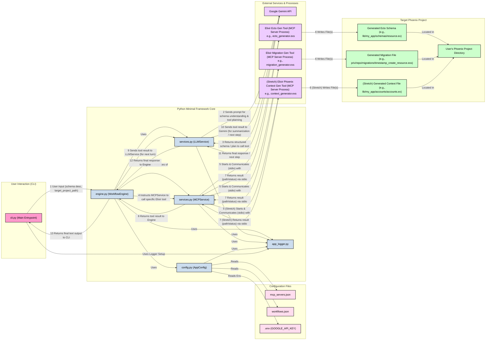

Okay, this is a great setup! We're essentially using your existing Python framework (`config.py`, `services.py`, `engine.py`, `cli.py`, `app_logger.py`) as the "minimal framework" to orchestrate an LLM and external MCP tools for Elixir/Phoenix CRUD generation.

Here's the architectural map.

## System Architecture: Elixir/Phoenix CRUD Generator (Minimal Framework MVP)



## Key Components and Flow (MVP):

1.  **User Interaction (`cli.py`):**
    *   The user provides a natural language description of the desired data model/schema (e.g., "a blog post with a title, body text, and an author_id which is an integer").
    *   Crucially, the user also needs to specify the `target_project_path` for the Phoenix project where files will be generated. This could be a CLI argument or prompted.

2.  **Configuration (`config.py`, `mcp_servers.json`, `workflows.json`):**
    *   `AppConfig` loads all configurations.
    *   **`mcp_servers.json`**:
        *   Defines entries for `elixir_ecto_gen_tool`, `elixir_migration_gen_tool`, (and `elixir_phoenix_context_gen_tool` for stretch).
        *   Each entry specifies the `command` (e.g., `["elixir", "path/to/your/ecto_generator_mcp_server.exs"]`) and any necessary `args` or `env`.
        *   **Important:** These Elixir scripts will be self-contained MCP servers (likely using stdio). They need to be designed to accept parameters like the structured schema (from LLM) and the `target_project_path`. MCP Roots can be configured here, pointing to the `target_project_path`, allowing the Elixir tools to write files into it securely.
    *   **`workflows.json`**:
        *   A workflow (e.g., `elixir_crud_generator`) defines:
            *   `llm_model` (e.g., a Gemini model).
            *   `mcp_servers_used`: Listing the names of the Elixir tools from `mcp_servers.json`.
            *   `initial_prompt_template`: This is key. It will instruct the LLM:
                *   To understand the user's schema description.
                *   To convert it into a structured format (e.g., JSON representing fields, types, relationships).
                *   To then plan to call the available tools (`elixir_ecto_gen_tool`, `elixir_migration_gen_tool`) with this structured schema and the `target_project_path`.
            *   `max_conversation_turns`.

3.  **Python Minimal Framework Core:**
    *   **`engine.py (WorkflowEngine)`**:
        *   Orchestrates the entire process based on the selected workflow.
        *   Initializes `LLMService` and `MCPService` instances for each required Elixir tool.
        *   Manages the conversation loop with the LLM.
    *   **`services.py (LLMService)`**:
        *   Communicates with the Google Gemini API.
        *   Prepares MCP tool schemas for Gemini's function calling.
        *   Sends prompts (including structured schema from previous turns or tool outputs) and conversation history to Gemini.
        *   Receives Gemini's response, which might be text or a request to call one of the Elixir tools.
    *   **`services.py (MCPService)`**:
        *   Manages the lifecycle of and communication with the external Elixir MCP server processes (e.g., `ecto_generator.exs`).
        *   Starts the Elixir script process.
        *   Sends tool call requests (e.g., `generate_ecto_schema` with `structured_schema_json` and `target_project_path` as arguments) to the Elixir process via stdio.
        *   Receives results (e.g., path to generated file, status) from the Elixir process.

4.  **External Services & Processes:**
    *   **Google Gemini API**: The LLM brain.
    *   **Elixir Ecto Gen Tool (`ecto_generator.exs` - *You need to create this*)**:
        *   An Elixir script that acts as an MCP server.
        *   Listens for tool calls (e.g., `generate_ecto_schema`) on stdio.
        *   Input: Structured schema (JSON), `target_project_path`.
        *   Logic: Parses schema, generates Ecto schema file content, writes it to the correct location within `target_project_path`.
        *   Output: Success/failure, path to generated file.
    *   **Elixir Migration Gen Tool (`migration_generator.exs` - *You need to create this*)**:
        *   Similar to the Ecto Gen Tool, but for generating migration files.
        *   Might internally use `Mix.Tasks.Ecto.Gen.Migration` to create the migration file structure and then populate the `change` function based on the provided schema.
    *   **Elixir Phoenix Context Gen Tool (`context_generator.exs` - *Stretch goal, you create this*)**:
        *   Similar, for generating Phoenix context modules with basic CRUD functions.

5.  **Target Phoenix Project:**
    *   The directory specified by the user.
    *   The Elixir MCP tools write the generated `.ex` and `.exs` files directly into this directory.

## MVP Workflow Example:

1.  User runs: `python cli.py elixir_crud_generator --query "Create a User schema with name (string), email (string), and age (integer). Project path is /home/me/my_phoenix_app"`
2.  `WorkflowEngine` starts.
3.  `LLMService` sends initial prompt + user query to Gemini: "You are an Elixir/Phoenix code generation assistant... The user wants a User schema... Convert this to structured JSON and then call the `elixir_ecto_gen_tool` to create the Ecto schema and `elixir_migration_gen_tool` for the migration. The target project path is /home/me/my_phoenix_app."
4.  Gemini responds with a plan, likely first asking to call `elixir_ecto_gen_tool` with args:
    ```json
    {
      "tool_name": "generate_ecto_schema", // Name exposed by your Elixir MCP server
      "args": {
        "schema_definition": { "module_name": "User", "fields": [{"name": "name", "type": "string"}, {"name": "email", "type": "string"}, {"name": "age", "type": "integer"}]},
        "target_project_path": "/home/me/my_phoenix_app"
      }
    }
    ```
5.  `WorkflowEngine` directs `MCPService` to call `elixir_ecto_gen_tool`.
6.  `MCPService` starts `ecto_generator.exs`, sends the tool call via stdio.
7.  `ecto_generator.exs` generates `user.ex` in `/home/me/my_phoenix_app/lib/my_phoenix_app/schemas/` and returns `{"status": "success", "file_path": "..."}`.
8.  `MCPService` returns this to `WorkflowEngine`.
9.  `WorkflowEngine` sends this tool result back to Gemini via `LLMService`.
10. Gemini acknowledges and then requests to call `elixir_migration_gen_tool` similarly.
11. Process repeats for the migration tool.
12. Gemini finally responds with a summary: "I have generated the Ecto schema at ... and the migration at ...".
13. `WorkflowEngine` sends this text to `cli.py` for display.

## Essential Parts from "Dream Docs" for this MVP:

*   **Core:** LLM interaction, tool use via MCP, configurable workflows. Your current Python files provide this.
*   **Elixir Tools as MCP Servers:** This is the main new piece to build outside the Python framework. They need to understand MCP and perform the actual file generation.
*   **Prompt Engineering:** The `initial_prompt_template` in `workflows.json` will be critical for guiding Gemini effectively.
*   **Logging:** Your `app_logger.py` is essential for debugging.
*   **Configuration:** `mcp_servers.json` defining how to run the Elixir tools, and `workflows.json` tying it all together.

This architecture directly uses your existing Python code as the central orchestrator and outsources the Elixir-specific code generation to external MCP-compliant Elixir scripts.
