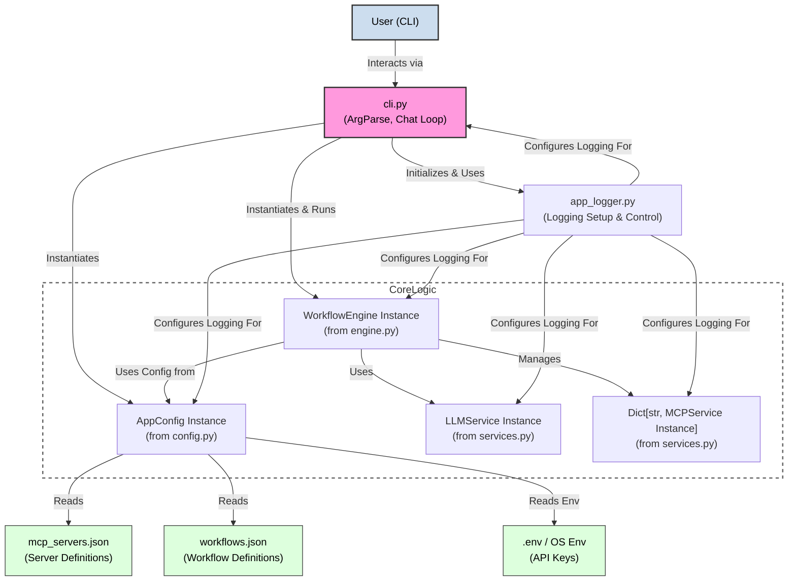
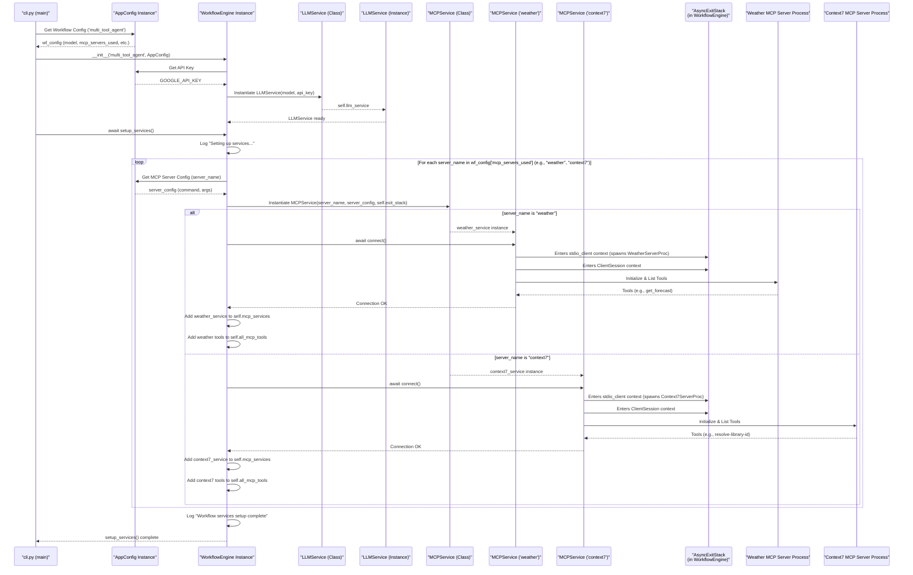
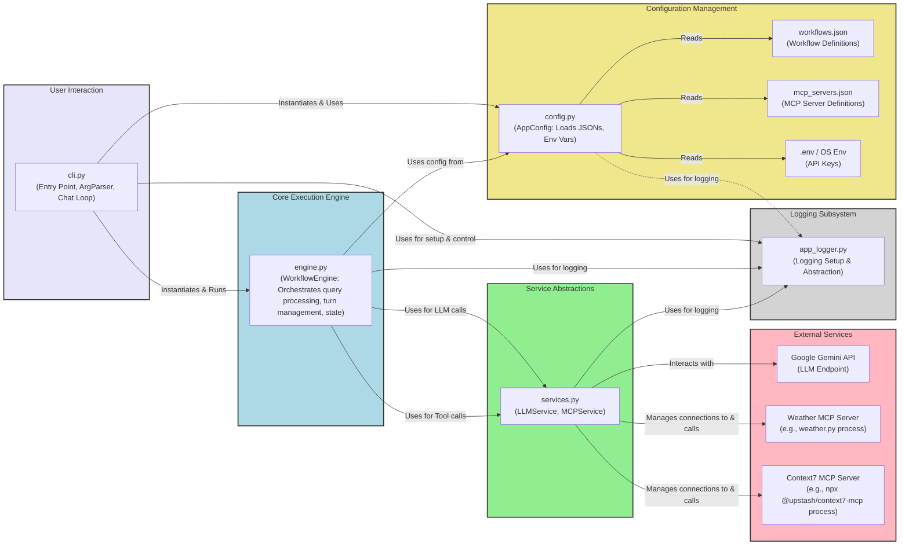
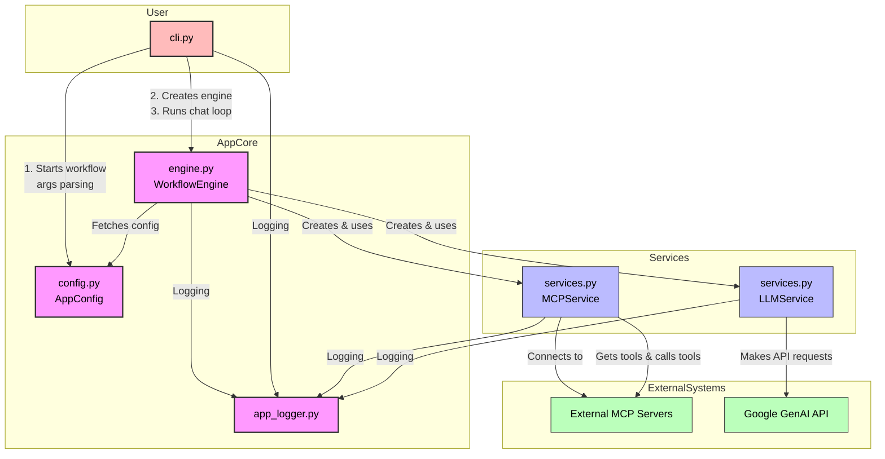
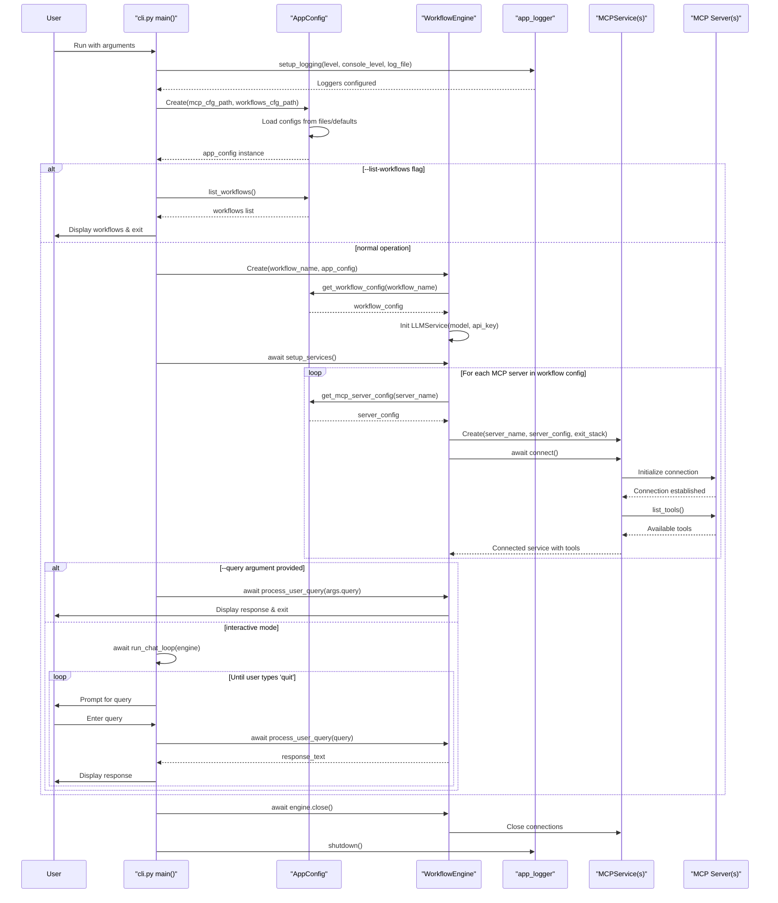
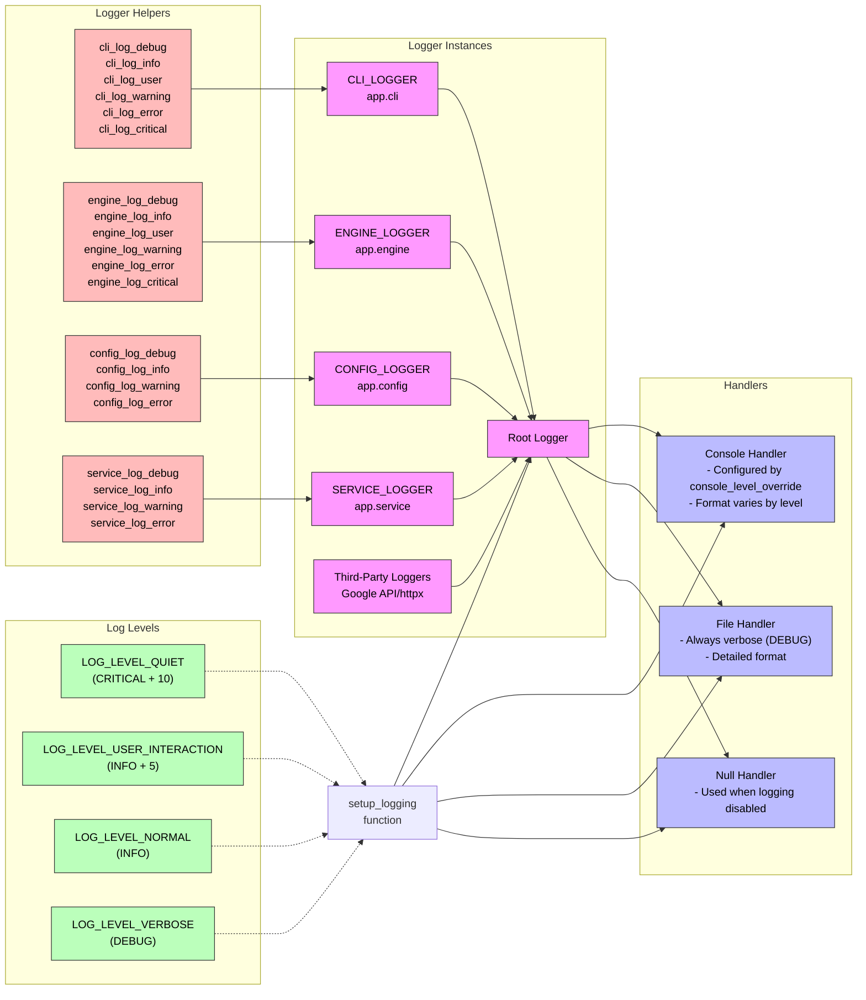
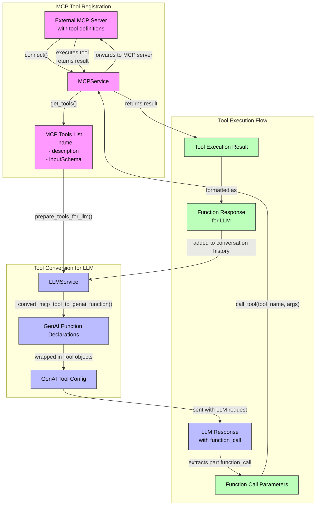
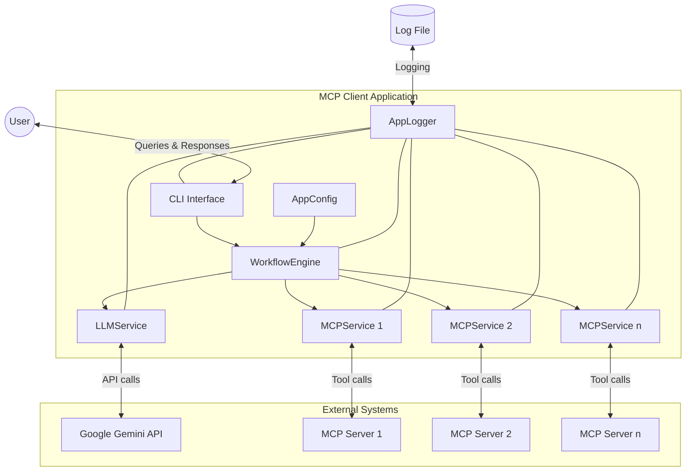
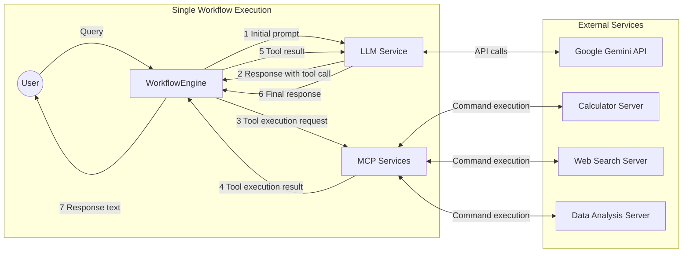

# Composable MCP Client with Workflows

This project demonstrates a modular Python client for interacting with MCP (Model Context Protocol) servers. It uses a configuration-driven approach to define workflows that leverage an LLM (Google Gemini via `google-genai`) and various MCP tools.

## Features

*   **Modular Design:** Code is split into logical components for configuration, services, workflow engine, CLI, and logging.
*   **Configuration-Driven:**
    *   `mcp_servers.json`: Define connection details for MCP servers (e.g., weather, Context7).
    *   `workflows.json`: Define different "personalities" or task-specific setups for the LLM, specifying which model to use, which MCP servers (tools) are available, an initial prompt, and conversation turn limits.
*   **MCP Integration:** Connects to and utilizes tools exposed by MCP servers.
*   **LLM Integration:** Uses Google Gemini for natural language understanding and function calling.
*   **Flexible Logging:**
    *   Configurable console log verbosity (`quiet`, `user`, `normal`, `verbose`).
    *   Detailed file logging (`app_client.log`).
    *   Control over third-party library log noise.
*   **Asynchronous Operations:** Built with `asyncio` for efficient I/O.

## Project Structure

```bash
.
├── app_logger.py       # Logging abstraction and setup
├── cli.py              # Command-line interface and main entry point
├── config.py           # Handles loading mcp_servers.json and workflows.json
├── engine.py           # Core workflow orchestration logic
├── services.py         # Classes for interacting with MCP servers and LLM
├── mcp_servers.json    # Example MCP server configurations
├── workflows.json      # Example workflow definitions
└── app_client.log      # Log file (generated on run)
```

## Prerequisites

*   Python 3.9+
*   Node.js (if using MCP servers like Context7 that are Node-based, e.g., via `npx`)
*   An environment variable `GOOGLE_API_KEY` (or `GEMINI_API_KEY`) set with your Google AI Studio API key.

## Setup

1.  **Clone the repository (or create the files):**
    ```bash
    # If you have the files already, skip this
    # git clone <repository_url>
    # cd <repository_name>
    ```

2.  **Create Python Virtual Environment (recommended):**
    ```bash
    python -m venv venv
    source venv/bin/activate  # On Windows: venv\Scripts\activate
    ```

3.  **Install Dependencies:**
    ```bash
    pip install python-dotenv mcp-protocols google-generativeai google-genai
    ```

4.  **Configure API Key:**
    Create a `.env` file in the project root:
    ```env
    GOOGLE_API_KEY="YOUR_API_KEY_HERE"
    ```
    Alternatively, set the environment variable directly in your shell.

5.  **Create Configuration Files:**
    *   **`mcp_servers.json`:**
        (See example content from previous responses or create your own based on the structure)
        Example:
        ```json
        {
          "mcpServers": {
            "weather": {
              "command": "python",
              "args": ["../path/to/your/weather_server.py"],
              "description": "Weather MCP server"
            },
            "context7": {
              "command": "npx",
              "args": ["-y", "@upstash/context7-mcp@latest"],
              "env": {"DEFAULT_MINIMUM_TOKENS": "10000"},
              "description": "Context7 MCP server"
            }
          }
        }
        ```
        *Ensure paths in `args` for local servers are correct relative to where `cli.py` is run.*

    *   **`workflows.json`:**
        (See example content from previous responses or create your own)
        Example:
        ```json
        {
          "workflows": {
            "weather_assistant": {
              "description": "Ask about the weather.",
              "llm_model": "gemini-1.5-flash-latest",
              "mcp_servers_used": ["weather"],
              "initial_prompt_template": "You are a helpful weather assistant. User Query: {query}",
              "max_conversation_turns": 5
            },
            "multi_tool_agent": {
              "description": "An agent that can use weather and context7.",
              "llm_model": "gemini-1.5-flash-latest",
              "mcp_servers_used": ["weather", "context7"],
              "initial_prompt_template": "You are a multi-talented assistant. User Query: {query}",
              "max_conversation_turns": 7
            }
          }
        }
        ```

## Usage

All commands are run from the project root directory where `cli.py` is located.

**1. List Available Workflows:**
   ```bash
   python cli.py --list-workflows
   # or
   python cli.py -l
   ```

**2. Run a Workflow (Interactive Chat Mode):**
   ```bash
   python cli.py <workflow_name>
   ```
   Example:
   ```bash
   python cli.py multi_tool_agent
   ```
   Then type your queries at the "Query:" prompt. Type `quit` to exit the chat loop.

**3. Run a Workflow with a Single Query (Non-Interactive):**
   ```bash
   python cli.py <workflow_name> --query "Your question here"
   ```
   Example:
   ```bash
   python cli.py weather_assistant --query "What's the weather in London?"
   ```

**4. Controlling Log Verbosity (Console Output):**
   The `--log-level` option controls how much log information is printed to the console.
   *   `quiet`: Minimal output (mostly just `print` statements from the CLI).
   *   `user`: (Default) Shows key interactions like LLM turns and tool calls.
   *   `normal`: More operational info (INFO level logs).
   *   `verbose`: Detailed debug output.

   Examples:
   ```bash
   # Default (user level)
   python cli.py multi_tool_agent

   # Verbose console output
   python cli.py multi_tool_agent --log-level verbose

   # Normal console output
   python cli.py multi_tool_agent --log-level normal

   # Quiet console output (from the logger)
   python cli.py multi_tool_agent --log-level quiet
   ```

**5. Disabling File Logging:**
   By default, detailed logs are written to `app_client.log`. To disable this:
   ```bash
   python cli.py multi_tool_agent --no-log-file
   ```

**6. Using Custom Configuration File Paths:**
   ```bash
   python cli.py multi_tool_agent \
       --mcp-config /path/to/your/custom_mcp_servers.json \
       --workflows-config /path/to/your/custom_workflows.json
   ```

## Development & Troubleshooting

*   Check `app_client.log` for detailed logs, especially if console output is minimal or errors occur.
*   Use `--log-level verbose` for maximum insight into the application's operations.
*   Ensure MCP server commands specified in `mcp_servers.json` are correct and executable from your environment.
*   Verify your `GOOGLE_API_KEY` is correctly set and has access to the Gemini API.

---

## Architectural Mermaid Diagrams

Here are diagrams focusing on the architecture and interactions, especially around the `engine.py` and its use of MCP/tools.

**Diagram 1: Overall System Architecture & Configuration**



**Diagram 2: `WorkflowEngine` Initialization and Service Setup**

This diagram shows what happens when `WorkflowEngine` is created and `setup_services()` is called.



**Diagram 3: The elusive buggy seq diag:**



 **Diagram 4: Class Diagram:**

 ```mermaid
 classDiagram
    class WorkflowEngine {
        -workflow_name: str
        -app_config: AppConfig
        -workflow_config: Dict
        -llm_service: LLMService
        -mcp_services: Dict[str, MCPService]
        -all_mcp_tools: List[Tool]
        -exit_stack: AsyncExitStack
        +__init__(workflow_name, app_config)
        +setup_services() async
        +process_user_query(user_query) async
        +close() async
    }
    
    class MCPService {
        -server_name: str
        -server_config: Dict
        -exit_stack: AsyncExitStack
        -session: ClientSession
        -stdio
        -input
        +__init__(server_name, server_config, exit_stack)
        +connect() async
        +get_tools() async
        +call_tool(tool_name, args) async
    }
    
    class LLMService {
        -model_name: str
        -genai_client
        +__init__(model_name, api_key)
        -_convert_mcp_tool_to_genai_function(mcp_tool)
        +prepare_tools_for_llm(mcp_tools)
        +generate_response(conversation_history, tool_config) async
    }
    
    class AppConfig {
        -mcp_config_path: str
        -workflows_config_path: str
        -mcp_servers: Dict
        -workflows: Dict
        -google_api_key: str
        +__init__(mcp_config_path, workflows_config_path)
        +get_mcp_server_config(server_name)
        +get_workflow_config(workflow_name)
        +list_workflows()
    }
    
    class Tool {
        +name: str
        +description: str
        +inputSchema: Dict
    }
    
    WorkflowEngine --> AppConfig : uses
    WorkflowEngine --> LLMService : uses
    WorkflowEngine --> MCPService : uses multiple
    LLMService ..> Tool : converts
    MCPService ..> Tool : provides
```

**Diagram 5: Component Diagram**



**Diagram 6: App Startup Sequence Diag**



**Diagram 7: Logging Architecture **



**Diagram 8: MCP Tool Data Flow**



# HIGHER LEVEL DIAGS (MAYBE BETTER FOR YOU)

**Diagram 9: MCP Client Architecture**



**Diagram 10: MCP Client Data Flow**

