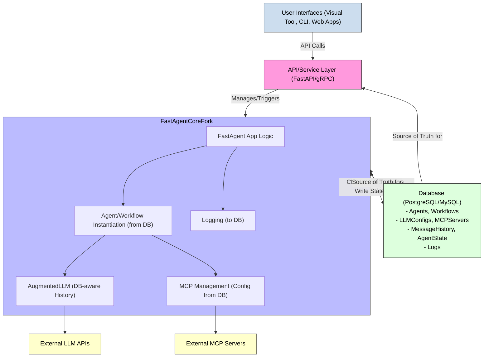

This is indeed a significant architectural decision, and aiming for a "DB-first" multi-agent framework leveraging a *fork* of `fast-agent` changes the game considerably. It implies a tighter integration and the ability to modify `fast-agent`'s core to better suit this database-centric approach.

Here's a high-level architecture recommendation for such a system, emphasizing high cohesion within the `fast-agent` fork and deliberate coupling with the database as the source of truth.

---

## DB-First Multi-Agent Framework (Leveraging a `fast-agent` Fork)

**Core Principle:** The database is the central repository for agent definitions, workflow structures, state, memory, logs, and potentially even tool schemas and capabilities. The `fast-agent` fork reads from and writes to this database, acting as the execution engine and interaction layer.

### I. High-Level Architectural Layers

1.  **Database Layer (Source of Truth):**
    *   Relational Database (e.g., PostgreSQL, MySQL, SQLite for simpler cases) or a NoSQL database with strong schema/transaction support (though RDBMS often aligns better with "DB-first" structured data).
    *   Stores all persistent aspects of the agent system.
2.  **`fast-agent` Core (Forked & Modified):**
    *   The core execution engine, modified to be DB-aware.
    *   Reads agent/workflow definitions from the DB.
    *   Persists conversation history, agent state, and potentially memory components to the DB.
    *   Logs its operations to the DB (in addition to or instead of files/OTEL).
3.  **API/Service Layer:**
    *   Exposes functionalities for managing and interacting with agents (e.g., creating agents, triggering workflows, querying state).
    *   Could be REST, gRPC, or another service protocol.
4.  **Orchestration & Management Layer (Optional, but likely):**
    *   Higher-level services for managing the agent ecosystem, scaling, deploying workflows, etc.
5.  **User Interface Layer(s):**
    *   Could be your visual RAD tool, CLIs, web interfaces, etc., interacting with the API/Service Layer.

### II. Key Database Schemas (Conceptual - RDBMS focus)

*   **`Agents` Table:**
    *   `agent_id` (PK)
    *   `name` (UNIQUE)
    *   `agent_type` (e.g., 'basic', 'orchestrator', 'router' - mapping to `fast-agent` types)
    *   `instruction_template` (text, can include placeholders)
    *   `default_llm_config_id` (FK to `LLMConfigs`)
    *   `default_request_params` (JSON/Text, for overrides)
    *   `use_history` (boolean)
    *   `human_input_enabled` (boolean)
    *   `creation_timestamp`, `last_modified_timestamp`
    *   `version`
    *   `owner_id` (FK to `Users` if multi-tenancy)
*   **`Workflows` Table (for complex, named workflows composed of agents):**
    *   `workflow_id` (PK)
    *   `name` (UNIQUE)
    *   `description`
    *   `root_agent_id` (FK to `Agents` - the entry point agent for this workflow)
    *   `version`
    *   `creation_timestamp`, `last_modified_timestamp`
*   **`AgentWorkflowLinks` Table (Defines structure of complex workflows like Orchestrator, Chain, etc.):**
    *   `link_id` (PK)
    *   `parent_agent_id` (FK to `Agents` - the orchestrator/chain itself)
    *   `child_agent_id` (FK to `Agents` - the worker/step agent)
    *   `link_type` (e.g., 'orchestrates', 'chains_to', 'routes_to', 'fans_out_to', 'fan_in_from', 'generator_for_eval', 'evaluator_for_gen')
    *   `sequence_order` (for chains)
    *   `properties` (JSON/Text, for link-specific configs like router conditions)
*   **`LLMConfigs` Table:**
    *   `llm_config_id` (PK)
    *   `provider_name` (e.g., 'openai', 'anthropic')
    *   `model_name` (e.g., 'gpt-4.1-mini', 'claude-3-sonnet')
    *   `api_key_secret_id` (FK to a secure secrets store or reference)
    *   `base_url` (optional)
    *   `default_request_params` (JSON/Text)
*   **`AgentLLMOverrides` Table (If an agent uses a non-default LLM):**
    *   `agent_id` (FK)
    *   `llm_config_id` (FK)
    *   `purpose` (e.g., 'planning_llm_for_orchestrator', 'evaluation_llm')
*   **`MCPServers` Table:**
    *   `mcp_server_id` (PK)
    *   `server_name` (UNIQUE, used in agent configs)
    *   `transport_type` ('stdio', 'sse', 'http')
    *   `command` (for stdio)
    *   `args` (JSON/Text, for stdio)
    *   `env_vars` (JSON/Text, for stdio)
    *   `url` (for sse/http)
    *   `headers` (JSON/Text, for sse/http)
    *   `auth_config_id` (FK to `MCPServerAuthConfigs`, optional)
    *   `root_paths` (JSON/Text, for MCP roots feature)
    *   `sampling_model_id` (FK to `LLMConfigs`, optional, for server-side sampling)
*   **`AgentMCPServerLinks` Table:**
    *   `agent_id` (FK)
    *   `mcp_server_id` (FK)
*   **`Conversations` / `Sessions` Table:**
    *   `session_id` (PK, could be UUID)
    *   `agent_id` (FK, the primary agent for this session)
    *   `workflow_id` (FK, if part of a defined workflow)
    *   `start_time`, `end_time` (optional)
    *   `status` (e.g., 'active', 'completed', 'error')
    *   `user_id` (optional)
*   **`MessageHistory` Table:**
    *   `message_id` (PK)
    *   `session_id` (FK)
    *   `sequence_number`
    *   `role` ('user', 'assistant', 'tool_call', 'tool_response')
    *   `content` (JSON/Text, storing the `PromptMessageMultipart` structure or its parts)
    *   `timestamp`
    *   `llm_metadata` (JSON, optional, for tokens, model used for this turn)
    *   `tool_call_id` (optional)
    *   `tool_name` (optional)
*   **`AgentState` Table (for more complex, persistent agent-specific state beyond conversation):**
    *   `agent_id` (FK)
    *   `session_id` (FK, optional, if state is session-specific)
    *   `state_key` (string)
    *   `state_value` (JSON/Text/BLOB)
    *   `last_updated`
*   **`Logs` Table (structured logging):**
    *   `log_id` (PK)
    *   `timestamp`
    *   `session_id` (FK, optional)
    *   `agent_id` (FK, optional)
    *   `level` ('info', 'debug', 'error', 'warn')
    *   `message` (text)
    *   `data` (JSON, for structured log data)
    *   `trace_id`, `span_id` (if OTEL is also used)

### III. Modifications to `fast-agent` Core (The Fork)

This is where the "high coupling, high cohesion" comes in. You'll modify `fast-agent` to be DB-aware.

1.  **Configuration Loading (`config.py` in the fork):**
    *   Instead of `get_settings()` loading from YAML, it would query the `LLMConfigs` and `MCPServers` tables to populate the `Settings` Pydantic model.
    *   API keys might still be preferentially loaded from environment/secrets files for security, but their *references* could be in the DB.
2.  **Agent/Workflow Instantiation (`core/fastagent.py`, `core/direct_factory.py`):**
    *   When `FastAgent` is initialized or `fast.run()` is called, instead of just relying on decorated Python functions, it would:
        *   Query the `Agents` and `Workflows` tables.
        *   Dynamically construct `AgentConfig` objects from DB data.
        *   For workflow types like Orchestrator or Chain, it would query `AgentWorkflowLinks` to get the child agent IDs and their roles, then fetch/instantiate those child agents.
        *   The `@fast.agent` decorators might still be useful for defining the *behavior* of an agent type, but its *instance configuration* (instruction, model, servers) would largely come from the DB.
        *   Alternatively, the decorators could *register* agent types/templates to the DB, and instances are created based on DB records referencing these templates.
3.  **`MCPServerRegistry` & `MCPConnectionManager`:**
    *   These would be initialized with server configurations directly from the `MCPServers` table in the DB, rather than from the `Settings.mcp.servers` Pydantic attribute (which itself would be populated from the DB).
4.  **`AugmentedLLM` (`llm/augmented_llm.py` and providers):**
    *   **History Management:**
        *   The `history` attribute (currently `SimpleMemory`) would become a DB-backed memory.
        *   `_precall` would save incoming messages to `MessageHistory`.
        *   `_apply_prompt_provider_specific` (and its structured counterpart) would save the LLM's response and any tool interactions to `MessageHistory`.
        *   When preparing messages for the LLM, it would fetch relevant history from the `MessageHistory` table for the current `session_id`.
    *   **LLM Configuration:** Would fetch its model, API key reference, etc., based on the `Agent`'s `default_llm_config_id` or overrides.
5.  **Logging (`logging/logger.py`, `logging/transport.py`):**
    *   A new `DatabaseTransport` for `EventTransport` would be created to write `Event` objects to the `Logs` table.
    *   This could become the primary logging mechanism, or supplement existing file/console/OTEL logging.
6.  **State Management (`agents/base_agent.py` or new modules):**
    *   Introduce methods like `agent.save_state(key, value, session_id=None)` and `agent.load_state(key, session_id=None)` that interact with the `AgentState` table. This would be for more persistent or complex state than just conversation history.
7.  **Human-in-the-Loop (`human_input/`):**
    *   `HumanInputRequest` and `HumanInputResponse` could be persisted to the DB.
    *   The callback mechanism might involve writing a request to the DB and polling or using DB notifications/triggers for the response.

### IV. API/Service Layer

*   **Endpoints for Agent/Workflow CRUD:**
    *   `POST /agents`: Create a new agent definition in the DB.
    *   `GET /agents/{agent_id}`: Retrieve agent definition.
    *   `PUT /agents/{agent_id}`: Update agent definition.
    *   Similar endpoints for `Workflows`, `LLMConfigs`, `MCPServers`.
*   **Endpoints for Interaction:**
    *   `POST /sessions`: Start a new conversation/session, returns `session_id`.
    *   `POST /sessions/{session_id}/send`: Send a message to an agent within a session. The backend would:
        1.  Load the agent and its history from DB using `session_id`.
        2.  Use the `fast-agent` core to process the message.
        3.  Persist new messages and state changes.
        4.  Return the response.
    *   `GET /sessions/{session_id}/history`: Retrieve message history.
*   **Webhook/Callback Endpoints:** For asynchronous operations or HITL responses.

### V. Visual RAD Tool Integration

*   The visual tool you envision would interact with this API/Service Layer.
*   When a user designs a workflow:
    *   The GUI actions translate into API calls to create/update `Agents`, `Workflows`, `AgentWorkflowLinks`, etc., in the database.
*   When a user clicks "Run":
    *   The GUI sends the `workflow_id` or `agent_id` to an execution endpoint in the API layer.
    *   The backend fetches the definition from the DB, dynamically instantiates the `fast-agent` components, and runs the workflow.
    *   Results and logs (queried from the DB or streamed) are sent back to the GUI.

### VI. Tradeoffs (High Coupling, High Cohesion)

*   **High Coupling (with the Database):**
    *   **Pro:** Centralized truth, easier data consistency, powerful querying across all aspects of the agent system, historical analysis, auditability.
    *   **Con:** `fast-agent` core becomes heavily dependent on the DB schema. Changes to the DB might require changes to the `fast-agent` fork. Performance can be a concern if DB interactions are not optimized. More complex initial setup.
*   **High Cohesion (within `fast-agent` fork):**
    *   **Pro:** Modifications to `fast-agent` for DB interaction are contained within its codebase, making it a well-defined "DB-aware agent engine." Internal logic related to DB access is encapsulated.
    *   **Con:** Forking means maintaining divergence from upstream `fast-agent` if it's an active open-source project.

### VII. Mermaid Diagram: DB-First Framework Overview

**Recommendation & Plan:**

This DB-first approach is ambitious and powerful. Forking `fast-agent` is the right strategy if you need this level of deep integration with a database as the central source of truth.

**High-Level Plan:**

1.  **Fork `fast-agent`:** Create your own version of the library.
2.  **Database Schema Design:** Solidify the RDBMS schema for all core entities. Use an ORM like SQLAlchemy for Python-DB interaction.
3.  **Modify Configuration Loading:** Adapt `fast-agent`'s `config.py` to load settings primarily from the database.
4.  **DB-Aware Agent Instantiation:**
    *   Modify `FastAgent` and `direct_factory.py` to query the `Agents`, `Workflows`, and `AgentWorkflowLinks` tables to dynamically build agent instances and their relationships.
    *   The decorators might now serve to define *templates* or *behavioral types* that are stored in the DB, rather than directly creating runnable functions in memory for each app run.
5.  **Integrate DB-Backed Memory:** Replace `SimpleMemory` in `AugmentedLLM` with a class that reads/writes conversation history to the `MessageHistory` table.
6.  **Develop API Layer:** Create API endpoints for managing entities in the DB and for triggering agent executions.
7.  **Build Your Visual Tool:** Connect your GUI to this API layer.
8.  **Iteratively Add Features:** DB-backed logging, advanced state management, etc.

This is a substantial project, but by forking `fast-agent`, you get a huge head start on the agent execution logic, LLM provider integrations, and MCP handling, allowing you to focus on the DB integration and the unique aspects of your visual RAD tool.
