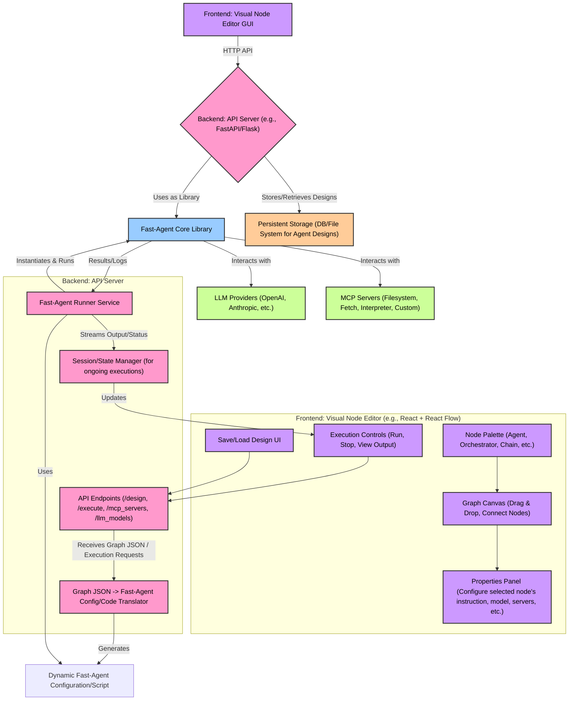

Okay, I understand now. You want to build a **new application** that *uses* `fast-agent` as its core agent-building and execution library. This new application will provide a **visual interface** for users to "roll together" agents and workflows, essentially acting as a GUI-driven design and runtime environment on top of `fast-agent`.

Let's design such a system.

**Core Idea:** Your application will have a frontend for visual design and a backend that translates these visual designs into `fast-agent` configurations, then uses the `fast-agent` library to execute them.

**Recommendation for GUI Approach:**

Given the goal of "rapid visual tool" and using `fast-agent`'s existing strengths, I recommend the following:

*   **Don't adapt to a fully complete existing agent GUI (like Flowise/LangFlow) *for the design part*.** While tempting for speed, their internal abstractions might not map perfectly to `fast-agent`'s specific workflow types (Orchestrator, EvaluatorOptimizer, etc.) and MCP-centric design. You'd spend a lot of time fighting the host system or being limited by its node types.
*   **Don't build a GUI entirely from scratch (e.g., raw HTML/CSS/JS canvas).** This is a massive undertaking.
*   **Recommend: Cobble together a GUI using a lower-level graph management/node editor library.**
    *   **Examples:** [React Flow](https://reactflow.dev/), [Svelte Flow](https://svelteflow.dev/), [Drawflow](https://github.com/jerosoler/drawflow), or similar.
    *   **Rationale:** These libraries provide the core canvas, node dragging, connection logic, zooming, panning, etc. This allows you to focus on:
        1.  Defining custom node types that directly correspond to `fast-agent` concepts (Basic Agent, Orchestrator, Chain, etc.).
        2.  Creating a properties panel for configuring each node (instruction, model, servers, workflow-specific parameters).
        3.  Translating the visual graph into a `fast-agent` consumable format on the backend.

This approach gives you control over the user experience and ensures a tight mapping to `fast-agent` features, while offloading the complex low-level GUI rendering and interaction logic.

## System Design: Visual Fast-Agent Builder

Here's a breakdown of the components:



**Detailed Components & Data Flow:**

1.  **Frontend (Visual Node Editor):**
    *   **Technology:** React with React Flow (or Svelte with Svelte Flow for a potentially lighter bundle) is a strong choice.
    *   **Node Palette:** Displays available `fast-agent` components:
        *   Basic Agent Node
        *   Orchestrator Node
        *   Chain Node
        *   Router Node
        *   Parallel Node
        *   Evaluator-Optimizer Node
        *   (Potentially) Input/Output Nodes for data.
    *   **Graph Canvas:** Users drag nodes from the palette, arrange them, and connect them.
        *   Connections for `Chain` represent sequence.
        *   Connections for `Orchestrator`, `Router`, `Parallel`, `Evaluator-Optimizer` represent dependencies or agent assignments (e.g., dragging an Agent node *into* an Orchestrator's "agents" property).
    *   **Properties Panel:** When a node is selected, this panel shows its configurable properties:
        *   **Common:** Name, Instruction, LLM Model (dropdown populated from backend), MCP Servers (multi-select from backend list), `RequestParams`.
        *   **Workflow-Specific:**
            *   `Orchestrator`: List of child agent names, `plan_type`.
            *   `Chain`: Sequence of agent names, `cumulative` flag.
            *   `Router`: List of routable agent names.
            *   `Parallel`: `fan_out` agent names, `fan_in` agent name.
            *   `Evaluator-Optimizer`: `generator` agent name, `evaluator` agent name, `min_rating`, `max_refinements`.
    *   **Execution Controls:** "Run" button (takes an initial prompt), "Stop" button, an area to display output/logs streamed from the backend.
    *   **Save/Load UI:** To save the graph design (as JSON) to persistent storage and load existing designs.
    *   **Output of Frontend:** A JSON object representing the graph structure (nodes, their properties, and connections).

2.  **Backend (API Server):**
    *   **Technology:** FastAPI (Python) is a good choice as `fast-agent` is Python-based.
    *   **API Endpoints:**
        *   `/designs (POST, GET, PUT, DELETE)`: For saving, loading, updating, deleting agent/workflow designs (the graph JSON).
        *   `/execute (POST)`: Takes a design (or design ID) and an initial user prompt. Initiates execution.
        *   `/mcp_servers (GET)`: Returns a list of available/configured MCP servers (potentially from a central `fastagent.config.yaml` or a DB).
        *   `/llm_models (GET)`: Returns a list of available LLM models (could be hardcoded, from config, or dynamically discovered).
    *   **Graph JSON -> Fast-Agent Config/Code Translator:** This is the *crucial* component. When the `/execute` endpoint is hit:
        1.  It receives the graph JSON from the frontend.
        2.  It parses this JSON.
        3.  **Strategy:** Dynamically generate a Python script string that uses `fast-agent` decorators to define the agents and workflows as per the graph.
            *   Example: A "Basic Agent" node in the GUI would translate to:
                ```python
                # ... imports ...
                # fast = FastAgent("dynamic_run_{uuid}") - created by FastAgentRunner
                # @fast.agent(name="gui_agent_1", instruction="...", model="...", servers=[...])
                # async def gui_agent_1_func():
                #    pass # The function body is often trivial for basic agents if they are just LLM calls
                ```
            *   Workflow nodes would translate to their respective decorators, referencing other generated agent names.
    *   **Fast-Agent Runner Service:**
        1.  Takes the dynamically generated Python script string (or the structured config if you evolve `fast-agent` for that).
        2.  Creates a unique `FastAgent` instance (e.g., `FastAgent("dynamic_run_{uuid}")`).
        3.  Executes the generated script string in a restricted environment (e.g., using `exec()` or by writing to a temporary file and importing it). This populates the `fast.agents` dictionary of the unique `FastAgent` instance.
            *   **Security Note:** If using `exec()`, ensure the input graph JSON is strictly validated to prevent arbitrary code injection. Generating a file and importing is generally safer.
        4.  Calls `async with fast_agent_instance.run() as app_runtime:`.
        5.  Identifies the "entry point" agent/workflow from the graph (e.g., the one marked as start or the one not connected *to* anything).
        6.  Invokes it: `await app_runtime.entry_point_agent_name.send(initial_user_prompt)`.
        7.  Streams responses, logs, and tool call information back to the client via the `StateManager`.
    *   **Session/State Manager:**
        *   Manages the lifecycle of asynchronous `fast-agent` executions.
        *   Could use WebSockets or Server-Sent Events (SSE) to stream output back to the frontend for a live view.
        *   Handles stopping/cancelling executions.

3.  **`fast-agent` Core Library:**
    *   Used by the `FastAgentRunner` as a standard Python library.
    *   The backend will need to manage the `fastagent.config.yaml` and `fastagent.secrets.yaml` for this library instance, providing API keys and default MCP server definitions. The GUI might allow users to add/override MCP server definitions on a per-design basis, which the backend would then dynamically configure for the `FastAgent` instance during execution.

4.  **LLM Providers & MCP Servers:**
    *   Accessed by the `fast-agent` library as usual, based on the configuration (either global or dynamically provided for the execution).

5.  **Persistent Storage:**
    *   A database (e.g., PostgreSQL, MongoDB) or even a file system to store the JSON representations of the agent designs created by users.
    *   Stores design name, description, the graph JSON, and user/versioning info.

**Execution Flow Example (User Clicks "Run"):**

1.  Frontend sends the current graph JSON (or design ID) and the initial user prompt to the backend's `/execute` API endpoint.
2.  Backend API receives the request. If a design ID is provided, it loads the graph JSON from Persistent Storage.
3.  The `GraphTranslator` converts the graph JSON into a Python script string defining the `fast-agent` agents and workflows.
4.  The `FastAgentRunner`:
    a.  Creates a new `FastAgent` instance.
    b.  Executes the generated script, populating the `FastAgent` instance's agent definitions. This uses the standard `fast-agent` decorator logic internally.
    c.  Enters the `async with fast_agent_instance.run() as app_runtime:` context. This initializes all defined agents (connects to MCP servers, sets up LLMs).
    d.  Calls the entry-point agent/workflow: `await app_runtime.entry_agent.send(initial_prompt)`.
5.  The `fast-agent` library executes the agent/workflow:
    a.  The entry agent (or workflow) runs.
    b.  If it's an Orchestrator, it plans and calls child agents. Child agents are looked up in `app_runtime`.
    c.  LLM calls are made, tools (MCP servers) are invoked.
    d.  `fast-agent`'s logging system emits events.
6.  The `FastAgentRunner` captures output, logs, and tool call information.
7.  The `StateManager` streams this information back to the Frontend via WebSocket/SSE.
8.  Frontend's `ExecutionControls` displays the live output and status.
9.  Once execution finishes, `fast.run()` context exits, cleaning up resources for that dynamic `FastAgent` instance.

**Plan of Action (Phased Approach):**

**Phase 1: Core Backend & Basic Agent Definition**

1.  **Backend Setup:**
    *   Choose backend framework (FastAPI recommended).
    *   Implement basic API endpoints: `/design/save`, `/design/load`, `/execute`.
    *   Set up `fastagent.config.yaml` and `fastagent.secrets.yaml` for the backend's `fast-agent` usage.
2.  **GraphTranslator (Initial):**
    *   Focus on translating a single "Basic Agent" node from a simple JSON structure into a `fast-agent` Python script string.
    *   JSON: `{ "nodes": [{"id": "agent1", "type": "BasicAgent", "name": "My Echo Agent", "instruction": "Echo back the input.", "model": "passthrough"}], "edges": [] }`
3.  **FastAgentRunner (Initial):**
    *   Ability to take the generated script for a single Basic Agent, instantiate `FastAgent`, execute the script to define the agent, run it with a prompt, and return the result.
4.  **Frontend (Minimal):**
    *   Use a simple UI (even just a textarea for graph JSON initially) to send a Basic Agent definition and prompt to the `/execute` endpoint.
    *   Display the returned result.

**Phase 2: Workflow Nodes & Simple Frontend Graphing**

1.  **GraphTranslator (Extended):**
    *   Add support for translating `Chain` and `Orchestrator` (simple, full plan) nodes and their connections.
    *   The JSON graph format will need to represent these relationships (e.g., `chain_node.sequence = ["agent1_id", "agent2_id"]`).
2.  **FastAgentRunner (Extended):**
    *   Ensure it correctly executes the more complex generated scripts involving workflows.
3.  **Frontend (Basic Graphing):**
    *   Integrate React Flow (or similar).
    *   Implement draggable nodes for Basic Agent, Chain, Orchestrator.
    *   Implement basic property editing for these nodes.
    *   Allow connecting nodes for chains/orchestrators.
    *   Generate the graph JSON.

**Phase 3: Full-Fledged GUI & Remaining Workflow Types**

1.  **Frontend (Enhanced):**
    *   Add nodes for Router, Parallel, Evaluator-Optimizer.
    *   Refine property panels for all node types.
    *   Implement robust graph validation (e.g., ensuring agent names referenced in workflows exist).
    *   Implement UI for selecting MCP servers and LLM models from lists fetched from the backend.
    *   Implement Save/Load functionality using `/design` endpoints.
    *   Implement real-time output streaming (WebSockets/SSE).
2.  **GraphTranslator (Complete):**
    *   Support all `fast-agent` workflow types.
3.  **Backend (Enhanced):**
    *   Implement `/mcp_servers/list` and `/llm_models/list` endpoints.
    *   Implement robust session management in `StateManager` for concurrent executions.

**Phase 4: Advanced Features & Polish**

1.  **Frontend:**
    *   Visual debugging of agent execution (highlighting active node).
    *   Version history for designs.
    *   User accounts and permissions for designs (if needed).
    *   Templates for common agent patterns.
2.  **Backend:**
    *   Ability to dynamically configure/add MCP servers for a specific execution through the GUI.
    *   More sophisticated error handling and reporting to the frontend.
    *   (Optional) Consider the "Configuration-Driven Factory" for `fast-agent` if dynamic script generation becomes a bottleneck or security concern.

This plan provides a visual, user-friendly way to leverage the power of `fast-agent` without requiring users to write Python code directly for design, while still using `fast-agent`'s robust engine underneath.
